# SPECYFIKACJA WYMAGAŃ

## System wpierający organizację komnatowych wydarzeń LARP

**Redaktor:** zespół projektu  
**Status:**

**Wersja:** 1.0  
**Data modyfikacji:** 26.02.2026

**Motto:**  
Platforma umożliwiająca organizowanie, zarządzanie i uczestnictwo w wydarzeniach LARP w jednym miejscu.

---

## Historia zmian:

- **26.02.2023** – Maksym Andrushchenko - dodany dokument md

---

# 1. Wprowadzenie

## 1.1 Cel dokumentu

Tutaj znajdzie się opis celu dokumentu...

## 1.2 Streszczenie dla kierownictwa

Tutaj znajdzie się streszczenie dla kierownictwa...

---

# 2. Opis biznesu

## 2.1 Procesy biznesowe

**Diagram:** Proces 1

---

# 3. Wizja systemu

## 3.1 Opis problemu

**P001: Problem organizacji wydarzeń LARP**

**Typ: «Wizja»**

Wersja: 1.0 (10.03.2026)

Odpowiedzialny: Maksym Andruchchenko

Priorytet i trudność: Istotne

Wydanie: 1.0

Problem związany z organizacją i zarządzaniem wydarzeniami LARP, dotyczący graczy, organizatorów wydarzeń oraz administratorów platformy, czego wynikiem jest trudność w wyszukiwaniu wydarzeń, zarządzaniu zapisami uczestników, komunikacji między uczestnikami oraz kontrolowaniu przebiegu gry.

Obecnie wiele zadań organizacyjnych wykonywanych jest ręcznie lub przy użyciu różnych, niespójnych narzędzi (np. komunikatorów, arkuszy kalkulacyjnych czy formularzy internetowych), co prowadzi do błędów organizacyjnych, problemów komunikacyjnych oraz ograniczonej kontroli nad przebiegiem wydarzenia.

Problem można rozwiązać budując zintegrowany system wspierający organizację wydarzeń LARP, który umożliwia tworzenie wydarzeń, zarządzanie uczestnikami, obsługę scenariuszy gry oraz interakcję graczy z elementami świata gry poprzez aplikację mobilną.

## Dzięki temu organizatorzy będą mogli sprawniej zarządzać wydarzeniami, gracze łatwiej znajdą interesujące rozgrywki, a cały proces organizacji i prowadzenia wydarzeń stanie się bardziej uporządkowany i efektywny.

## 3.2 Interesariusze

**Diagram:** Interesariusze

**Gracz**

- Typ: «interesariusz»
- Wersja: 1.0 (08.03.2026)
- Odpowiedzialny: TBD
- Priorytet i trudność: Wysoki
- Wydanie: 1.0

Gracz jest użytkownikiem systemu biorącym udział w wydarzeniach LARP. Jego głównym celem jest znalezienie interesujących wydarzeń, zapisanie się na nie oraz uczestnictwo w rozgrywce. Gracz korzysta z systemu do zarządzania swoim profilem, wybierania postaci, komunikacji z innymi uczestnikami oraz śledzenia swoich osiągnięć i historii wydarzeń.

**Administrator systemu**

- Typ: «interesariusz»
- Wersja: 1.0 (08.03.2026)
- Odpowiedzialny: TBD
- Priorytet i trudność: Średni
- Wydanie: 1.0

Administrator systemu odpowiada za utrzymanie poprawnego działania platformy. Jego zadaniem jest zarządzanie użytkownikami, moderowanie zgłoszeń problemów, kontrolowanie bezpieczeństwa systemu oraz weryfikowanie wydarzeń tworzonych przez użytkowników. Administrator posiada dostęp do narzędzi umożliwiających monitorowanie działania systemu.

**Organizator wydarzeń**

- Typ: «interesariusz»
- Wersja: 1.0 (08.03.2026)
- Odpowiedzialny: TBD
- Priorytet i trudność: Wysoki
- Wydanie: 1.0

Organizator wydarzeń odpowiada za przygotowanie i przeprowadzenie wydarzeń LARP. Korzysta z systemu w celu tworzenia nowych wydarzeń, zarządzania zapisami uczestników, planowania scenariusza gry oraz komunikacji z graczami przed i w trakcie wydarzenia. System powinien umożliwiać organizatorowi sprawne zarządzanie wszystkimi elementami wydarzenia.

---

## 3.3 Cechy funkcjonalne

### 3.3.1 Zarządzanie Użytkownikami

#### Wysoki Priorytet

F01: System powinien umożliwiać rejestrację nowego konta.
| Typ: _funkcjonalne_ | Wersja: 1.0 (02.03.2026) | Odpowiedzialny: Karolina Wiśniewska|
| :--- | :--- | :--- |
| Priorytet: Kluczowe || Wydanie: 1.0 |
| Zaimplementowanie funkcjonalności umożliwiającej użytkownikowi rejestrację konta na platformie. Tworzone konto wymaga od użytkownika podania swojego adresu e-mail, dostępnej i unikatowej nazwy konta, oraz dwukrotnego podania hasła. System powinien posiadać odpowiednie wymagania dotyczące hasła (np. długość, rodzaj znaków) i informować, kiedy użytkownik podał odpowiedni przykład. Rejestracja konta możliwa jest po potwierdzeniu tożsamości za pomocą podanego adresu e-mail.|

F02: System powinien umożliwiać edycję danych osobowych w profilu użytkownika.
| Typ: _funkcjonalne_ | Wersja: 1.0 (01.03.2026) | Odpowiedzialny: Polina Nesterova |
| :--- | :--- | :--- |
| Priorytet: Kluczowe || Wydanie: 1.0 |
| Zaimplementowanie panelu umożliwiającego użytkownikowi edycję swoich danych osobowych w systemie. Użytkownik powinien móc zmienić imię, nazwisko, adres email, numer telefonu oraz hasło do konta. System powinien wymagać potwierdzenia zmiany wrażliwych danych (email, hasło) poprzez weryfikację aktualnego hasła lub kod wysłany na dotychczasowy adres email. Wszystkie zmiany danych osobowych powinny być zapisywane w historii zmian konta dla celów bezpieczeństwa. |

F03: System powinien umożliwiać usunięcie konta użytkownika.
| Typ: _funkcjonalne_ | Wersja: 1.0 (28.02.2026) | Odpowiedzialny: Maciej Bankiewicz |
| :--- | :--- | :--- |
| Priorytet: Kluczowe || Wydanie: 1.0 |
| Zaimplementowanie opcji usunięcia konta użytkownika. Ta opcja powinna być jasno przedstawiona użytkownikowi i opatrzona ostrzeżeniami przed przypadkowym usunięciem konta, jednak musi byc łatwo dostępna. |

#### Średni Priorytet

F04: System powinien umożliwiać przeglądanie historii uczestnictwa w wydarzeniach.
| Typ: _funkcjonalne_ | Wersja: 1.0 (01.03.2026) | Odpowiedzialny: Polina Nesterova |
| :--- | :--- | :--- |
| Priorytet: Istotne || Wydanie: 1.0 |
| Zaimplementowanie sekcji pozwalającej użytkownikowi na przeglądanie pełnej historii wydarzeń LARP, w których brał udział. System powinien wyświetlać listę wszystkich ukończonych sesji z podstawowymi informacjami (data, nazwa wydarzenia, lokalizacja, odegrana postać, czas trwania), a także prezentować zagregowane statystyki takie jak: całkowita liczba ukończonych sesji, najczęściej grane role, ulubione scenariusze i typy wydarzeń. Historia powinna być sortowalna według daty oraz filtrowalna według typu wydarzenia, odgrywanej postaci lub organizatora. |

F05: System powinien umożliwiać zarządzanie preferencjami użytkownika.
| Typ: _funkcjonalne_ | Wersja: 1.0 (01.03.2026) | Odpowiedzialny: Polina Nesterova |
| :--- | :--- | :--- |
| Priorytet: Przydatne || Wydanie: 1.0 |
| Zaimplementowanie sekcji konfiguracji preferencji systemowych użytkownika. Użytkownik powinien móc skonfigurować ustawienia powiadomień (email, SMS, powiadomienia push dla aplikacji mobilnej), określić preferencje dotyczące typów wydarzeń LARP (fantasy, sci-fi, horror, historyczne), wskazać preferowane dni tygodnia i przedziały czasowe uczestnictwa, oraz ustawić poziom prywatności profilu określający widoczność swoich danych i statystyk dla innych użytkowników systemu. |

F06: System powinien umożliwiać logowanie metodą dwuetapową.
| Typ: _funkcjonalne_ | Wersja: 1.0 (02.03.2026) | Odpowiedzialny: Karolina Wiśniewska|
| :--- | :--- | :--- |
| Priorytet: Użyteczne || Wydanie: 1.0 |
| Zaimplementowanie funkcjonalności umożliwiającej użytkownikowi dwuetapowe potwierdzenie tożsamości, pierwszy raz za pomocą hasła i drugi raz np. za pomocą kodu QR pochodzącego od dezygnowanej aaplikacji. Użytkownik powinien mieć możliwość włączenia tej opcji wedle życzenia, oraz wyłączenia jej przy pomocy np. adresu mailowego.|

#### Niski Priorytet

F07: System powinien umożliwiać tworzenie rankingu graczy.
| Typ: _funkcjonalne_ | Wersja: 1.0 (08.03.2026) | Odpowiedzialny: Maksym Andrushchenko |
| :--- | :--- | :--- |
| Priorytet: Istotne || Wydanie: 1.0 |
| System powinien tworzyć ranking graczy na podstawie ich osiągnięć, zdobytych punktów oraz aktywności w wydarzeniach. Ranking powinien być widoczny dla użytkowników w systemie.

F08: System powinien umożliwiać naliczanie doświadczenia graczy.
| Typ: _funkcjonalne_ | Wersja: 1.0 (08.03.2026) | Odpowiedzialny: Maksym Andrushchenko |
| :--- | :--- | :--- |
| Priorytet: Istotne || Wydanie: 1.0 |
| Po zakończeniu wydarzenia system powinien przyznawać graczom punkty doświadczenia na podstawie ich aktywności oraz wyników w trakcie rozgrywki. Punkty doświadczenia powinny wpływać na poziom postaci oraz statystyki użytkownika. |

### 3.3.2 Zarządzanie wydarzeniami

#### Wysoki Priorytet

F09: System powinien umożliwiać tworzenie wydarzeń LARP.
| Typ: _funkcjonalne_ | Wersja: 1.0 (08.03.2026) | Odpowiedzialny: Maksym Andrushchenko |
| :--- | :--- | :--- |
| Priorytet: Kluczowe || Wydanie: 1.0 |
| System powinien umożliwiać organizatorowi tworzenie nowego wydarzenia LARP. Organizator powinien móc określić nazwę wydarzenia, lokalizację, datę, maksymalną liczbę uczestników oraz wymagania dotyczące postaci. Utworzone wydarzenie powinno być widoczne dla użytkowników w systemie po jego zatwierdzeniu. |

F10: System powinien umożliwiać zapisanie się na wydarzenie.
| Typ: _funkcjonalne_ | Wersja: 1.0 (08.03.2026) | Odpowiedzialny: Maksym Andrushchenko |
| :--- | :--- | :--- |
| Priorytet: Kluczowe || Wydanie: 1.0 |
| Użytkownik powinien mieć możliwość zapisania się na wydarzenie poprzez wybór dostępnego wydarzenia z listy. System powinien automatycznie dodawać użytkownika do listy uczestników lub do listy rezerwowej w przypadku osiągnięcia maksymalnej liczby miejsc. |

F11: System powinien umożliwiać wyszukiwanie wydarzeń.
| Typ: _funkcjonalne_ | Wersja: 1.0 (08.03.2026) | Odpowiedzialny: Maksym Andrushchenko |
| :--- | :--- | :--- |
| Priorytet: Kluczowe || Wydanie: 1.0 |
| System powinien umożliwiać użytkownikom wyszukiwanie wydarzeń LARP według różnych kryteriów, takich jak data, lokalizacja, liczba uczestników, poziom trudności oraz typ gry. Wyniki wyszukiwania powinny być prezentowane w formie listy wraz z podstawowymi informacjami o wydarzeniu. |

F12: System powinien umożliwiać uruchomienie wydarzenia.
| Typ: _funkcjonalne_ | Wersja: 1.0 (08.03.2026) | Odpowiedzialny: Maksym Andrushchenko |
| :--- | :--- | :--- |
| Priorytet: Kluczowe || Wydanie: 1.0 |
| Organizator wydarzenia powinien mieć możliwość uruchomienia wydarzenia w systemie w momencie rozpoczęcia rozgrywki. Uruchomienie wydarzenia aktywuje mechaniki gry, interakcje z obiektami oraz funkcje komunikacyjne dla uczestników. |

F13: System powinien umożliwiać odwołanie wydarzenia.
| Typ: _funkcjonalne_ | Wersja: 1.0 (08.03.2026) | Odpowiedzialny: Maksym Andrushchenko |
| :--- | :--- | :--- |
| Priorytet: Istotne || Wydanie: 1.0 |
| Organizator wydarzenia powinien mieć możliwość odwołania wydarzenia przed jego rozpoczęciem. W przypadku anulowania wydarzenia system powinien powiadomić wszystkich zapisanych użytkowników oraz zaktualizować status wydarzenia. |

F14: System powinien umożliwiać automatyczne odwołanie wydarzenia.
| Typ: _funkcjonalne_ | Wersja: 1.0 (08.03.2026) | Odpowiedzialny: Maksym Andrushchenko |
| :--- | :--- | :--- |
| Priorytet: Istotne || Wydanie: 1.0 |
| System powinien automatycznie anulować wydarzenie w przypadku niespełnienia określonych warunków, takich jak brak minimalnej liczby uczestników lub problemy techniczne uniemożliwiające przeprowadzenie wydarzenia. |

#### Średni Priorytet

F15: System powinien umożliwiać zapraszanie graczy do wydarzenia.
| Typ: _funkcjonalne_ | Wersja: 1.0 (08.03.2026) | Odpowiedzialny: Maksym Andrushchenko |
| :--- | :--- | :--- |
| Priorytet: Istotne || Wydanie: 1.0 |
| Organizator wydarzenia powinien mieć możliwość wyszukiwania użytkowników systemu oraz wysyłania im zaproszeń do udziału w konkretnym wydarzeniu. Zaproszeni użytkownicy powinni otrzymać powiadomienie w systemie oraz możliwość zaakceptowania lub odrzucenia zaproszenia. |

F15: System powinien udostępniać panel zarządzania wydarzeniem dla organizatora.
| Typ: _funkcjonalne_ | Wersja: 1.0 (08.03.2026) | Odpowiedzialny: Maksym Andrushchenko |
| :--- | :--- | :--- |
| Priorytet: Istotne || Wydanie: 1.0 |
| Organizator powinien mieć dostęp do panelu zarządzania wydarzeniem umożliwiającego przeglądanie listy uczestników, zarządzanie zapisami, wysyłanie komunikatów do graczy oraz kontrolowanie przebiegu wydarzenia w trakcie jego trwania. |

F16: System powinien informować użytkowników o odwołaniu gry.
| Typ: _funkcjonalne_ | Wersja: 1.0 (02.03.2026) | Odpowiedzialny: Filobok Hlib |
| :--- | :--- | :--- |
| Priorytet: Istotne || Wydanie: 1.0 |
| W przypadku odwołania wydarzenia z przyczyn technicznych lub z powodu niewystarczającej liczby uczestników (nieosiągnięcia minimalnego limitu), system powinien wysłać powiadomienie w aplikacji (w zakładce „Wiadomości”) oraz kopię powiadomienia na adres e-mail użytkownika. |

F17: System powinien umożliwiać zarządzanie kalendarzem wydarzeń.
| Typ: _funkcjonalne_ | Wersja: 1.0 (08.03.2026) | Odpowiedzialny: Maksym Andrushchenko |
| :--- | :--- | :--- |
| Priorytet: Istotne || Wydanie: 1.0 |
| System powinien udostępniać kalendarz wydarzeń umożliwiający przeglądanie zaplanowanych wydarzeń LARP w ujęciu czasowym. Kalendarz powinien umożliwiać filtrowanie wydarzeń oraz wyświetlanie szczegółów wybranego wydarzenia. |

#### Niski Priorytet

F18: System powinien umożliwiać dodanie wydarzenia do osobistego kalendarza użytkownika.
| Typ: _funkcjonalne_ | Wersja: 1.0 (08.03.2026) | Odpowiedzialny: Maksym Andrushchenko |
| :--- | :--- | :--- |
| Priorytet: Przydatne || Wydanie: 1.0 |
| Użytkownik powinien mieć możliwość dodania wybranego wydarzenia do swojego osobistego kalendarza w systemie lub eksportowania go do zewnętrznych aplikacji kalendarzowych. |

F19: System powinien umożliwiać rekomendowanie wydarzeń użytkownikom.
| Typ: _funkcjonalne_ | Wersja: 1.0 (08.03.2026) | Odpowiedzialny: Maksym Andrushchenko |
| :--- | :--- | :--- |
| Priorytet: Przydatne || Wydanie: 1.0 |
| System powinien analizować historię aktywności użytkownika oraz jego preferencje dotyczące typów wydarzeń LARP i na tej podstawie rekomendować wydarzenia, które mogą być dla niego interesujące. |

F20: System powinien udostępniać podsumowanie wydarzenia po jego zakończeniu.
| Typ: _funkcjonalne_ | Wersja: 1.0 (08.03.2026) | Odpowiedzialny: Maksym Andrushchenko |
| :--- | :--- | :--- |
| Priorytet: Przydatne || Wydanie: 1.0 |
| Po zakończeniu wydarzenia system powinien udostępnić uczestnikom podsumowanie rozgrywki zawierające informacje o zdobytych punktach, osiągnięciach, ukończonych zadaniach oraz statystyki przebiegu gry. |

### 3.3.3 System gry (Gameplay)

#### Wysoki Priorytet

F21: System powinien umożliwiać zgłoszenie problemu w trakcie rozgrywki.
| Typ: _funkcjonalne_ | Wersja: 1.0 (03.03.2026) | Odpowiedzialny: Cezary Rybiński |
| :--- | :--- | :--- |
| Priorytet: Kluczowe || Wydanie: 1.0 |
| System powinien umożliwiać zgłoszenie problemu w trakcie rozgrywki poprzez wybranie opcji w menu i opisanie problemu. Zgłoszenie nie przerywa automatycznie rozgrywki a powiadamia jedynie organizatora o konieczności interwencji. |

F22: System powinien umożliwiać definiowanie warunków zwycięstwa w scenariuszu gry.
| Typ: _funkcjonalne_ | Wersja: 1.0 (08.03.2026) | Odpowiedzialny: Maksym Andrushchenko |
| :--- | :--- | :--- |
| Priorytet: Kluczowe || Wydanie: 1.0 |
| Organizator wydarzenia powinien mieć możliwość określenia warunków zwycięstwa dla uczestników lub frakcji w scenariuszu gry. Warunki te mogą obejmować zdobycie określonej liczby punktów, wykonanie konkretnych zadań. |

F23: System powinien umożliwiać definiowanie limitu czasu trwania gry.
| Typ: _funkcjonalne_ | Wersja: 1.0 (08.03.2026) | Odpowiedzialny: Maksym Andrushchenko |
| :--- | :--- | :--- |
| Priorytet: Kluczowe || Wydanie: 1.0 |
| Organizator wydarzenia powinien mieć możliwość określenia maksymalnego czasu trwania rozgrywki. Po upływie zdefiniowanego czasu system powinien automatycznie zakończyć wydarzenie oraz zapisać wyniki gry. |

F24: System powinien umożliwiać zarządzanie punktacją graczy w trakcie gry.
| Typ: _funkcjonalne_ | Wersja: 1.0 (08.03.2026) | Odpowiedzialny: Maksym Andrushchenko |
| :--- | :--- | :--- |
| Priorytet: Kluczowe || Wydanie: 1.0 |
| System powinien automatycznie rejestrować zdobywane przez graczy punkty podczas wykonywania zadań lub interakcji z elementami gry. Punkty powinny być przypisywane do odpowiedniej postaci oraz zapisywane w historii rozgrywki. |

F25: System powinien umożliwiać obsługę sytuacji awaryjnych w trakcie gry.
| Typ: _funkcjonalne_ | Wersja: 1.0 (08.03.2026) | Odpowiedzialny: Maksym Andrushchenko |
| :--- | :--- | :--- |
| Priorytet: Kluczowe || Wydanie: 1.0 |
| Organizator wydarzenia powinien mieć możliwość wstrzymania lub zakończenia gry w przypadku wystąpienia sytuacji awaryjnej. System powinien powiadomić uczestników o przerwaniu gry oraz zapisać aktualny stan rozgrywki. |

#### Średni Priorytet

F26: System powinien umożliwiać definiowanie poziomu trudności scenariusza gry.
| Typ: _funkcjonalne_ | Wersja: 1.0 (08.03.2026) | Odpowiedzialny: Maksym Andrushchenko |
| :--- | :--- | :--- |
| Priorytet: Istotne || Wydanie: 1.0 |
| Organizator wydarzenia powinien mieć możliwość określenia poziomu trudności scenariusza gry (np. łatwy, średni, trudny). Poziom trudności może wpływać na parametry rozgrywki takie jak liczba zadań, dostępność wskazówek lub liczba przeciwników. |

F27: System powinien umożliwiać tworzenie frakcji graczy w wydarzeniu.
| Typ: _funkcjonalne_ | Wersja: 1.0 (08.03.2026) | Odpowiedzialny: Maksym Andrushchenko |
| :--- | :--- | :--- |
| Priorytet: Istotne || Wydanie: 1.0 |
| Organizator wydarzenia powinien mieć możliwość podziału uczestników na frakcje. System powinien umożliwiać przypisywanie graczy do frakcji oraz śledzenie postępów każdej z nich podczas rozgrywki. |

F28: System powinien umożliwiać projektowanie zadań w scenariuszu gry.
| Typ: _funkcjonalne_ | Wersja: 1.0 (08.03.2026) | Odpowiedzialny: Maksym Andrushchenko |
| :--- | :--- | :--- |
| Priorytet: Istotne || Wydanie: 1.0 |
| Organizator wydarzenia powinien mieć możliwość tworzenia zadań fabularnych dla graczy. Zadania mogą wymagać wykonania określonych akcji, odnalezienia przedmiotów lub rozwiązania zagadek. System powinien umożliwiać śledzenie postępów graczy w realizacji tych zadań. |

F29: System powinien udostępniać interaktywną mapę terenu gry.
| Typ: _funkcjonalne_ | Wersja: 1.0 (03.03.2026) | Odpowiedzialny: Kacper Koziara |
| :--- | :--- | :--- |
| Priorytet: Przydatne || Wydanie: 1.0 |
| Zaimplementowanie w aplikacji widoku mapy przedstawiającej plan układu pomieszczeń (komnat) wydarzenia. Mapa powinna dynamicznie dostosowywać się do posiadanych przez postać uprawnień, odkrywając przed graczem strefy, do których uzyskał dostęp (np. po zdobyciu odpowiedniego klucza lub przedmiotu questowego), oraz ukrywając obszary, które są dla niego niedostępne lub tajne. |

### 3.3.4 Mechaniki gry

#### Wysoki Priorytet

F30: System powinien umożliwiać interakcję z otoczeniem poprzez kody QR.
| Typ: _funkcjonalne_ | Wersja: 1.0 (02.03.2026) | Odpowiedzialny: Tomasz Rogalski |
| :--- | :--- | :--- |
| Priorytet: Istotne || Wydanie: 1.0 |
| Zaimplementowanie w aplikacji mobilnej skanera kodów QR, który pozwoli graczom na wchodzenie w interakcję z fizycznymi elementami gry. Po zeskanowaniu kodu system powinien wyświetlić opis obiektu, dodać przedmiot do ekwipunku lub uruchomić przypisaną akcję fabularną. |

F31: System powinien umożliwiać definiowanie logicznych powiązań między czujnikami a zdarzeniami w grze.
| Typ: _funkcjonalne_ | Wersja: 1.0 (02.03.2026) | Odpowiedzialny: Igor Ochocki |
| :--- | :--- | :--- |
| Priorytet: Istotne || Wydanie: 1.0 |
| Zaimplementowanie modułu zarządzania terenem, który pozwala przypisać konkretne akcje systemowe lub fabularne do fizycznych czujników oraz kodów QR rozmieszczonych w pomieszczeniach. System powinien reagować na interakcję z czujnikiem poprzez zmianę statusu gry lub powiadomienie gracza. |

#### Średni Priorytet

F32: System powinien umożliwiać odblokowywanie materiałów multimedialnych przez użytkowników.
| Typ: _funkcjonalne_ | Wersja: 1.0 (03.03.2026) | Odpowiedzialny: Cezary Rybiński |
| :--- | :--- | :--- |
| Priorytet: Przydatne || Wydanie: 1.0 |
| System powinien umożliwiać odblokowywanie materiałów multimedialnych (nagrania audio, tajne dokumenty PDF, fragmenty wideo) po wejściu w interakcję z obiektem w świecie gry. Materiały te są trwale zapisywane w "dzienniku" postaci, umożliwiając ich późniejszą analizę. |

F33: System powinien umożliwiać wymianę wirtualnych zasobów pomiędzy graczami.
| Typ: _funkcjonalne_ | Wersja: 1.0 (03.03.2026) | Odpowiedzialny: Kacper Koziara |
| :--- | :--- | :--- |
| Priorytet: Istotne || Wydanie: 1.0 |
| Zaimplementowanie modułu handlu pozwalającego graczom na bezpieczną wymianę posiadanych przedmiotów i wirtualnej waluty za pomocą aplikacji mobilnej. Proces wymiany powinien wymagać potwierdzenia transakcji przez obie strony (np. poprzez zeskanowanie jednorazowego kodu QR wygenerowanego na ekranie urządzenia jednego z graczy). System musi na bieżąco aktualizować stany ekwipunków zaangażowanych postaci i zapisywać historię transakcji w logach. |

### Ekonomia / płatności

#### Wysoki Priorytet

F34: System powinien umożliwiać obsługę płatności za wydarzenia poprzez integrację z systemem zewnętrznym.
| Typ: Funkcjonalne | Wersja: 1.0 (2.03.2026) | Odpowiedzialny: Michał Marciniak |
| :--- | :--- | :--- |
| Priorytet: Kluczowe || Wydanie: 1.0|
| Zapewnienie uczestnikom możliwości opłacenia udziału w wydarzeniu bezpośrednio po zatwierdzeniu ich zgłoszenia. System powinien integrować się z zewnętrznymi systemami płatności i automatycznie aktualizować status zapisu uczestnika po otrzymaniu potwierdzenia transakcji. ||

F35: System powinien umożliwiać wstępną wycenę wydarzenia LARP.
| Typ: _funkcjonalne_ | Wersja: 1.0 (08.03.2026) | Odpowiedzialny: Maksym Andrushchenko |
| :--- | :--- | :--- |
| Priorytet: Kluczowe || Wydanie: 1.0 |
| Podczas tworzenia wydarzenia system powinien umożliwiać organizatorowi oszacowanie kosztu organizacji wydarzenia na podstawie wybranych elementów takich jak liczba pomieszczeń, wykorzystane dekoracje, liczba uczestników oraz dodatkowe zasoby. System powinien wyświetlać przybliżony koszt organizacji wydarzenia. |

F36: System powinien umożliwiać obsługę ostatecznej wyceny wydarzenia.
| Typ: _funkcjonalne_ | Wersja: 1.0 (08.03.2026) | Odpowiedzialny: Maksym Andrushchenko |
| :--- | :--- | :--- |
| Priorytet: Kluczowe || Wydanie: 1.0 |
| System powinien umożliwiać pracownikowi platformy zatwierdzenie ostatecznej ceny wydarzenia przed jego publikacją. Cena wydarzenia powinna być widoczna dla użytkowników podczas zapisu na wydarzenie. |

#### Średni Priorytet

F37: System powinien umożliwiać zwrot zaliczki za wydarzenie.
| Typ: _funkcjonalne_ | Wersja: 1.0 (08.03.2026) | Odpowiedzialny: Maksym Andrushchenko |
| :--- | :--- | :--- |
| Priorytet: Istotne || Wydanie: 1.0 |
| W przypadku odwołania wydarzenia lub rezygnacji użytkownika w dopuszczalnym terminie system powinien umożliwiać automatyczny zwrot zaliczki poprzez zintegrowany system płatności. |

F38: System powinien umożliwiać zarządzanie rabatami dla użytkowników.
| Typ: _funkcjonalne_ | Wersja: 1.0 (08.03.2026) | Odpowiedzialny: Maksym Andrushchenko |
| :--- | :--- | :--- |
| Priorytet: Istotne || Wydanie: 1.0 |
| Administrator systemu powinien mieć możliwość przyznawania rabatów dla wybranych użytkowników lub grup użytkowników, na przykład dla stałych klientów lub uczestników wielu wydarzeń. Rabaty powinny być automatycznie uwzględniane podczas płatności za wydarzenie. |

#### 3.3.5 System techniczny

#### Wysoki Priorytet

F39: System powinien umożliwiać przywrócenie stanu gry po awarii.
| Typ: _funkcjonalne_ | Wersja: 1.0 (08.03.2026) | Odpowiedzialny: Maksym Andrushchenko |
| :--- | :--- | :--- |
| Priorytet: Kluczowe || Wydanie: 1.0 |
| System powinien automatycznie zapisywać stan gry w regularnych odstępach czasu, aby umożliwić przywrócenie rozgrywki w przypadku awarii systemu lub utraty połączenia z serwerem. |

F40: System powinien umożliwiać obsługę sytuacji awaryjnych w trakcie gry.
| Typ: _funkcjonalne_ | Wersja: 1.0 (08.03.2026) | Odpowiedzialny: Maksym Andrushchenko |
| :--- | :--- | :--- |
| Priorytet: Kluczowe || Wydanie: 1.0 |
| Organizator wydarzenia powinien mieć możliwość wstrzymania lub zakończenia gry w przypadku wystąpienia sytuacji awaryjnej. System powinien powiadomić uczestników o przerwaniu gry oraz zapisać aktualny stan rozgrywki. |

#### Średni Priorytet

F41: System powinien umożliwiać proces akceptacji nowych scenariuszy wydarzeń.
| Typ: _funkcjonalne_ | Wersja: 1.0 (08.03.2026) | Odpowiedzialny: TBD |
| :--- | :--- | :--- |
| Priorytet i trudność: Istotne || Wydanie: 1.0 |
| Scenariusze wydarzeń zgłoszone przez użytkowników powinny przechodzić proces weryfikacji przez pracownika systemu przed ich publikacją. |

F42: System powinien umożliwiać udostępnianie instrukcji do budowy wydarzenia.
| Typ: _funkcjonalne_ | Wersja: 1.0 (08.03.2026) | Odpowiedzialny: Maksym Andrushchenko |
| :--- | :--- | :--- |
| Priorytet: Przydatne || Wydanie: 1.0 |
| System powinien umożliwiać przechowywanie oraz udostępnianie instrukcji dotyczących przygotowania wydarzenia, takich jak rozmieszczenie elementów scenografii, opis zadań oraz wymagania techniczne. |

#### Niski Priorytet

F43: System powinien udostępniać publiczne API.
| Typ: _funkcjonalne_ | Wersja: 1.0 (08.03.2026) | Odpowiedzialny: Maksym Andrushchenko |
| :--- | :--- | :--- |
| Priorytet: Przydatne || Wydanie: 1.0 |
| System powinien udostępniać publiczne API umożliwiające integrację z zewnętrznymi aplikacjami oraz systemami wspierającymi organizację wydarzeń LARP. |

### 3.3.6 System społecznościowy

#### Wysoki priorytet

F44: System powinien umożliwiać wystawienie oceny wydarzeniu, w którym brał udział użytkownik.
| Typ: _funkcjonalne_ | Wersja: 1.0 (28.02.2026) | Odpowiedzialny: Maciej Bankiewicz |
| :--- | :--- | :--- |
| Priorytet: Istotne || Wydanie: 1.0 |
| Zaimplementowanie opcji umożliwiającej wystawienie oceny danemu wydarzeniu w skali od 1 do 5 gwiazdek. Ocenę można wystawić tylko wtedy, gdy użytkownik był zgłoszony na dane wydarzenie i zarejestrowano jego udział. |

F45: System powinien umożliwiać wystawianie oceny użytkownikom
| Typ: _funkcjonalne_ | Wersja 1.0 (02.03.2025) | Odpowiedzialny: Łukasz Czajka |
| :--- | :--- | :--- |
| Priorytet i trudność: Istotne || Wydanie: 1.0 |
| Użytkownik powinien być w stanie wystawić opinię na temat innego użytkownika. Użytkownik nie może wystawić wielu opinii dla jednego użytkownika. System powinien analizować zachowanie zgłaszających w celu oflagowania podejrzanych zgłoszeń. |

#### Średni Priorytet

F46: System powinien umożliwaić wyświetlanie oceny użytkownika
| Typ: _funkcjonalne_ | Wersja 1.0 (02.03.2025) | Odpowiedzialny: Łukasz Czajka |
| :--- | :--- | :--- |
| Priorytet: Istotne || Wydanie: 1.0 |
| System ma zapewniać organizatorom wyłączny dostęp do ocen użytkowników w celu sprawnej selekcji uczestników wydarzenia. Interfejs musi prezentować zarówno średnią, jak i szczegółową listę wszystkich wystawionych opinii wraz z ich treścią. W przypadku wykrycia podejrzanych wpisów mechanizm powinien umożliwiać nałożenie ostrzeżenia, obniżenie ich wpływu na wynik ogólny lub usunięcie. |

F47: System powinien umożliwiać zgłaszanie nieprzyzwoitych zachowań użytkowników
| Typ: _funkcjonalne_ | Wersja 1.0 (02.03.2025) | Odpowiedzialny: Łukasz Czajka |
| :--- | :--- | :--- |
| Priorytet: Istotne || Wydanie: 1.0 |
| Zaimplementowanie funkcjonalności zgłoszenia użytkownika. Powinny być 2 typy zgłoszeń — za złamanie reguły serwisu oraz za złamanie reguły wydarzenia.
W przypadku złamania reguły wydarzenia zgłaszający wybiera — użytkownika, wydarzenie, złamaną regułę, dodaję opis incydentu oraz ewentualnie załączniki. Zgłoszenie trafia do organizatorów wydarzenia.
W przypadku złamania reguły serwisu zgłaszający wybiera — użytkownika, wydarzenie (opcjonalnie), złamaną regułę serwisu, dodaje opis incydentu oraz ewentualne załączniki. Zgłoszenie trafia do administracji serwisu. |

#### Niski Priorytet

F48: System powinien umożliwiać wystawienie oceny i opinii o wydarzeniu LARP.
| Typ: _funkcjonalne_ | Wersja: 1.0 (02.03.2026) | Odpowiedzialny: Filobok Hlib |
| :--- | :--- | :--- |
| Priorytet: Przydatne || Wydanie: 1.0 |
| Po zakończeniu wydarzenia użytkownik powinien mieć możliwość wystawienia oceny (np. w skali 1–5 gwiazdek) oraz dodania krótkiej opinii tekstowej. |

F49: System powinien umożliwiać wyświetlanie ocen i opinii wybranego wydarzenia LARP.
| Typ: _funkcjonalne_ | Wersja: 1.0 (02.03.2026) | Odpowiedzialny: Filobok Hlib |
| :--- | :--- | :--- |
| Priorytet: Przydatne || Wydanie: 1.0 |
| Podczas wyszukiwania wydarzeń użytkownik powinien mieć możliwość zobaczenia średniej oceny danego wydarzenia (lub organizatora — na podstawie ocen z jego poprzednich wydarzeń) oraz zapoznania się z opiniami w opisie tego wydarzenia. |

F50: System powinien umożliwiać przyznawanie odznak i osiągnięć graczom.
| Typ: _funkcjonalne_ | Wersja: 1.0 (08.03.2026) | Odpowiedzialny: Maksym Andrushchenko |
| :--- | :--- | :--- |
| Priorytet: Przydatne || Wydanie: 1.0 |
| System powinien przyznawać graczom odznaki i osiągnięcia za wykonanie określonych działań takich jak ukończenie wielu wydarzeń, zdobycie wysokiej liczby punktów lub wykonanie specjalnych zadań w grze. |

### 3.3.7 Zarządzanie postaciami

#### Wysoki priorytet

F51: System powinien umożliwiać tworzenie profili postaci.
| Typ: _funkcjonalne_ | Wersja: 1.0 (01.03.2026) | Odpowiedzialny: Polina Nesterova |
| :--- | :--- | :--- |
| Priorytet: Kluczowe || Wydanie: 1.0 |
| Zaimplementowanie funkcjonalności umożliwiającej użytkownikowi tworzenie nowych profili postaci do gry LARP. Użytkownik powinien móc zdefiniować podstawowe atrybuty postaci (imię, klasa/rasa np. elf, krasnolud, rycerz, poziom doświadczenia), dodać opis biografii oraz wybrać wygląd postaci. Każda utworzona postać jest automatycznie powiązana z kontem użytkownika, który ją stworzył. |

F52: System powinien pozwalać użytkownikom na wybór postaci przed rozpoczęciem gry.
| Typ: Funkcjonalne | Wersja: 1.0 (2.03.2026) | Odpowiedzialny: Michał Marciniak |
| :--- | :--- | :--- |
| Priorytet: Kluczowe || Wydanie: 1.0|
| Uczestnicy powinni mieć możliwość wyboru roli z listy przypisanej do gry. System powinien prezentować listę dostępnych postaci wraz z ich opisami i umożliwiać zgłoszenie chęci odgrywania konkretnej postaci przez użytkownika. ||

#### Średni priorytet

F53: System powinien umożliwiać edycję i przeglądanie szczegółów postaci.
| Typ: _funkcjonalne_ | Wersja: 1.0 (01.03.2026) | Odpowiedzialny: Polina Nesterova |
| :--- | :--- | :--- |
| Priorytet: Istotne || Wydanie: 1.0 |
|Zaimplementowanie funkcjonalności pozwalającej użytkownikowi na edycję wszystkich danych istniejącej postaci (imię, biografia, atrybuty, ekwipunek) oraz przeglądanie jej szczegółowych statystyk. System powinien wyświetlać informacje o poziomie doświadczenia, posiadanych przedmiotach, osiągnięciach z poprzednich sesji oraz historię rozgrywek daną postacią. Edycja postaci powinna być możliwa tylko gdy postać nie bierze aktualnie udziału w trwającej sesji LARP. |

F54: System powinien wspierać mechanizm priorytetyzacji wyboru ról.
| Typ: Funkcjonalne | Wersja: 1.0 (2.03.2026) | Odpowiedzialny: Michał Marciniak |
| :--- | :--- | :--- |
| Priorytet: Istotne || Wydanie: 1.0|
| Uczestnicy, którzy nie grali danej roli powinni mieć priorytet w zapisach, aby umożliwić im zdobycie nowych doświadczeń. Jednocześnie uczestnicy, którzy ostatnio odgrywali dane role powinni mieć mniejszy priorytet. ||

### 3.3.8 System komunikacji

#### Średni Priorytet

F55: System powinien umożliwiać przesyłanie komunikatów do wybranych grup użytkowników.
| Typ: _funkcjonalne_ | Wersja: 1.0 (02.03.2026) | Odpowiedzialny: Igor Ochocki |
| :--- | :--- | :--- |
| Priorytet: Przydatne || Wydanie: 1.0 |
| Zaimplementowanie funkcjonalności pozwalającej organizatorowi na kierowanie powiadomień i informacji fabularnych do konkretnych podzbiorów uczestników. System powinien wspierać segmentację odbiorców na podstawie przypisanych im ról, przynależności do frakcji lub aktualnej lokalizacji w świecie gry. |

#### Niski Priorytet

F56: System powinien umożliwiać komunikację tekstową między graczami.
| Typ: _funkcjonalne_ | Wersja: 1.0 (08.03.2026) | Odpowiedzialny: Maksym Andrushchenko |
| :--- | :--- | :--- |
| Priorytet: Przydatne || Wydanie: 1.0 |
| System powinien udostępniać czat tekstowy umożliwiający komunikację pomiędzy graczami. Czat powinien umożliwiać komunikację w ramach wydarzenia, w obrębie frakcji oraz w kanałach globalnych. |

### 3.3.9 Projektowanie świata gry

#### Priorytet Średni

F57: System powinien pozwalać na zgłaszanie własnych pomysłów na grę.
| Typ: _funkcjonalne_ | Wersja: 1.0 (04.03.2026) | Odpowiedzialny: Julian Stefan |
| :--- | :--- | :--- |
| Priorytet: Przydatne || Wydanie: 1.0 |
| Użytkownicy powinni mieć możliwość zgłaszania własnych pomysłów na gry publiczne i prywatne. Przed zatwierdzeniem gra musi zostać zweryfikowana przez pracownika pod względem wykonalności projektu oraz sensowności zgłoszenia.

F58: System powinien udostępniać edytor komnat
| Typ: _funkcjonalne_ | Wersja: 1.0 (04.03.2026) | Odpowiedzialny: Julian Stefan |
| :--- | :--- | :--- |
| Priorytet: Przydatne || Wydanie: 1.0 |
| Stworzenie edytora pozwalającego użytkownikowi na samodzielne dostosowanie komnat do potrzeb gry stworzonej przez siebie. Lista dostępnych materiałów, z których można tworzyć komnaty, musi pokrywać się z dostępnym stanem magazynowym.

F59: System powinien dać możliwość zamówienia niestandardowych obiektów
| Typ: _funkcjonalne_ | Wersja: 1.0 (04.03.2026) | Odpowiedzialny: Julian Stefan |
| :--- | :--- | :--- |
| Priorytet i trudność: Przydatne || Wydanie: 1.0 |
| Użytkownik powinien mieć możliwość zamówienia niestandardowych obiektów na potrzeby tworzonej przez siebie gry. Ocena wykonalności oraz wycena takiego obiektu musi zostać dokonana przez pracownika. 

---

## 3.4 Cechy jakościowe

J01: System powinien być intuicyjny w obsłudze.
| Typ: _jakościowe_ | Wersja: 1.0 (28.02.2026) | Odpowiedzialny: Maciej Bankiewicz |
| :--- | :--- | :--- |
| Priorytet: Kluczowe || Wydanie: 1.0 |
| Użytkownik nie powinien mieć trudności w poruszaniu się po systemie. System powinien mieć dostępne wszystkie najważniejsze funkcje w jednym, widocznym miejscu. Mniej ważne funkcje mogą się znajdować w pobocznych menu, ale nie mogą się zagnieżdżać w sobie na więcej niż dwa poziomy. |

J02: System powinien wyświetlać dezygnowane ekrany oczekiwania w momentach ładowania się strony.
| Typ: _jakościowe_ | Wersja: 1.0 (02.03.2026) | Odpowiedzialny: Karolina Wiśniewska|
| :--- | :--- | :--- |
| Priorytet: Istotne || Wydanie: 1.0 |
| Strona i aplikacja powinny posiadać ekrany oczekiwania w sytuacjach ładowania i przesyłania zasobów, słabszego połączenia z internetem etc. Użytkownik powinien być poinformowany o statusie ładowania (np pasek postępu), oraz ew. o procesie obecnie zachodzącym np. "Zapisywanie Twojej postaci - nie wychodź z aplikacji" |

J03: System powinien zapewniać czas dostarczenia powiadomień krytycznych poniżej 5 sekund.
| Typ: _jakościowe_ | Wersja: 1.0 (02.03.2026) | Odpowiedzialny: Igor Ochocki |
| :--- | :--- | :--- |
| Priorytet: Kluczowe || Wydanie: 1.0 |
| System powinien gwarantować minimalne opóźnienia w komunikacji między serwerem a aplikacją mobilną. Kluczowe informacje o zmianach w świecie gry muszą zostać wyświetlone na urządzeniu gracza w czasie nieprzekraczającym 5 sekund od ich zaistnienia przy stabilnym połączeniu sieciowym. |

| Strona i aplikacja powinny posiadać ekrany oczekiwania w sytuacjach ładowania i przesyłania zasob

J04: System powinien zapewniać dostępność interfejsu mobilnego w trybie offline.
| Typ: _jakościowe_ | Wersja: 1.0 (02.03.2026) | Odpowiedzialny: Tomasz Rogalski |
| :--- | :--- | :--- |
| Priorytet: Istotne || Wydanie: 1.0 |
| Zapewnienie ciągłości działania kluczowych funkcji aplikacji (podgląd karty postaci, historia akcji) w warunkach braku połączenia z siecią. System musi lokalnie przechowywać najważniejsze dane i przeprowadzać synchronizację z serwerem natychmiast po odzyskaniu dostępu do Internetu. |

J05: System powinien zapewniać bezpieczną i zgodną z zasadami rpzgrywkę
| Typ: _jakościowe_ | Wersja: 1.0 (02.03.2026) | Odpowiedzialny: Łukasz Czajka |
| :--- | :--- | :--- |
| Priorytet: Istotne || Wydanie: 1.0 |
| System powinien zapewniać bezpieczną oraz uczciwą rozgrywkę dla użytkowników. Łamiące zasady zachowanie powinno skutkować restrykcjami dla użytkownika takimi jak brak możliwości uczestnictwa w niektórych wydarzeniach oraz blokady konta. |

J06: System powinien minimalizować zużycie baterii urządzenia mobilnego.
| Typ: _jakościowe_ | Wersja: 1.0 (03.03.2026) | Odpowiedzialny: Kacper Koziara |
| :--- | :--- | :--- |
| Priorytet: Kluczowe || Wydanie: 1.0 |
| Aplikacja mobilna musi być zoptymalizowana pod kątem niskiego zużycia energii, biorąc pod uwagę wielogodzinny czas trwania wydarzeń LARP. Mechanizmy sprawdzania lokalizacji, synchronizacji danych w tle oraz jasność interfejsu (np. wymuszony lub domyślny tryb ciemny) powinny być zaprojektowane tak, aby aplikacja minimalizowała drenowanie akumulatora smartfona podczas długotrwałego działania w trybie gotowości. |

J07: Interfejs aplikacji powinien posiadać tryb 'Dark-Mode'.
| Typ: _jakościowe_ | Wersja: 1.0 (03.03.2026) | Odpowiedzialny: Cezary Rybiński |
| :--- | :--- | :--- |
| Priorytet: Istotne || Wydanie: 1.0 |
| Interfejs aplikacji mobilnej musi być dostosowany do pracy w warunkach niskiego oświetlenia. |

## 3.5 Słownik

**Diagram:** Słownik

---

**Gra**

- Typ: pojęcie domenowe
- Wersja: 1.0 (16.03.2026)
- Odpowiedzialny: Zespół projektowy
- Priorytet i trudność: Istotne
- Wydanie: 1.0

Zdefiniowany zestaw zasad określających interakcje między uczestnikami systemu. Gra zawiera elementy takie jak mapa, postacie, przedmioty oraz możliwe akcje wykonywane przez graczy.

---

**Wydarzenie**

- Typ: pojęcie domenowe
- Wersja: 1.0 (16.03.2026)
- Odpowiedzialny: Zespół projektowy
- Priorytet i trudność: Istotne
- Wydanie: 1.0

Konkretna instancja gry uruchomiona w określonym czasie i miejscu. W wydarzeniu uczestniczą gracze wykonujący akcje zgodnie z zasadami gry.

---

**Interakcja**

- Typ: pojęcie domenowe
- Wersja: 1.0 (08.04.2026)
- Odpowiedzialny: Tomasz Rogalski
- Priorytet i trudność: Istotne
- Wydanie: 1.0

Akcja zachodząca między graczem a przedmiotem (np. mini-grą) lub innym graczem (np. walka). Interakcja wymaga zeskanowania kodu QR i wiąże się bezpośrednio z nałożeniem na gracza ograniczeń czasowych (cooldown) uniemożliwiających natychmiastowe powtórzenie tej samej akcji wobec tego samego przedmiotu lub gracza.

---

**Postać**

- Typ: pojęcie domenowe
- Wersja: 1.0 (16.03.2026)
- Odpowiedzialny: Zespół projektowy
- Priorytet i trudność: Istotne
- Wydanie: 1.0

Rola przypisana graczowi podczas wydarzenia. Postać posiada określone atrybuty, przedmioty oraz możliwe akcje w trakcie rozgrywki.

---

**Przedmiot**

- Typ: pojęcie domenowe
- Wersja: 1.0 (16.03.2026)
- Odpowiedzialny: Zespół projektowy
- Priorytet i trudność: Przydatne
- Wydanie: 1.0

Obiekt w świecie gry, który może być posiadany przez postać. Przedmiot może umożliwiać wykonanie określonych akcji lub wywoływać efekty w grze.

---

**Mapa**

- Typ: pojęcie domenowe
- Wersja: 1.0 (16.03.2026)
- Odpowiedzialny: Zespół projektowy
- Priorytet i trudność: Istotne
- Wydanie: 1.0

Reprezentacja przestrzeni, w której odbywa się gra. Mapa zawiera pomieszczenia, przejścia, przeszkody oraz inne elementy środowiska gry.

---

**Pomieszczenie**

- Typ: pojęcie domenowe
- Wersja: 1.0 (16.03.2026)
- Odpowiedzialny: Zespół projektowy
- Priorytet i trudność: Przydatne
- Wydanie: 1.0

Element mapy reprezentujący konkretną lokalizację w świecie gry. Pomieszczenie może zawierać przedmioty, zdarzenia lub inne elementy interakcji.

---

**Akcja**

- Typ: pojęcie domenowe
- Wersja: 1.0 (16.03.2026)
- Odpowiedzialny: Zespół projektowy
- Priorytet i trudność: Istotne
- Wydanie: 1.0

Działanie wykonywane przez system w wyniku interakcji użytkownika, postaci lub zdarzeń w świecie gry.

---

**Czujnik**
- Typ: pojęcie domenowe
- Wersja: 1.1 (24.04.2026)
- Odpowiedzialna: Alicja Rosiak
- Wydanie: 1.0

Element [mapy] pozwalający na wchodzenie w [interakcje] przez [gracza].
Ma określony [typ czujnika] oraz pozycję na [mapie]. Aktywowanie czujnika zależy
od jego typu i powoduje wykonanie powiązanej [akcji].

---

**Typ czujnika**
- Typ: pojęcie domenowe
- Wersja: 1.0 (24.04.2026)
- Odpowiedzialna: Alicja Rosiak
- Wydanie: 1.0

Sposób, w jaki [czujnik] może być aktywowany. Możliwe typy: NFC, [kod QR],
czujnik ruchu.

---

**Użytkownik**

- Typ: aktor systemu
- Wersja: 1.0 (16.03.2026)
- Odpowiedzialny: Zespół projektowy
- Priorytet i trudność: Kluczowe
- Wydanie: 1.0

Osoba posiadająca konto w systemie i korzystająca z jego funkcjonalności.

---

**Gracz**

- Typ: aktor systemu
- Wersja: 1.0 (16.03.2026)
- Odpowiedzialny: Zespół projektowy
- Priorytet i trudność: Kluczowe
- Wydanie: 1.0

Użytkownik uczestniczący w wydarzeniu i wykonujący akcje w trakcie rozgrywki.

---

**Organizator**

- Typ: aktor systemu
- Wersja: 1.0 (16.03.2026)
- Odpowiedzialny: Zespół projektowy
- Priorytet i trudność: Kluczowe
- Wydanie: 1.0

Użytkownik odpowiedzialny za tworzenie i zarządzanie wydarzeniami w systemie.

---

**Organizator zewnętrzny**

- Typ: aktor systemu
- Wersja: 1.0 (16.03.2026)
- Odpowiedzialny: Zespół projektowy
- Priorytet i trudność: Przydatne
- Wydanie: 1.0

Podmiot zewnętrzny mający dostęp do wybranych funkcji systemu. Osoba tworzy grę w systemie (wypełnia formularz gdzie można zdefiniować małe poprawki), rezerwuje czas dla swoich wydarzeń, przegląd zgłoszeń i komunikację z uczestnikami.

---

**Twórca gier**

- Typ: aktor systemu
- Wersja: 1.0 (16.03.2026)
- Odpowiedzialny: Zespół projektowy
- Priorytet i trudność: Istotne
- Wydanie: 1.0

Użytkownik odpowiedzialny za definiowanie struktury gry, w tym mapy, postaci oraz akcji dostępnych w rozgrywce.

---

**Mistrz wydarzenia**

- Typ: aktor systemu
- Wersja: 1.0 (16.03.2026)
- Odpowiedzialny: Zespół projektowy
- Priorytet i trudność: Istotne
- Wydanie: 1.0

Osoba prowadząca wydarzenie i kontrolująca jego przebieg w trakcie rozgrywki.

---

**Recenzent**

- Typ: aktor systemu
- Wersja: 1.0 (16.03.2026)
- Odpowiedzialny: Zespół projektowy
- Priorytet i trudność: Przydatne
- Wydanie: 1.0

Użytkownik odpowiedzialny za ocenę i weryfikację zgłoszonych gier.

---

**Administrator**

- Typ: aktor systemu
- Wersja: 1.0 (16.03.2026)
- Odpowiedzialny: Zespół projektowy
- Priorytet i trudność: Kluczowe
- Wydanie: 1.0

Użytkownik posiadający najwyższe uprawnienia w systemie odpowiedzialny za moderowanie i zarządzanie systemem.

---

**Kalendarz wydarzeń**

- Typ: pojęcie systemowe
- Wersja: 1.0 (16.03.2026)
- Odpowiedzialny: Zespół projektowy
- Priorytet i trudność: Istotne
- Wydanie: 1.0

Widok systemowy umożliwiający przeglądanie wydarzeń w ujęciu czasowym i planowanie wydarzeń.

---

**Zaproszenie**

- Typ: pojęcie systemowe
- Wersja: 1.0 (16.03.2026)
- Odpowiedzialny: Zespół projektowy
- Priorytet i trudność: Istotne
- Wydanie: 1.0

Powiadomienie wysyłane do użytkownika umożliwiające dołączenie do wydarzenia.

---

**Kod QR**

- Typ: pojęcie techniczne
- Wersja: 1.0 (16.03.2026)
- Odpowiedzialny: Zespół projektowy
- Priorytet i trudność: Przydatne
- Wydanie: 1.0

Kod graficzny wykorzystywany do identyfikacji elementów gry oraz inicjowania interakcji w aplikacji.

---

**Mini-gra**

- Typ: pojęcie domenowe
- Wersja: 1.0 (16.03.2026)
- Odpowiedzialny: Zespół projektowy
- Priorytet i trudność: Przydatne
- Wydanie: 1.0

Dodatkowa aktywność dostępna w trakcie wydarzenia umożliwiająca wykonanie krótkiej interakcji lub zadania.

---

**Skarga**

- Typ: pojęcie systemowe
- Wersja: 1.0 (16.03.2026)
- Odpowiedzialny: Zespół projektowy
- Priorytet i trudność: Istotne
- Wydanie: 1.0

Zgłoszenie wysyłane przez użytkownika w celu poinformowania organizatora lub administratora o problemie.

---

**Wiadomość**
- Typ: pojęcie systemowe
- Wersja: 1.0 (15.04.2026)
- Odpowiedzialny: Łukasz Czajka
- Wydanie: 1.0

Wiadomość wysłana przez jednego użytkownika do drugiego. Wiadomość może zawierać tekst, obrazy lub inne pliki.
Tyko użytkownik, do którego dana wiadomość została wysłana jest w stanie ją zobaczyć.

---

# 4. Wymagania użytkownika

- Typ: pojęcie systemowe
- Wersja: 1.0 (15.04.2026)
- Odpowiedzialna: Polina Nesterova
- Priorytet i trudność: Kluczowe
- Wydanie: 1.0

Aktywny okres korzystania z systemu przez zalogowanego użytkownika. Sesja jest identyfikowana przez token sesji, ma ograniczony czas ważności (wygasa po zdefiniowanym czasie nieaktywności) i może zostać zakończona przez wylogowanie lub unieważniona przez system (np. po zmianie hasła).

**Diagram:** Funkcje recenzenta

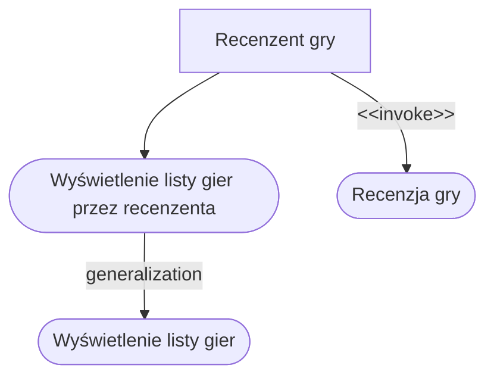

**PU001: Wyświetlenie listy gier**

- Wersja: 1.0 (14.04.2026)
- Odpowiedzialny: Maciej Bankiewicz
- Priorytet i trudność: Istotne
- Wydanie: 1.0
- **Opis:** System wyświetla listę zawierającą wszystkie stworzone uprzednio [gry].

**PU002: Wyświetlenie listy gier przez recenzenta**

- Wersja: 1.0 (14.04.2026)
- Odpowiedzialny: Maciej Bankiewicz
- Priorytet i trudność: Istotne
- Wydanie: 1.0
- **Opis:** System wyświetla listę zawierającą wszystkie stworzone uprzednio [gry] dodając do każdego rekordu opcję recenzji [gry].

**PU003: Recenzja gry**

- Wersja: 1.0 (14.04.2026)
- Odpowiedzialny: Maciej Bankiewicz
- Priorytet i trudność: Istotne
- Wydanie: 1.0
- **Opis:** System wyświetla okno do zapisu tekstu. [Recenzent] zapisuje [recenzję] i zatwierdza ją.

**Blokada konta**

- Typ: pojęcie systemowe
- Wersja: 1.0 (15.04.2026)
- Odpowiedzialna: Polina Nesterova
- Priorytet i trudność: Istotne
- Wydanie: 1.0

Tymczasowe wstrzymanie dostępu do konta użytkownika w reakcji na zdarzenie bezpieczeństwa (np. przekroczenie limitu nieudanych prób logowania) lub decyzję administratora. Blokada uniemożliwia logowanie do czasu odblokowania — automatycznego po upływie zdefiniowanego czasu lub ręcznego przez reset hasła.

---

**Strefa (Komnata)**

- Typ: pojęcie domenowe
- Wersja: 1.0 (15.04.2026)
- Odpowiedzialny: Kacper Koziara
- Priorytet i trudność: Istotne
- Wydanie: 1.0

Wydzielony fizycznie i wirtualnie obszar terenu gry, który może posiadać własne ograniczenia dostępu. Strefy mogą być ukryte na interaktywnej mapie gracza, dopóki jego postać nie zdobędzie odpowiednich uprawnień.

---

**Ekwipunek**

- Typ: pojęcie domenowe
- Wersja: 1.0 (15.04.2026)
- Odpowiedzialny: Kacper Koziara
- Priorytet i trudność: Kluczowe
- Wydanie: 1.0

Zbiór wirtualnych zasobów (przedmiotów questowych, kluczy, wirtualnej waluty) przypisanych do danej postaci w konkretnym wydarzeniu. Stan ekwipunku może ulegać zmianie poprzez akcje w grze oraz system handlu.

---

**Transakcja wymiany**

- Typ: pojęcie systemowe
- Wersja: 1.0 (15.04.2026)
- Odpowiedzialny: Kacper Koziara
- Priorytet i trudność: Istotne
- Wydanie: 1.0

Bezpieczny transfer zasobów wirtualnych między dwoma graczami, autoryzowany za pomocą aplikacji mobilnej (np. poprzez skanowanie kodu QR). Wymaga obecności obu stron transakcji i zatwierdzenia jej w systemie.

---

# 4. Wymagania użytkownika

## 4.1 Wymagania funkcjonalne

### 4.1.1 Zarządzanie wydarzeniami

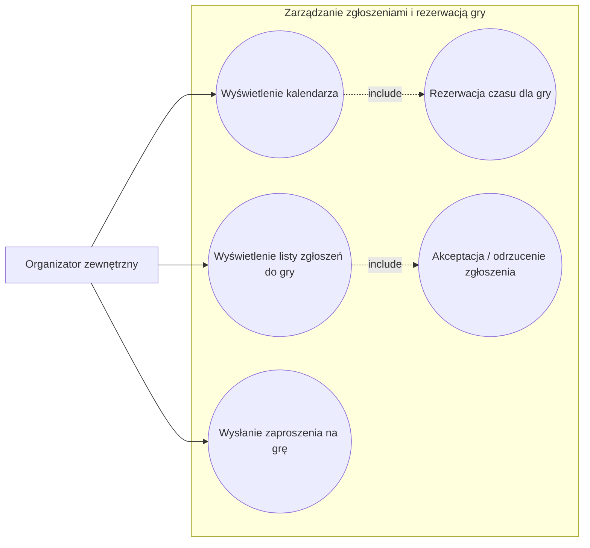

#### PU1: Wyświetlenie kalendarza

**Wersja:** 1.0 (14.04.2026)  
**Odpowiedzialny:** Hlib Filobok 
**Priorytet i trudność:** Istotne  
**Wydanie:** 1.0  

**Opis:** Organizator przegląda kalendarz dostępnych terminów gry. System wyświetla wolne i zajęte sloty czasowe na podstawie typu wybranej gry.

---

#### PU2: Rezerwacja czasu dla gry

**Wersja:** 1.0 (14.04.2026)  
**Odpowiedzialny:** Hlib Filobok  
**Priorytet i trudność:** Istotne  
**Wydanie:** 1.0  

**Opis:** Organizator wybiera dostępny termin w kalendarzu i dokonuje rezerwacji. System wyświetla prośbę o potwierdzenie (z opcją cofnięcia), następnie wymaga dokonania płatności. Potwierdzenie wysyła się do jego skrzynki wiadomości.

---

#### PU3: Wyświetlenie listy zgłoszeń do gry

**Wersja:** 1.0 (14.04.2026)  
**Odpowiedzialny:** Hlib Filobok  
**Priorytet i trudność:** Istotne  
**Wydanie:** 1.0  

**Opis:** Organizator przegląda listę zgłoszeń uczestników w swojej skrzynce wiadomości.

---

#### PU4: Akceptacja/odrzucenie zgłoszenia

**Wersja:** 1.0 (14.04.2026)  
**Odpowiedzialny:** Hlib Filobok  
**Priorytet i trudność:** Istotne  
**Wydanie:** 1.0  

**Opis:** Organizator wybiera zgłoszenie z listy i widzi profil gracza. Po naciśnięciu "Akceptuj" lub "Odrzuć" gracz jest przypisany do gry lub zgłoszenie zostaje odrzucone. Wiadomość znika ze skrzynki organizatora.

---

#### PU5: Wysłanie zaproszenia na grę

**Wersja:** 1.0 (14.04.2026)  
**Odpowiedzialny:** Hlib Filobok  
**Priorytet i trudność:** Istotne  
**Wydanie:** 1.0  

**Opis:** Organizator przechodzi do zakładki "Przyjaciele" i wybiera użytkownika. Po naciśnięciu "Zaproś" system wyświetla listę aktualnych gier. Po wyborze gry zaproszenie zostaje wysłane użytkownikowi.

---

## 4.1.2 Administracja kont
DIAGRAM:
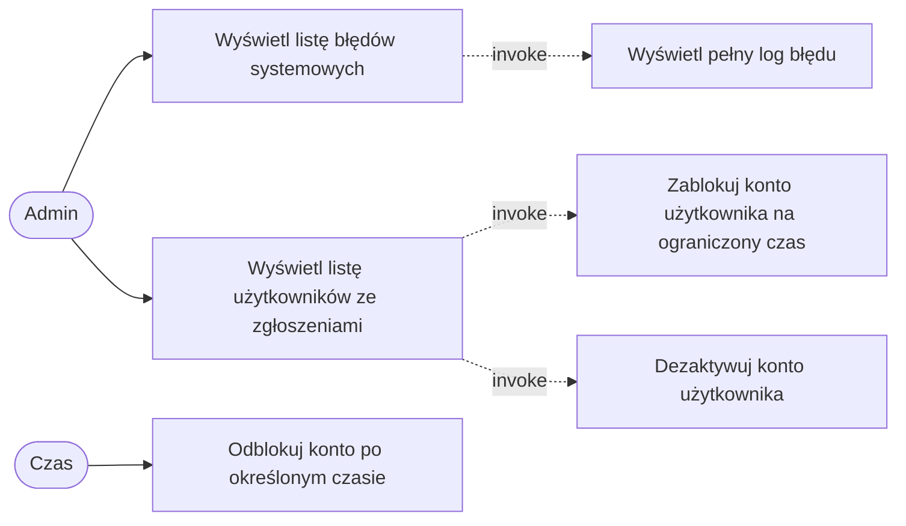

**PU1001: Wyświetlenie listy  użytkowników ze zgłoszeniami **
- Wersja: 1.0 (14.04.2026)
- Odpowiedzialna: Karolina Wiśniewska
- Wydanie: 1.0
- Opis: System wyświetla menu administratora. Administrator wybiera opcję wyświetlenia listy użytkowników, którzy zostali zgłoszeni za łamanie regulaminu/ zasad społeczności. system wyświetla listę

  
**PU1002: Zablokowanie konta użytkownika na ograniczony czas **
- Wersja: 1.0 (14.04.2026)
- Odpowiedzialna: Karolina Wiśniewska
- Wydanie: 1.0
- Opis: Invoked by PU1001. Administrator wybiera wybrane konto uczestnika. System wyświetla zapytanie o blokowanie lub dezaktywację konta. Administrator wybiera opcję zablokowania konta na ustalony czas. System nadaje kontu status zablokowanego  na określony czas.

  
**PU1003: Zablokowanie konta użytkownika na ograniczony czas **
- Wersja: 1.0 (14.04.2026)
- Odpowiedzialna: Karolina Wiśniewska
- Wydanie: 1.0
- Opis: Invoked by PU1001. Administrator wybiera wybrane konto uczestnika. System wyświetla zapytanie o blokowanie lub dezaktywację konta. Administrator wybiera opcję dezaktywacji konta. System usuwa konto z listy kont aktywnych. System zmienia status konta na zdezaktywowane

  
**PU1004: Odblokowanie konta po określonym czasie **
- Wersja: 1.0 (14.04.2026)
- Odpowiedzialna: Karolina Wiśniewska
- Wydanie: 1.0
- Opis: System odblokowuje konto po upływie określonego czasu.

  
  **PU1005: Wyświetlenie listy  błędów systemowych**
- Wersja: 1.0 (14.04.2026)
- Odpowiedzialna: Karolina Wiśniewska
- Wydanie: 1.0
- Opis: System wyświetla menu administratora. Administrator wybiera opcję wyświetlenia listy błędów systemowych.  System wyświetla listę błędów.

  
  **PU1006: Wyświetlenie pełnego logu błędu**
- Wersja: 1.0 (14.04.2026)
- Odpowiedzialna: Karolina Wiśniewska
- Wydanie: 1.0
- Opis: Invoked by PU1005. Administrator wybiera dowolny log błędu. System wyświetla szczegółowy zapis logu błędu systemowego

---
## 4.1.3 Autentykacja i historia wydarzeń
DIAGRAM:
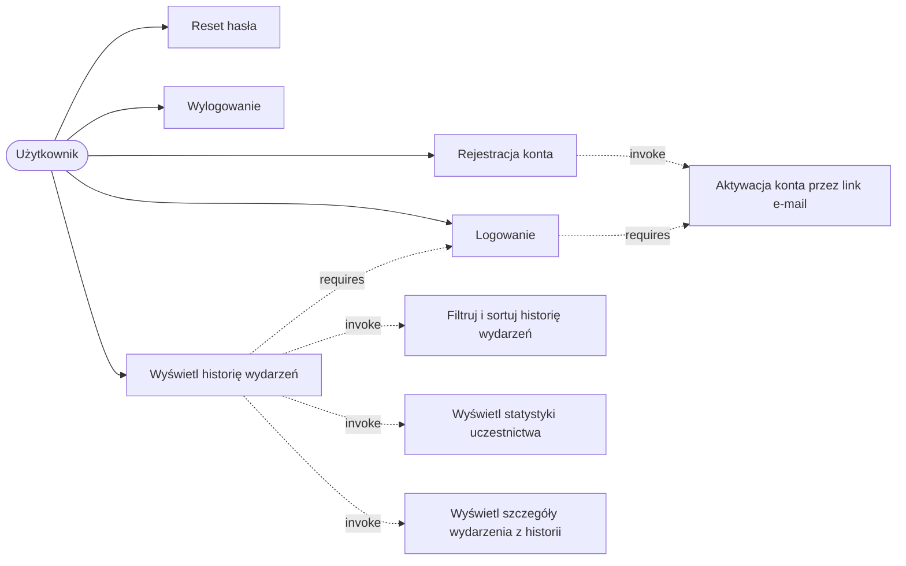

**PU1101: Rejestracja konta**
- Wersja: 1.0 (15.04.2026)
- Odpowiedzialna: Polina Nesterova
- Wydanie: 1.0
- Opis: System wyświetla formularz rejestracji. Użytkownik podaje imię, nazwisko, adres e-mail oraz hasło (dwukrotnie). System weryfikuje unikalność adresu e-mail w bazie, zapisuje konto ze statusem „nieaktywne" i wysyła na podany adres e-mail wiadomość z linkiem aktywacyjnym.

**PU1102: Aktywacja konta przez link e-mail**
- Wersja: 1.0 (15.04.2026)
- Odpowiedzialna: Polina Nesterova
- Wydanie: 1.0
- Opis: Invoked by PU1101. Użytkownik klika w link aktywacyjny otrzymany w wiadomości e-mail. System weryfikuje poprawność i ważność linku, zmienia status konta na „aktywne" oraz umożliwia logowanie.

**PU1103: Logowanie**
- Wersja: 1.0 (15.04.2026)
- Odpowiedzialna: Polina Nesterova
- Wydanie: 1.0
- Opis: System wyświetla ekran logowania. Użytkownik podaje adres e-mail oraz hasło. System weryfikuje dane uwierzytelniające oraz status konta (aktywne / nieaktywne / zablokowane). Po poprawnej autoryzacji system tworzy sesję użytkownika i przyznaje dostęp do funkcji systemu. Po przekroczeniu 5 nieudanych prób w ciągu 15 minut system tymczasowo blokuje konto.

**PU1104: Reset hasła**
- Wersja: 1.0 (15.04.2026)
- Odpowiedzialna: Polina Nesterova
- Wydanie: 1.0
- Opis: Użytkownik wybiera opcję „Nie pamiętam hasła" i podaje adres e-mail. System wysyła na ten adres jednorazowy link do resetu hasła (ważny 1 godzinę). Użytkownik po kliknięciu w link ustala nowe hasło, a system aktualizuje dane konta i unieważnia dotychczasową sesję.

**PU1105: Wylogowanie**
- Wersja: 1.0 (15.04.2026)
- Odpowiedzialna: Polina Nesterova
- Wydanie: 1.0
- Opis: Zalogowany użytkownik wybiera opcję wylogowania. System kończy sesję użytkownika, unieważnia token sesji i przekierowuje na ekran logowania.

**PU1106: Wyświetlenie historii wydarzeń**
- Wersja: 1.0 (15.04.2026)
- Odpowiedzialna: Polina Nesterova
- Wydanie: 1.0
- Opis: Zalogowany użytkownik wybiera zakładkę „Historia wydarzeń". System pobiera listę wydarzeń, w których użytkownik brał udział, i wyświetla ją w porządku chronologicznym wraz z podstawowymi informacjami (nazwa wydarzenia, data, lokalizacja, odgrywana postać, czas trwania, status).

**PU1107: Filtrowanie i sortowanie historii wydarzeń**
- Wersja: 1.0 (15.04.2026)
- Odpowiedzialna: Polina Nesterova
- Wydanie: 1.0
- Opis: Invoked by PU1106. Użytkownik wybiera filtry (przedział czasowy, typ wydarzenia, status, lokalizacja) lub sposób sortowania (data rosnąco/malejąco, nazwa wydarzenia). System aktualizuje wyświetlaną listę zgodnie z wybranymi kryteriami.

**PU1108: Wyświetlenie statystyk uczestnictwa**
- Wersja: 1.0 (15.04.2026)
- Odpowiedzialna: Polina Nesterova
- Wydanie: 1.0
- Opis: Invoked by PU1106. System agreguje dane z historii użytkownika i prezentuje statystyki: liczbę ukończonych sesji, całkowity czas uczestnictwa, najczęściej grane typy postaci, ulubione scenariusze oraz ranking organizatorów.

**PU1109: Wyświetlenie szczegółów wydarzenia z historii**
- Wersja: 1.0 (15.04.2026)
- Odpowiedzialna: Polina Nesterova
- Wydanie: 1.0
- Opis: Invoked by PU1106. Użytkownik wybiera konkretne wydarzenie z listy. System wyświetla szczegółowy widok wydarzenia — pełny opis postaci, przebieg sesji, współuczestników oraz dodatkowe materiały powiązane z wydarzeniem.

### 4.1.4 Obsługa wydarzeń

**PU401: Uruchomienie wydarzenia**

- Wersja: 1.0 (14.04.2026)
- Odpowiedzialny: Julian Stefan
- Wydanie: 1.0
- **Opis:** Po osiągnięciu warunków rozpoczęcia wydarzenia, mistrz wydarzenia rozpoczyna wydarzenie.

**PU402: Zakończenie wydarzenia**

- Wersja: 1.0 (14.04.2026)
- Odpowiedzialny: Julian Stefan
- Wydanie: 1.0
- **Opis:** Po osiągnięciu warunków zakończenia wydarzenia, mistrz wydarzenia konczy wydarzenie.

---
### 4.1.3 Gracz i jego akcje podczas wydarzenia

**Diagram:** Gracz i jego akcje podczas wydarzenia

**PU301: Skanowanie kodu QR**

- Wersja: 1.0 (14.04.2026)
- Odpowiedzialny: Tomasz Rogalski
- Priorytet i trudność: Kluczowe
- Wydanie: 1.0
- **Opis:** Gracz skanuje kod QR umieszczony na przedmiocie lub w otoczeniu gry, aby uruchomić mini-grę, albo skanuje kod QR innego gracza, aby zainicjować walkę.

**PU302: Granie w mini-grę**

- Wersja: 1.0 (14.04.2026)
- Odpowiedzialny: Tomasz Rogalski
- Priorytet i trudność: Istotne
- Wydanie: 1.0
- **Opis:** System uruchamia mini-grę opartą na szablonie. Gracz musi ukończyć ją w wyznaczonym czasie.

**PU303: Walczenie z innym graczem**

- Wersja: 1.0 (14.04.2026)
- Odpowiedzialny: Tomasz Rogalski
- Priorytet i trudność: Istotne
- Wydanie: 1.0
- **Opis:** System kalkuluje wynik walki na podstawie statystyk obu postaci i wyłania zwycięzcę.

**PU304: Otrzymanie nagrody**

- Wersja: 1.0 (14.04.2026)
- Odpowiedzialny: Tomasz Rogalski
- Priorytet i trudność: Istotne
- Wydanie: 1.0
- **Opis:** Po wygranej mini-grze lub walce system przyznaje graczowi nagrodę (np. przedmiot, punkty doświadczenia).

**PU305: Poniesienie konsekwencji**

- Wersja: 1.0 (14.04.2026)
- Odpowiedzialny: Tomasz Rogalski
- Priorytet i trudność: Istotne
- Wydanie: 1.0
- **Opis:** Po przegranej mini-grze lub walce gracz ponosi konsekwencje w postaci spadku HP lub utraty przedmiotu z ekwipunku.

### 4.1.5 Tworzenie gier
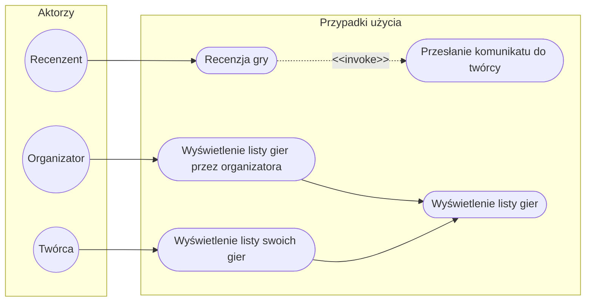

**PU109: Wyświetlenie listy gier przez twórcę** 
- Wersja: 1.0 (15.04.2026)
- Odpowiedzialny: Łukasz Czajka
- Opis: Twórcy gier mają możliwość wyświetlania listy gier, których są twórcami. Wybranie pozycji z listy pozwala na czynności takie jak edycja.

**PU110: Wyświetlenie listy gier przez organizatora** 
- Wersja: 1.0 (15.04.2026)
- Odpowiedzialny: Łukasz Czajka
- Opis: Organizatorzy mają możliwość wyświetlania gier, które mogą zostać zorganizowane.

**PU111: Przesłanie komunikatu do twórcy** 
- Wersja: 1.0 (15.04.2026)
- Odpowiedzialny: Łukasz Czajka
- Opis: Recenzenci mają możliwość przesłania uwag dotyczących recenzowanej gry.
---

## 4.1.12 Akcje Gracza w trakcie gry (Cezary Rybiński)
DIAGRAM:
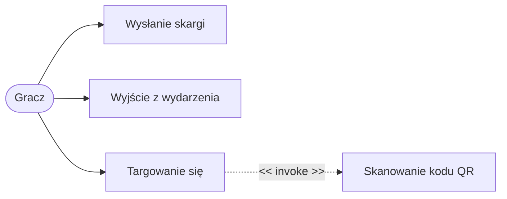

**PU1201: Wysłanie skargi**
- Wersja: 1.0 (15.04.2026)
- Odpowiedzialny: Cezary Rybiński
- Wydanie: 1.0
- Opis: Gracz inicjuje proces zgłoszenia poprzez menu aplikacji. System wymaga zdefiniowania kategorii problemu (błąd techniczny, zachowanie gracza, naruszenie bezpieczeństwa) oraz opisania go w dodatkowym polu. 

**PU1202: Wyjście z wydarzenia**
- Wersja: 1.0 (15.04.2026)
- Odpowiedzialny: Cezary Rybiński
- Wydanie: 1.0
- Opis: Gracz rezygnuje z dalszego udziału przed zakończeniem eventu. System weryfikuje posiadane przez gracza wirtualne przedmioty o znaczeniu krytycznym dla fabuły i przekazuje stosowny komunikat.

**PU1203: Targowanie się**
- Wersja: 1.0 (15.04.2026)
- Odpowiedzialny: Cezary Rybiński
- Wydanie: 1.0
- Opis: Gracz inicjujący wybiera zasoby do przekazania. System generuje unikalny kod QR transakcji. Aby sfinalizować proces drugi gracz musi dołączyć do interakcji, co realizowane jest poprzez PU1019: Skanowanie kodu QR. Następnie muszą zaakceptować wymianę lub ją odrzucić (wystarczy aby jedna ze stron się nie zgodziła na wymianę aby nie doszła do skutku).

**PU1204: Skanowanie kodu QR**
- Wersja: 1.0 (15.04.2026)
- Odpowiedzialny: Cezary Rybiński
- Wydanie: 1.0
- Opis: Gracz uruchamia skaner kodów QR w aplikacji i nakierowuje aparat na kod (wyświetlony u innego gracza lub umieszczony w przestrzeni gry). System dekoduje informację i wywołuje przypisaną do niej akcję.

---

## 4.1.13 Interaktywna mapa i wymiana zasobów (Kacper Koziara)
DIAGRAM:
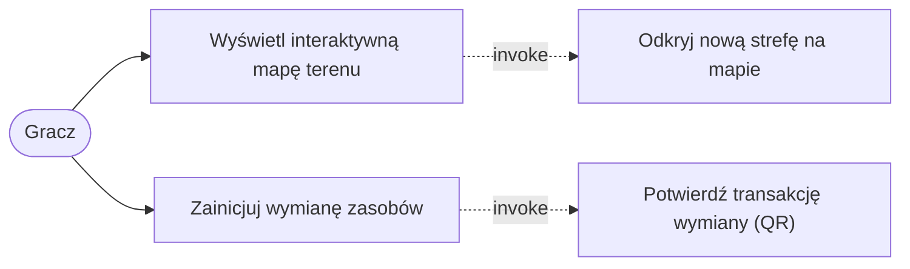

**PU1016: Wyświetlenie interaktywnej mapy terenu**
- Wersja: 1.0 (15.04.2026)
- Odpowiedzialny: Kacper Koziara
- Wydanie: 1.0
- Opis: System wyświetla ekran z mapą układu pomieszczeń (komnat). Mapa dynamicznie dostosowuje się do uprawnień posiadanych przez postać, prezentując graczowi ogólny zarys terenu i szczegóły dostępnych dla niego lokacji.

**PU1017: Odkrycie nowej strefy na mapie**
- Wersja: 1.0 (15.04.2026)
- Odpowiedzialny: Kacper Koziara
- Wydanie: 1.0
- Opis: Invoked by PU1016. Po uzyskaniu odpowiedniego uprawnienia (np. zdobycie fizycznego klucza, przedmiotu questowego lub zeskanowaniu kodu QR strefy), system odblokowuje przed graczem wcześniej niedostępną lub ukrytą część mapy.

**PU1018: Zainicjowanie wymiany zasobów**
- Wersja: 1.0 (15.04.2026)
- Odpowiedzialny: Kacper Koziara
- Wydanie: 1.0
- Opis: Gracz wybiera w module handlu przedmioty lub wirtualną walutę ze swojego ekwipunku, które chce przekazać innemu graczowi. System generuje na ekranie jego urządzenia unikalny, jednorazowy kod QR reprezentujący tę ofertę.

**PU1019: Potwierdzenie transakcji wymiany (QR)**
- Wersja: 1.0 (15.04.2026)
- Odpowiedzialny: Kacper Koziara
- Wydanie: 1.0
- Opis: Invoked by PU1018. Drugi gracz przy użyciu swojej aplikacji skanuje kod QR z ekranu inicjatora. System wyświetla podsumowanie, a po obustronnej akceptacji aktualizuje stany ekwipunków obu postaci i zapisuje transakcję w logach.

---
## 4.1.6 Zarządzanie wydarzeniami przez organizatora
DIAGRAM:
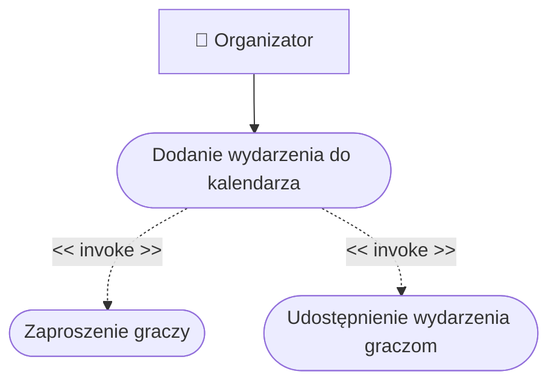

**PU1016: Dodanie wydarzenia do kalendarza**
- Wersja: 1.0 (15.04.2026)
- Odpowiedzialny: Olaf Smoleński
- Wydanie: 1.0
- Opis: Organizator dodaje wydarzenie do kalendarza. Przy dodawaniu musi podać najważniejsze informacje na temat wydarzenia - nazwę i ewentualny opis, datę i godzinę, miejsce, maksymalną liczbę graczy oraz wymagania dotyczące postaci. Po dodaniu wydarzenie jest widoczne w kalendarzu dla każdego użytkownika systemu.

**PU1017: Zaproszenie graczy**
- Wersja: 1.0 (15.04.2026)
- Odpowiedzialny: Olaf Smoleński
- Wydanie: 1.0
- Opis: Invoked by PU1016. Organizator wysyła graczom zaproszenia na wydarzenie. Organizator może wybrać graczy, którym wyśle zaproszenie, klikając przycisk *Zaproś graczy* w menu wydarzenia. Po jego kliknięciu pokazuje się lista zarejestrowanych graczy, spośród których organizator wybiera poszczególne osoby i klika przycisk *Wyślij zaproszenie*. Zaproszony gracz otrzymuje powiadomienie o zaproszeniu na wydarzenie.

**PU1018: Udostępnienie wydarzenia graczom**
- Wersja: 1.0 (15.04.2026)
- Odpowiedzialny: Olaf Smoleński
- Wydanie: 1.0
- Opis: Invoked by PU1016. Organizator, klikając przycisk *Udostępnij dla graczy* w menu wydarzenia, otwiera graczom możliwość zapisania się na dane wydarzenie. Gracz będzie mógł dokonać zapisu, jeżeli są jeszcze wolne miejsca na wydarzenie.

---

### 4.1.7 Rejestracja i zapis przed wydarzeniem
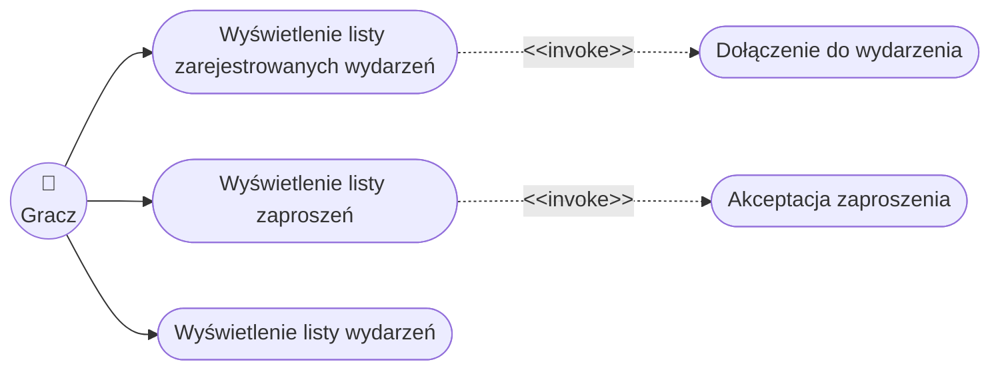

**PU301: Wyświetlenie listy wydarzeń**
- Wersja: 1.0 (14.04.2026)
- Odpowiedzialny: Michał Marciniak
- Priorytet i trudność: Kluczowe 
- Wydanie: 1.0
- **Opis:** System wyświetla listę wydarzeń. Gracz określa filtry wydarzeń. System wyświetla wydarzenia spełniające dane kryteria.

**PU302: Wyświetlenie listy zaproszeń**
- Wersja: 1.0 (14.04.2026)
- Odpowiedzialny: Michał Marciniak
- Priorytet i trudność: Istotne 
- Wydanie: 1.0
- **Opis:** System wyświetla listę otrzymanych zaproszeń gracza na wydarzenie, które nie zostały jeszcze rozpatrzone.

**PU303: Akceptacja zaproszenia**
- Wersja: 1.0 (14.04.2026)
- Odpowiedzialny: Michał Marciniak
- Priorytet i trudność: Istotne 
- Wydanie: 1.0
- **Opis:** Gracz wybiera zaproszenie do akceptacji. System sprawdza dostępność miejsc. W przypadku wolnych miejsc, system dodaje gracza do listy zarejestrowanych i usuwa zaproszenie z listy. W przeciwnym razie, system informuje o braku miejsc.

**PU304: Wyświetlenie listy zarejestrowanych wydarzeń**
- Wersja: 1.0 (14.04.2026)
- Odpowiedzialny: Michał Marciniak
- Priorytet i trudność: Kluczowe 
- Wydanie: 1.0
- **Opis:** Gracz wybiera wgląd w swoje rejestracje. System wyświetla wydarzenia, na które gracz jest zarejestrowany.

**PU305: Dołączenie do wydarzenia**
- Wersja: 1.0 (14.04.2026)
- Odpowiedzialny: Michał Marciniak
- Priorytet i trudność: Kluczowe 
- Wydanie: 1.0
- **Opis:** Gracz wybiera zarejestrowane wydarzenie i deklaruje chęć dołączenia. System sprawdza status wydarzenia i rejestruje obecność gracza.

### 4.1.8 Zarządzanie organizacją wydarzeń

DIAGRAM:
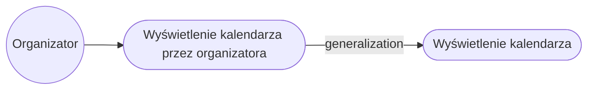

**PU991: Wyświetlenie kalendarza przez organizatora**
- Wersja: 1.0(14.04.2026)
- Odpowiedzialna: Alicja Rosiak
- Wydanie: 1.0
- Opis: System wyświetla kalendarz wydarzeń organizatora. Organizator widzi
  nadchodzące wydarzenia oraz wolne terminy.

### 4.1.9 Zapisy na wydarzenia

DIAGRAM:
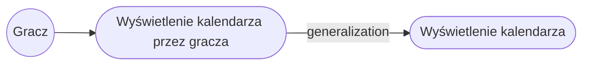

**PU981: Wyświetlenie kalendarza przez gracza**
- Wersja: 1.0(14.04.2026)
- Odpowiedzialna: Alicja Rosiak
- Wydanie: 1.0
- Opis: System wyświetla kalendarz wydarzeń gracza. Gracz widzi dostępne
  wydarzenia, wydarzenia w których bierze udział.

### 4.1.10 Projektowanie świata gry

DIAGRAM:
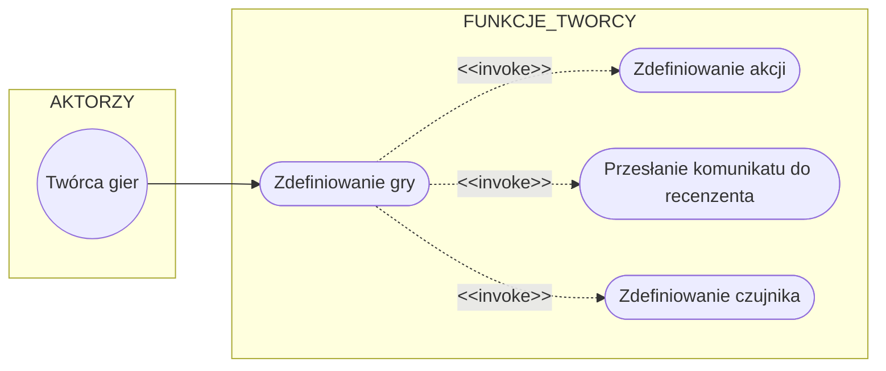
**PU201: Zdefiniowanie gry**
- Wersja: 1.0 (08.04.2026)
- Odpowiedzialny: Igor Ochocki
- Priorytet i trudność: Istotne
- Wydanie: 1.0
- **Opis:** System wyświetla formularz [opisu ogólnego gry]. Twórca gry wprowadza [dane opisu ogólnego gry] do formularza. Twórca gry może dodać [pozostałe elementy gry]. Twórca gry wciska przycisk zapisz. System zamyka formularz [opisu ogólnego gry] i wyświetla informację o poprawnym zapisie.

**PU202: Zdefiniowanie akcji**
- Wersja: 1.0 (08.04.2026)
- Odpowiedzialny: Igor Ochocki
- Priorytet i trudność: Kluczowe
- Wydanie: 1.0
- **Opis:** System wyświetla formularz [definicji akcji]. Twórca gry wybiera [typ akcji], a następnie uzupełnia [skutki akcji]. Na koniec twórca gry wciska przycisk `zapisz i zamknij`. System zamyka formularz [definicji akcji].

**PU203: Przesłanie komunikatu do recenzenta**
- Wersja: 1.0 (08.04.2026)
- Odpowiedzialny: Igor Ochocki
- Priorytet i trudność: Istotne
- Wydanie: 1.0
- **Opis:** Twórca gry wprowadza treść [komunikatu do recenzenta] a następnie klika wyślij. System wyświetla informację o potwierdzeniu przesłania komunikatu i dodaje ją do [okna komunikacji twórcy gry z recenzentem].

**PU204: Zdefiniowanie czujnika**
- Wersja: 1.1(24.04.2026)
- Odpowiedzialna: Alicja Rosiak
- Wydanie: 1.0
- **Opis:** System wyświetla [formularz definicji czujnika]. Twórca wybiera
  umiejscowienie [czujnika] na [mapie]. Następnie wybiera [akcję]
  z [listy akcji]. Po zakończeniu twórca zapisuje zmiany. System zamyka
  [formularz definicji czujnika].

---

# 5. Scenariusze i scenopisy

## 5.1 PU001: Dodanie nowego samochodu

**Scenariusz główny**

1. Aktor wybiera opcję
2. System wyświetla ekran

**Diagram:** Dodanie nowego samochodu - scenopis

---

## 5.2 PU101: Dokonanie płatności online

**Scenariusz główny**

1. Aktor wybiera opcję
2. System wyświetla ekran

---

## 5.3 PU106: Wydanie samochodu do sprzedaży

**Scenariusz główny**

1. Aktor wybiera opcję
2. System wyświetla okno
3. System zapisuje dane

**Błąd danych**

1-2. -"-  
3a. System wyświetla komunikat

---

## 5.4 PU1009: Logowanie

- Wersja: 1.0 (15.04.2026)
- Odpowiedzialna: Polina Nesterova
- Wydanie: 1.0
- Aktor główny: Użytkownik
- Warunek początkowy: Użytkownik posiada zarejestrowane i aktywowane konto.
- Warunek końcowy (sukces): Użytkownik jest zalogowany, system utworzył sesję i wyświetla ekran główny.

**Scenariusz główny**

1. Użytkownik uruchamia aplikację i wybiera opcję „Zaloguj się".
2. System wyświetla formularz logowania z polami adres e-mail oraz hasło.
3. Użytkownik wprowadza adres e-mail oraz hasło i potwierdza przyciskiem „Zaloguj".
4. System weryfikuje poprawność danych uwierzytelniających w bazie użytkowników.
5. System sprawdza status konta (aktywne / nieaktywne / zablokowane).
6. System tworzy nową sesję użytkownika i generuje token sesji.
7. System zapisuje informację o zalogowaniu (data, godzina, adres IP) w historii konta.
8. System przekierowuje użytkownika na ekran główny i wyświetla powitanie.

**Scenariusz alternatywny A: Niepoprawne dane uwierzytelniające**

4a. System nie znajduje użytkownika o podanym adresie e-mail lub hasło nie pasuje do zapisanego w bazie.
1. System wyświetla komunikat „Niepoprawny adres e-mail lub hasło" bez wskazywania, które pole jest błędne.
2. System inkrementuje licznik nieudanych prób logowania dla tego konta.
3. Scenariusz wraca do kroku 2 scenariusza głównego.

**Scenariusz alternatywny B: Konto nieaktywowane**

5a. System stwierdza, że konto ma status „nieaktywne".
1. System wyświetla komunikat „Konto nie zostało jeszcze aktywowane. Sprawdź skrzynkę e-mail i kliknij w link aktywacyjny".
2. System oferuje opcję ponownego wysłania linku aktywacyjnego.
3. Użytkownik wybiera opcję wysłania linku lub zamyka formularz.

**Scenariusz alternatywny C: Konto zablokowane**

5b. System stwierdza, że konto ma status „zablokowane".
1. System wyświetla komunikat „Konto zostało tymczasowo zablokowane. Spróbuj ponownie za [pozostały czas] lub zresetuj hasło".
2. System oferuje opcję resetu hasła.
3. Logowanie zostaje przerwane.

**Scenariusz alternatywny D: Przekroczenie limitu prób**

4b. Licznik nieudanych prób przekracza 5 w ciągu 15 minut.
1. System zmienia status konta na „zablokowane" na okres 15 minut.
2. System wysyła na adres e-mail użytkownika powiadomienie o próbach logowania i blokadzie.
3. System wyświetla komunikat o blokadzie konta.
4. Logowanie zostaje przerwane.

**Scenariusz alternatywny E: Zapomniane hasło**

3a. Użytkownik wybiera opcję „Nie pamiętam hasła" zamiast potwierdzania logowania.
1. System przekierowuje do przypadku użycia PU1010 (Reset hasła).

---

## 5.5 PU1018/PU1019: Dokonanie wymiany zasobów między graczami

- Wersja: 1.0 (15.04.2026)
- Odpowiedzialny: Kacper Koziara
- Wydanie: 1.0
- Aktor główny: Gracz A (Inicjator)
- Aktor pomocniczy: Gracz B (Odbiorca)
- Warunek początkowy: Obaj gracze są zalogowani do aplikacji, uczestniczą w tym samym aktywnym wydarzeniu LARP, a Gracz A posiada w ekwipunku zasoby, które chce przekazać.
- Warunek końcowy (sukces): Wybrane zasoby zostały bezpiecznie przeniesione z ekwipunku Gracza A do ekwipunku Gracza B, a system zapisał log z transakcji.

**Scenariusz główny**

1. Gracz A wybiera w swojej aplikacji moduł „Handel / Wymiana”.
2. System wyświetla listę dostępnych zasobów w ekwipunku Gracza A.
3. Gracz A zaznacza przedmioty i/lub wpisuje kwotę wirtualnej waluty, którą chce przekazać, a następnie klika „Generuj ofertę”.
4. System tymczasowo blokuje wybrane zasoby u Gracza A i wyświetla na jego ekranie jednorazowy kod QR reprezentujący ofertę.
5. Gracz B otwiera w swojej aplikacji skaner kodów i skanuje kod QR z ekranu Gracza A.
6. System wyświetla na ekranie Gracza B okno podsumowania („Gracz A chce przekazać Ci: [lista]”) i prosi o akceptację.
7. Gracz B wybiera przycisk „Zatwierdź transakcję”.
8. System weryfikuje poprawność danych i dokonuje transferu, aktualizując stany ekwipunków obu postaci w bazie danych.
9. System zapisuje szczegóły operacji (data, strony transakcji, zasoby) w logach wydarzenia.
10. System wyświetla obu graczom komunikat o pomyślnym zakończeniu wymiany.

**Scenariusz alternatywny A: Odrzucenie transakcji przez Odbiorcę**

7a. Gracz B wybiera przycisk „Odrzuć”.
1. System przerywa operację i zdejmuje blokadę z zasobów Gracza A.
2. System wyświetla Graczowi A komunikat „Transakcja została odrzucona przez drugą stronę”.
3. Wygenerowany kod QR zostaje trwale unieważniony.

**Scenariusz alternatywny B: Przekroczenie limitu czasu (Timeout)**

5a. Gracz B nie zdąży zeskanować kodu lub zatwierdzić operacji w określonym czasie (np. 3 minuty).
1. System automatycznie anuluje ofertę i zdejmuje blokadę z zasobów Gracza A.
2. System wyświetla Graczowi A komunikat „Czas na akceptację transakcji minął”.
3. Kod QR zostaje unieważniony, proces wymiany należy zainicjować od nowa.

---

## 5.5 PU2: Rezerwacja czasu dla gry

- Wersja: 1.0 (15.04.2026)
- Odpowiedzialna: FilobokHlib i Maksym Andrushchenko
- Wydanie: 1.0
- Aktor główny: Organizator zewnętrzny
- Warunek początkowy: Organizator zewnętrzny jest zalogowany na stronie głównej i posiada uprawnienia do tworzenia gier, rezerwacji czasu dla gry, zarządzaniem uczęstnikami do gry i komunikacji z nimi.
- Warunek końcowy (sukces): Rezerwacja czasu została utworzona, terminy są niedostępne dla innych użytkowników, organizator otrzymał potwierdzenie w skrzynce wiadomości, a płatność została przetworzona.

Scenariusz główny

1. Organizator znajduje się na stronie głównej i klika przycisk „Stwórz grę".
2. System wyświetla formularz tworzenia gry z polami wymaganymi: nazwa gry, typ gry, liczba uczestników, poziom trudności i dodatkowe informacje (opcjonalne).
3. Organizator wypełnia wszystkie wymagane pola formularza.
4. System waliduje poprawność danych wpisanych w formularz.
5. Organizator potwierdza formularz przyciskiem „Dalej".
6. System pobiera dane z formularza i przekierowuje organizatora do kalendarza.
7. Kalendarz wyświetla dostępne godziny dostosowane do czasu trwania wybranego typu gry (różne gry mają różny czas trwania).
8. System uniemożliwia wybranie terminów niedostępnych (zarezerwowane, poza godzinami pracy, itp.).
9. Organizator wybiera jeden lub więcej dostępnych terminów z kalendarza.
10. System wyznacza przedział czasowy dla każdego wybranego terminu.
11. Organizator potwierdza wybór terminów przyciskiem „Potwierdź wybór".
12. System wyświetla podsumowanie rezerwacji zawierające dane gry, wybrane terminy i całkowity koszt.
13. Organizator ma możliwość potwierdzenia rezerwacji przyciskiem „Potwierdź i płać" lub cofnięcia operacji przyciskiem „Cofnij".
14. Organizator potwierdza rezerwację przyciskiem „Potwierdź i płać".
15. System przenosi organizatora do modułu płatności.
16. Organizator dokonuje płatności.
17. System potwierdza wykonanie transakcji.
18. Po udanej płatności system blokuje wybrane terminy w kalendarzu i rejestruje rezerwację w bazie danych.
19. System generuje potwierdzenie rezerwacji i wysyła powiadomienie do skrzynki wiadomości organizatora zawierające dane gry, zarezerwowane terminy i numer rezerwacji.
20. System przekierowuje organizatora na stronę główną.

Scenariusz alternatywny A: Anulowanie na etapie formularza

5a. Organizator klika przycisk „Anuluj" podczas wypełniania formularza.
1. System powraca na stronę główną bez zapisywania danych.
2. Dane formularza są tracone.

Scenariusz alternatywny B: Brak wymaganych pól w formularzu

4a. System stwierdza, że jedno lub więcej wymaganych pól formularza jest puste.
1. System wyświetla komunikat „Uzupełnij wszystkie wymagane pola" i podświetla brakujące pola.
2. Scenariusz wraca do kroku 3 scenariusza głównego.

Scenariusz alternatywny C: Brak dostępnych terminów

7a. System nie znalazł dostępnych terminów dla wybranego typu gry.
1. System wyświetla komunikat „Brak dostępnych terminów dla wybranego typu gry".
2. System oferuje organizatorowi opcje: zmianę danych gry lub powrót do strony głównej.
3. Organizator wybiera jedną z opcji.

Scenariusz alternatywny D: Cofnięcie operacji przed potwierdzeniem

13a. Organizator klika przycisk „Cofnij" w podsumowaniu rezerwacji.
1. System powraca do kalendarza.
2. Wcześniej wybrane terminy są odznaczane.
3. Organizator może wybrać inne terminy lub anulować operację przyciskiem „Anuluj".

Scenariusz alternatywny E: Brak zaznaczonych terminów

11a. Organizator klika przycisk „Potwierdź wybór" bez wybrania żadnego terminu.
1. System wyświetla komunikat „Wybierz co najmniej jeden termin".
2. Scenariusz wraca do kroku 9 scenariusza głównego.

Scenariusz alternatywny F: Błąd płatności
17a. Płatność nie powiodła się z powodu błędu systemu płatności, braku środków lub innych przyczyn.
1. System wyświetla komunikat o błędzie płatności.
2. System oferuje organizatorowi opcje: ponowienie próby płatności lub anulowanie rezerwacji.
3. Jeśli organizator wybierze anulowanie, rezerwacja nie jest tworzona i terminy pozostają dostępne.
4. Jeśli organizator wybierze ponowienie próby, system przenosi go do modułu płatności (scenariusz wraca do kroku 15 scenariusza głównego).

Scenariusz alternatywny G: Timeout sesji

(W dowolnym momencie scenariusza głównego lub alternatywnego) Sesja organizatora wygasa z powodu nieaktywności.
1. System wylogowuje użytkownika.
2. System wyświetla komunikat „Sesja wygasła. Zaloguj się ponownie".
3. System przekierowuje organizatora na ekran logowania.
4. Rezerwacja nie jest tworzona i terminy pozostają dostępne.

Scenariusz alternatywny H: Wybrany termin stanie się niedostępny

9a. Między momentem wyświetlenia kalendarza a potwierdzeniem rezerwacji (krok 11) wybrany termin zostaje zarezerwowany przez innego użytkownika.
1. System wykrywa konflikt dostępności podczas potwierdzania rezerwacji.
2. System wyświetla komunikat „Wybrany termin jest już niedostępny. Dostępne są inne terminy".
3. System oferuje organizatorowi powrót do kalendarza w celu wybrania innych dostępnych terminów.
4. Scenariusz wraca do kroku 9 scenariusza głównego.

## 5.6 PU204: Zdefiniowanie czujnika**

- Wersja: 1.1 (24.04.2026)
- Odpowiedzialna: Alicja Rosiak
- Wydanie: 1.0
- Aktor główny: Twórca gry
- Warunek początkowy: Twórca gry jest zalogowany
  i jest w menu definiowania gry
  i conajmniej jedna akcja została zdefiniowana dla danej gry
  i mapa gry została została zdefiniowana dla danej gry

**Scenariusz główny**

1. Twórca wybiera opcję dodania nowego czujnika.
2. System wyświetla formularz definicji czujnika.
3. Twórca wybiera opcję wybrania pozycji czujnika.
4. System wyświetla okno podglądu mapy.
5. Twórca wybiera pozycję nowego czujnika.
6. System zamyka okno podglądu mapy.
7. Twórca uzupełnia pozostałe dane czujnika.
8. Twórca wybiera opcję zapisu i zamknięcia formularza.  
[dane poprawne]
9. System zapisuje nowy czujnik.  
[zapis pomyślny]
10. System wyświetla komunikat o pomyślnym dodaniu czujnika.

Warunek końcowy: nowy czujnik jest zarejestrowany dla danej gry

**Scenariusz alternatywny 1**

1.-8. jak w Scenariuszu głównym  
[dane niepoprawne]  
9a. System wyświetla komunikat o błędnych danych.  
Powrót do kroku 3. w Scenariuszu głównym

**Scenariusz alternatywny 2**

1.-9. jak w Scenariuszu głównym  
[zapis niepomyślny]  
10b. System wyświetla komunikat o błędzie zapisu.  
11b. System zamyka formularz definicji czujnika.

Warunek końcowy: nowy czujnik nie został zarejestrowany dla danej gry
