# SPECYFIKACJA WYMAGAŃ

## System wpierający organizację komnatowych wydarzeń LARP

**Redaktor:** zespół projektu  
**Status:**

**Wersja:** 1.0  
**Data modyfikacji:** 26.02.2026

**Motto:**  
Platforma umożliwiająca organizowanie, zarządzanie i uczestnictwo w wydarzeniach LARP w jednym miejscu.

---

## Historia zmian:

- **26.02.2023** – Maksym Andrushchenko - dodany dokument md

---

# 1. Wprowadzenie

## 1.1 Cel dokumentu

Tutaj znajdzie się opis celu dokumentu...

## 1.2 Streszczenie dla kierownictwa

Tutaj znajdzie się streszczenie dla kierownictwa...

---

# 2. Opis biznesu

## 2.1 Procesy biznesowe

**Diagram:** Proces 1

---

# 3. Wizja systemu

## 3.1 Opis problemu

**P001: Problem organizacji wydarzeń LARP**

**Typ: «Wizja»**

Wersja: 1.0 (10.03.2026)

Odpowiedzialny: Maksym Andruchchenko

Priorytet i trudność: Istotne

Wydanie: 1.0

Problem związany z organizacją i zarządzaniem wydarzeniami LARP, dotyczący graczy, organizatorów wydarzeń oraz administratorów platformy, czego wynikiem jest trudność w wyszukiwaniu wydarzeń, zarządzaniu zapisami uczestników, komunikacji między uczestnikami oraz kontrolowaniu przebiegu gry.

Obecnie wiele zadań organizacyjnych wykonywanych jest ręcznie lub przy użyciu różnych, niespójnych narzędzi (np. komunikatorów, arkuszy kalkulacyjnych czy formularzy internetowych), co prowadzi do błędów organizacyjnych, problemów komunikacyjnych oraz ograniczonej kontroli nad przebiegiem wydarzenia.

Problem można rozwiązać budując zintegrowany system wspierający organizację wydarzeń LARP, który umożliwia tworzenie wydarzeń, zarządzanie uczestnikami, obsługę scenariuszy gry oraz interakcję graczy z elementami świata gry poprzez aplikację mobilną.

## Dzięki temu organizatorzy będą mogli sprawniej zarządzać wydarzeniami, gracze łatwiej znajdą interesujące rozgrywki, a cały proces organizacji i prowadzenia wydarzeń stanie się bardziej uporządkowany i efektywny.

## 3.2 Interesariusze

**Diagram:** Interesariusze

**Gracz**

- Typ: «interesariusz»
- Wersja: 1.0 (08.03.2026)
- Odpowiedzialny: TBD
- Priorytet i trudność: Wysoki
- Wydanie: 1.0

Gracz jest użytkownikiem systemu biorącym udział w wydarzeniach LARP. Jego głównym celem jest znalezienie interesujących wydarzeń, zapisanie się na nie oraz uczestnictwo w rozgrywce. Gracz korzysta z systemu do zarządzania swoim profilem, wybierania postaci, komunikacji z innymi uczestnikami oraz śledzenia swoich osiągnięć i historii wydarzeń.

**Administrator systemu**

- Typ: «interesariusz»
- Wersja: 1.0 (08.03.2026)
- Odpowiedzialny: TBD
- Priorytet i trudność: Średni
- Wydanie: 1.0

Administrator systemu odpowiada za utrzymanie poprawnego działania platformy. Jego zadaniem jest zarządzanie użytkownikami, moderowanie zgłoszeń problemów, kontrolowanie bezpieczeństwa systemu oraz weryfikowanie wydarzeń tworzonych przez użytkowników. Administrator posiada dostęp do narzędzi umożliwiających monitorowanie działania systemu.

**Organizator wydarzeń**

- Typ: «interesariusz»
- Wersja: 1.0 (08.03.2026)
- Odpowiedzialny: TBD
- Priorytet i trudność: Wysoki
- Wydanie: 1.0

Organizator wydarzeń odpowiada za przygotowanie i przeprowadzenie wydarzeń LARP. Korzysta z systemu w celu tworzenia nowych wydarzeń, zarządzania zapisami uczestników, planowania scenariusza gry oraz komunikacji z graczami przed i w trakcie wydarzenia. System powinien umożliwiać organizatorowi sprawne zarządzanie wszystkimi elementami wydarzenia.

---

## 3.3 Cechy funkcjonalne

### 3.3.1 Zarządzanie Użytkownikami

#### Wysoki Priorytet

F01: System powinien umożliwiać rejestrację nowego konta.
| Typ: _funkcjonalne_ | Wersja: 1.0 (02.03.2026) | Odpowiedzialny: Karolina Wiśniewska|
| :--- | :--- | :--- |
| Priorytet: Kluczowe || Wydanie: 1.0 |
| Zaimplementowanie funkcjonalności umożliwiającej użytkownikowi rejestrację konta na platformie. Tworzone konto wymaga od użytkownika podania swojego adresu e-mail, dostępnej i unikatowej nazwy konta, oraz dwukrotnego podania hasła. System powinien posiadać odpowiednie wymagania dotyczące hasła (np. długość, rodzaj znaków) i informować, kiedy użytkownik podał odpowiedni przykład. Rejestracja konta możliwa jest po potwierdzeniu tożsamości za pomocą podanego adresu e-mail.|

F02: System powinien umożliwiać edycję danych osobowych w profilu użytkownika.
| Typ: _funkcjonalne_ | Wersja: 1.0 (01.03.2026) | Odpowiedzialny: Polina Nesterova |
| :--- | :--- | :--- |
| Priorytet: Kluczowe || Wydanie: 1.0 |
| Zaimplementowanie panelu umożliwiającego użytkownikowi edycję swoich danych osobowych w systemie. Użytkownik powinien móc zmienić imię, nazwisko, adres email, numer telefonu oraz hasło do konta. System powinien wymagać potwierdzenia zmiany wrażliwych danych (email, hasło) poprzez weryfikację aktualnego hasła lub kod wysłany na dotychczasowy adres email. Wszystkie zmiany danych osobowych powinny być zapisywane w historii zmian konta dla celów bezpieczeństwa. |

F03: System powinien umożliwiać usunięcie konta użytkownika.
| Typ: _funkcjonalne_ | Wersja: 1.0 (28.02.2026) | Odpowiedzialny: Maciej Bankiewicz |
| :--- | :--- | :--- |
| Priorytet: Kluczowe || Wydanie: 1.0 |
| Zaimplementowanie opcji usunięcia konta użytkownika. Ta opcja powinna być jasno przedstawiona użytkownikowi i opatrzona ostrzeżeniami przed przypadkowym usunięciem konta, jednak musi byc łatwo dostępna. |

#### Średni Priorytet

F04: System powinien umożliwiać przeglądanie historii uczestnictwa w wydarzeniach.
| Typ: _funkcjonalne_ | Wersja: 1.0 (01.03.2026) | Odpowiedzialny: Polina Nesterova |
| :--- | :--- | :--- |
| Priorytet: Istotne || Wydanie: 1.0 |
| Zaimplementowanie sekcji pozwalającej użytkownikowi na przeglądanie pełnej historii wydarzeń LARP, w których brał udział. System powinien wyświetlać listę wszystkich ukończonych sesji z podstawowymi informacjami (data, nazwa wydarzenia, lokalizacja, odegrana postać, czas trwania), a także prezentować zagregowane statystyki takie jak: całkowita liczba ukończonych sesji, najczęściej grane role, ulubione scenariusze i typy wydarzeń. Historia powinna być sortowalna według daty oraz filtrowalna według typu wydarzenia, odgrywanej postaci lub organizatora. |

F05: System powinien umożliwiać zarządzanie preferencjami użytkownika.
| Typ: _funkcjonalne_ | Wersja: 1.0 (01.03.2026) | Odpowiedzialny: Polina Nesterova |
| :--- | :--- | :--- |
| Priorytet: Przydatne || Wydanie: 1.0 |
| Zaimplementowanie sekcji konfiguracji preferencji systemowych użytkownika. Użytkownik powinien móc skonfigurować ustawienia powiadomień (email, SMS, powiadomienia push dla aplikacji mobilnej), określić preferencje dotyczące typów wydarzeń LARP (fantasy, sci-fi, horror, historyczne), wskazać preferowane dni tygodnia i przedziały czasowe uczestnictwa, oraz ustawić poziom prywatności profilu określający widoczność swoich danych i statystyk dla innych użytkowników systemu. |

F06: System powinien umożliwiać logowanie metodą dwuetapową.
| Typ: _funkcjonalne_ | Wersja: 1.0 (02.03.2026) | Odpowiedzialny: Karolina Wiśniewska|
| :--- | :--- | :--- |
| Priorytet: Użyteczne || Wydanie: 1.0 |
| Zaimplementowanie funkcjonalności umożliwiającej użytkownikowi dwuetapowe potwierdzenie tożsamości, pierwszy raz za pomocą hasła i drugi raz np. za pomocą kodu QR pochodzącego od dezygnowanej aaplikacji. Użytkownik powinien mieć możliwość włączenia tej opcji wedle życzenia, oraz wyłączenia jej przy pomocy np. adresu mailowego.|

#### Niski Priorytet

F07: System powinien umożliwiać tworzenie rankingu graczy.
| Typ: _funkcjonalne_ | Wersja: 1.0 (08.03.2026) | Odpowiedzialny: Maksym Andrushchenko |
| :--- | :--- | :--- |
| Priorytet: Istotne || Wydanie: 1.0 |
| System powinien tworzyć ranking graczy na podstawie ich osiągnięć, zdobytych punktów oraz aktywności w wydarzeniach. Ranking powinien być widoczny dla użytkowników w systemie.

F08: System powinien umożliwiać naliczanie doświadczenia graczy.
| Typ: _funkcjonalne_ | Wersja: 1.0 (08.03.2026) | Odpowiedzialny: Maksym Andrushchenko |
| :--- | :--- | :--- |
| Priorytet: Istotne || Wydanie: 1.0 |
| Po zakończeniu wydarzenia system powinien przyznawać graczom punkty doświadczenia na podstawie ich aktywności oraz wyników w trakcie rozgrywki. Punkty doświadczenia powinny wpływać na poziom postaci oraz statystyki użytkownika. |

### 3.3.2 Zarządzanie wydarzeniami

#### Wysoki Priorytet

F09: System powinien umożliwiać tworzenie wydarzeń LARP.
| Typ: _funkcjonalne_ | Wersja: 1.0 (08.03.2026) | Odpowiedzialny: Maksym Andrushchenko |
| :--- | :--- | :--- |
| Priorytet: Kluczowe || Wydanie: 1.0 |
| System powinien umożliwiać organizatorowi tworzenie nowego wydarzenia LARP. Organizator powinien móc określić nazwę wydarzenia, lokalizację, datę, maksymalną liczbę uczestników oraz wymagania dotyczące postaci. Utworzone wydarzenie powinno być widoczne dla użytkowników w systemie po jego zatwierdzeniu. |

F10: System powinien umożliwiać zapisanie się na wydarzenie.
| Typ: _funkcjonalne_ | Wersja: 1.0 (08.03.2026) | Odpowiedzialny: Maksym Andrushchenko |
| :--- | :--- | :--- |
| Priorytet: Kluczowe || Wydanie: 1.0 |
| Użytkownik powinien mieć możliwość zapisania się na wydarzenie poprzez wybór dostępnego wydarzenia z listy. System powinien automatycznie dodawać użytkownika do listy uczestników lub do listy rezerwowej w przypadku osiągnięcia maksymalnej liczby miejsc. |

F11: System powinien umożliwiać wyszukiwanie wydarzeń.
| Typ: _funkcjonalne_ | Wersja: 1.0 (08.03.2026) | Odpowiedzialny: Maksym Andrushchenko |
| :--- | :--- | :--- |
| Priorytet: Kluczowe || Wydanie: 1.0 |
| System powinien umożliwiać użytkownikom wyszukiwanie wydarzeń LARP według różnych kryteriów, takich jak data, lokalizacja, liczba uczestników, poziom trudności oraz typ gry. Wyniki wyszukiwania powinny być prezentowane w formie listy wraz z podstawowymi informacjami o wydarzeniu. |

F12: System powinien umożliwiać uruchomienie wydarzenia.
| Typ: _funkcjonalne_ | Wersja: 1.0 (08.03.2026) | Odpowiedzialny: Maksym Andrushchenko |
| :--- | :--- | :--- |
| Priorytet: Kluczowe || Wydanie: 1.0 |
| Organizator wydarzenia powinien mieć możliwość uruchomienia wydarzenia w systemie w momencie rozpoczęcia rozgrywki. Uruchomienie wydarzenia aktywuje mechaniki gry, interakcje z obiektami oraz funkcje komunikacyjne dla uczestników. |

F13: System powinien umożliwiać odwołanie wydarzenia.
| Typ: _funkcjonalne_ | Wersja: 1.0 (08.03.2026) | Odpowiedzialny: Maksym Andrushchenko |
| :--- | :--- | :--- |
| Priorytet: Istotne || Wydanie: 1.0 |
| Organizator wydarzenia powinien mieć możliwość odwołania wydarzenia przed jego rozpoczęciem. W przypadku anulowania wydarzenia system powinien powiadomić wszystkich zapisanych użytkowników oraz zaktualizować status wydarzenia. |

F14: System powinien umożliwiać automatyczne odwołanie wydarzenia.
| Typ: _funkcjonalne_ | Wersja: 1.0 (08.03.2026) | Odpowiedzialny: Maksym Andrushchenko |
| :--- | :--- | :--- |
| Priorytet: Istotne || Wydanie: 1.0 |
| System powinien automatycznie anulować wydarzenie w przypadku niespełnienia określonych warunków, takich jak brak minimalnej liczby uczestników lub problemy techniczne uniemożliwiające przeprowadzenie wydarzenia. |

#### Średni Priorytet

F15: System powinien umożliwiać zapraszanie graczy do wydarzenia.
| Typ: _funkcjonalne_ | Wersja: 1.0 (08.03.2026) | Odpowiedzialny: Maksym Andrushchenko |
| :--- | :--- | :--- |
| Priorytet: Istotne || Wydanie: 1.0 |
| Organizator wydarzenia powinien mieć możliwość wyszukiwania użytkowników systemu oraz wysyłania im zaproszeń do udziału w konkretnym wydarzeniu. Zaproszeni użytkownicy powinni otrzymać powiadomienie w systemie oraz możliwość zaakceptowania lub odrzucenia zaproszenia. |

F16: System powinien udostępniać panel zarządzania wydarzeniem dla organizatora.
| Typ: _funkcjonalne_ | Wersja: 1.0 (08.03.2026) | Odpowiedzialny: Maksym Andrushchenko |
| :--- | :--- | :--- |
| Priorytet: Istotne || Wydanie: 1.0 |
| Organizator powinien mieć dostęp do panelu zarządzania wydarzeniem umożliwiającego przeglądanie listy uczestników, zarządzanie zapisami, wysyłanie komunikatów do graczy oraz kontrolowanie przebiegu wydarzenia w trakcie jego trwania. |

F17: System powinien informować użytkowników o odwołaniu gry.
| Typ: _funkcjonalne_ | Wersja: 1.0 (02.03.2026) | Odpowiedzialny: Filobok Hlib |
| :--- | :--- | :--- |
| Priorytet: Istotne || Wydanie: 1.0 |
| W przypadku odwołania wydarzenia z przyczyn technicznych lub z powodu niewystarczającej liczby uczestników (nieosiągnięcia minimalnego limitu), system powinien wysłać powiadomienie w aplikacji (w zakładce „Wiadomości”) oraz kopię powiadomienia na adres e-mail użytkownika. |

F18: System powinien umożliwiać zarządzanie kalendarzem wydarzeń.
| Typ: _funkcjonalne_ | Wersja: 1.0 (08.03.2026) | Odpowiedzialny: Maksym Andrushchenko |
| :--- | :--- | :--- |
| Priorytet: Istotne || Wydanie: 1.0 |
| System powinien udostępniać kalendarz wydarzeń umożliwiający przeglądanie zaplanowanych wydarzeń LARP w ujęciu czasowym. Kalendarz powinien umożliwiać filtrowanie wydarzeń oraz wyświetlanie szczegółów wybranego wydarzenia. |

#### Niski Priorytet

F19: System powinien umożliwiać dodanie wydarzenia do osobistego kalendarza użytkownika.
| Typ: _funkcjonalne_ | Wersja: 1.0 (08.03.2026) | Odpowiedzialny: Maksym Andrushchenko |
| :--- | :--- | :--- |
| Priorytet: Przydatne || Wydanie: 1.0 |
| Użytkownik powinien mieć możliwość dodania wybranego wydarzenia do swojego osobistego kalendarza w systemie lub eksportowania go do zewnętrznych aplikacji kalendarzowych. |

F20: System powinien umożliwiać rekomendowanie wydarzeń użytkownikom.
| Typ: _funkcjonalne_ | Wersja: 1.0 (08.03.2026) | Odpowiedzialny: Maksym Andrushchenko |
| :--- | :--- | :--- |
| Priorytet: Przydatne || Wydanie: 1.0 |
| System powinien analizować historię aktywności użytkownika oraz jego preferencje dotyczące typów wydarzeń LARP i na tej podstawie rekomendować wydarzenia, które mogą być dla niego interesujące. |

F21: System powinien udostępniać podsumowanie wydarzenia po jego zakończeniu.
| Typ: _funkcjonalne_ | Wersja: 1.0 (08.03.2026) | Odpowiedzialny: Maksym Andrushchenko |
| :--- | :--- | :--- |
| Priorytet: Przydatne || Wydanie: 1.0 |
| Po zakończeniu wydarzenia system powinien udostępnić uczestnikom podsumowanie rozgrywki zawierające informacje o zdobytych punktach, osiągnięciach, ukończonych zadaniach oraz statystyki przebiegu gry. |

### 3.3.3 System gry (Gameplay)

#### Wysoki Priorytet

F22: System powinien umożliwiać zgłoszenie problemu w trakcie rozgrywki.
| Typ: _funkcjonalne_ | Wersja: 1.0 (03.03.2026) | Odpowiedzialny: Cezary Rybiński |
| :--- | :--- | :--- |
| Priorytet: Kluczowe || Wydanie: 1.0 |
| System powinien umożliwiać zgłoszenie problemu w trakcie rozgrywki poprzez wybranie opcji w menu i opisanie problemu. Zgłoszenie nie przerywa automatycznie rozgrywki a powiadamia jedynie organizatora o konieczności interwencji. |

F23: System powinien umożliwiać definiowanie warunków zwycięstwa w scenariuszu gry.
| Typ: _funkcjonalne_ | Wersja: 1.0 (08.03.2026) | Odpowiedzialny: Maksym Andrushchenko |
| :--- | :--- | :--- |
| Priorytet: Kluczowe || Wydanie: 1.0 |
| Organizator wydarzenia powinien mieć możliwość określenia warunków zwycięstwa dla uczestników lub frakcji w scenariuszu gry. Warunki te mogą obejmować zdobycie określonej liczby punktów, wykonanie konkretnych zadań. |

F24: System powinien umożliwiać definiowanie limitu czasu trwania gry.
| Typ: _funkcjonalne_ | Wersja: 1.0 (08.03.2026) | Odpowiedzialny: Maksym Andrushchenko |
| :--- | :--- | :--- |
| Priorytet: Kluczowe || Wydanie: 1.0 |
| Organizator wydarzenia powinien mieć możliwość określenia maksymalnego czasu trwania rozgrywki. Po upływie zdefiniowanego czasu system powinien automatycznie zakończyć wydarzenie oraz zapisać wyniki gry. |

F25: System powinien umożliwiać zarządzanie punktacją graczy w trakcie gry.
| Typ: _funkcjonalne_ | Wersja: 1.0 (08.03.2026) | Odpowiedzialny: Maksym Andrushchenko |
| :--- | :--- | :--- |
| Priorytet: Kluczowe || Wydanie: 1.0 |
| System powinien automatycznie rejestrować zdobywane przez graczy punkty podczas wykonywania zadań lub interakcji z elementami gry. Punkty powinny być przypisywane do odpowiedniej postaci oraz zapisywane w historii rozgrywki. |

F26: System powinien umożliwiać obsługę sytuacji awaryjnych w trakcie gry.
| Typ: _funkcjonalne_ | Wersja: 1.0 (08.03.2026) | Odpowiedzialny: Maksym Andrushchenko |
| :--- | :--- | :--- |
| Priorytet: Kluczowe || Wydanie: 1.0 |
| Organizator wydarzenia powinien mieć możliwość wstrzymania lub zakończenia gry w przypadku wystąpienia sytuacji awaryjnej. System powinien powiadomić uczestników o przerwaniu gry oraz zapisać aktualny stan rozgrywki. |

#### Średni Priorytet

F27: System powinien umożliwiać definiowanie poziomu trudności scenariusza gry.
| Typ: _funkcjonalne_ | Wersja: 1.0 (08.03.2026) | Odpowiedzialny: Maksym Andrushchenko |
| :--- | :--- | :--- |
| Priorytet: Istotne || Wydanie: 1.0 |
| Organizator wydarzenia powinien mieć możliwość określenia poziomu trudności scenariusza gry (np. łatwy, średni, trudny). Poziom trudności może wpływać na parametry rozgrywki takie jak liczba zadań, dostępność wskazówek lub liczba przeciwników. |

F28: System powinien umożliwiać tworzenie frakcji graczy w wydarzeniu.
| Typ: _funkcjonalne_ | Wersja: 1.0 (08.03.2026) | Odpowiedzialny: Maksym Andrushchenko |
| :--- | :--- | :--- |
| Priorytet: Istotne || Wydanie: 1.0 |
| Organizator wydarzenia powinien mieć możliwość podziału uczestników na frakcje. System powinien umożliwiać przypisywanie graczy do frakcji oraz śledzenie postępów każdej z nich podczas rozgrywki. |

F29: System powinien umożliwiać projektowanie zadań w scenariuszu gry.
| Typ: _funkcjonalne_ | Wersja: 1.0 (08.03.2026) | Odpowiedzialny: Maksym Andrushchenko |
| :--- | :--- | :--- |
| Priorytet: Istotne || Wydanie: 1.0 |
| Organizator wydarzenia powinien mieć możliwość tworzenia zadań fabularnych dla graczy. Zadania mogą wymagać wykonania określonych akcji, odnalezienia przedmiotów lub rozwiązania zagadek. System powinien umożliwiać śledzenie postępów graczy w realizacji tych zadań. |

F30: System powinien udostępniać interaktywną mapę terenu gry.
| Typ: _funkcjonalne_ | Wersja: 1.0 (03.03.2026) | Odpowiedzialny: Kacper Koziara |
| :--- | :--- | :--- |
| Priorytet: Przydatne || Wydanie: 1.0 |
| Zaimplementowanie w aplikacji widoku mapy przedstawiającej plan układu pomieszczeń (komnat) wydarzenia. Mapa powinna dynamicznie dostosowywać się do posiadanych przez postać uprawnień, odkrywając przed graczem strefy, do których uzyskał dostęp (np. po zdobyciu odpowiedniego klucza lub przedmiotu questowego), oraz ukrywając obszary, które są dla niego niedostępne lub tajne. |

### 3.3.4 Mechaniki gry

#### Wysoki Priorytet

F31: System powinien umożliwiać interakcję z otoczeniem poprzez kody QR.
| Typ: _funkcjonalne_ | Wersja: 1.0 (02.03.2026) | Odpowiedzialny: Tomasz Rogalski |
| :--- | :--- | :--- |
| Priorytet: Istotne || Wydanie: 1.0 |
| Zaimplementowanie w aplikacji mobilnej skanera kodów QR, który pozwoli graczom na wchodzenie w interakcję z fizycznymi elementami gry. Po zeskanowaniu kodu system powinien wyświetlić opis obiektu, dodać przedmiot do ekwipunku lub uruchomić przypisaną akcję fabularną. |

F32: System powinien umożliwiać definiowanie logicznych powiązań między czujnikami a zdarzeniami w grze.
| Typ: _funkcjonalne_ | Wersja: 1.0 (02.03.2026) | Odpowiedzialny: Igor Ochocki |
| :--- | :--- | :--- |
| Priorytet: Istotne || Wydanie: 1.0 |
| Zaimplementowanie modułu zarządzania terenem, który pozwala przypisać konkretne akcje systemowe lub fabularne do fizycznych czujników oraz kodów QR rozmieszczonych w pomieszczeniach. System powinien reagować na interakcję z czujnikiem poprzez zmianę statusu gry lub powiadomienie gracza. |

#### Średni Priorytet

F33: System powinien umożliwiać odblokowywanie materiałów multimedialnych przez użytkowników.
| Typ: _funkcjonalne_ | Wersja: 1.0 (03.03.2026) | Odpowiedzialny: Cezary Rybiński |
| :--- | :--- | :--- |
| Priorytet: Przydatne || Wydanie: 1.0 |
| System powinien umożliwiać odblokowywanie materiałów multimedialnych (nagrania audio, tajne dokumenty PDF, fragmenty wideo) po wejściu w interakcję z obiektem w świecie gry. Materiały te są trwale zapisywane w "dzienniku" postaci, umożliwiając ich późniejszą analizę. |

F34: System powinien umożliwiać wymianę wirtualnych zasobów pomiędzy graczami.
| Typ: _funkcjonalne_ | Wersja: 1.0 (03.03.2026) | Odpowiedzialny: Kacper Koziara |
| :--- | :--- | :--- |
| Priorytet: Istotne || Wydanie: 1.0 |
| Zaimplementowanie modułu handlu pozwalającego graczom na bezpieczną wymianę posiadanych przedmiotów i wirtualnej waluty za pomocą aplikacji mobilnej. Proces wymiany powinien wymagać potwierdzenia transakcji przez obie strony (np. poprzez zeskanowanie jednorazowego kodu QR wygenerowanego na ekranie urządzenia jednego z graczy). System musi na bieżąco aktualizować stany ekwipunków zaangażowanych postaci i zapisywać historię transakcji w logach. |

### Ekonomia / płatności

#### Wysoki Priorytet

F35: System powinien umożliwiać obsługę płatności za wydarzenia poprzez integrację z systemem zewnętrznym.
| Typ: Funkcjonalne | Wersja: 1.0 (2.03.2026) | Odpowiedzialny: Michał Marciniak |
| :--- | :--- | :--- |
| Priorytet: Kluczowe || Wydanie: 1.0|
| Zapewnienie uczestnikom możliwości opłacenia udziału w wydarzeniu bezpośrednio po zatwierdzeniu ich zgłoszenia. System powinien integrować się z zewnętrznymi systemami płatności i automatycznie aktualizować status zapisu uczestnika po otrzymaniu potwierdzenia transakcji. ||

F36: System powinien umożliwiać wstępną wycenę wydarzenia LARP.
| Typ: _funkcjonalne_ | Wersja: 1.0 (08.03.2026) | Odpowiedzialny: Maksym Andrushchenko |
| :--- | :--- | :--- |
| Priorytet: Kluczowe || Wydanie: 1.0 |
| Podczas tworzenia wydarzenia system powinien umożliwiać organizatorowi oszacowanie kosztu organizacji wydarzenia na podstawie wybranych elementów takich jak liczba pomieszczeń, wykorzystane dekoracje, liczba uczestników oraz dodatkowe zasoby. System powinien wyświetlać przybliżony koszt organizacji wydarzenia. |

F37: System powinien umożliwiać obsługę ostatecznej wyceny wydarzenia.
| Typ: _funkcjonalne_ | Wersja: 1.0 (08.03.2026) | Odpowiedzialny: Maksym Andrushchenko |
| :--- | :--- | :--- |
| Priorytet: Kluczowe || Wydanie: 1.0 |
| System powinien umożliwiać pracownikowi platformy zatwierdzenie ostatecznej ceny wydarzenia przed jego publikacją. Cena wydarzenia powinna być widoczna dla użytkowników podczas zapisu na wydarzenie. |

#### Średni Priorytet

F38: System powinien umożliwiać zwrot zaliczki za wydarzenie.
| Typ: _funkcjonalne_ | Wersja: 1.0 (08.03.2026) | Odpowiedzialny: Maksym Andrushchenko |
| :--- | :--- | :--- |
| Priorytet: Istotne || Wydanie: 1.0 |
| W przypadku odwołania wydarzenia lub rezygnacji użytkownika w dopuszczalnym terminie system powinien umożliwiać automatyczny zwrot zaliczki poprzez zintegrowany system płatności. |

F39: System powinien umożliwiać zarządzanie rabatami dla użytkowników.
| Typ: _funkcjonalne_ | Wersja: 1.0 (08.03.2026) | Odpowiedzialny: Maksym Andrushchenko |
| :--- | :--- | :--- |
| Priorytet: Istotne || Wydanie: 1.0 |
| Administrator systemu powinien mieć możliwość przyznawania rabatów dla wybranych użytkowników lub grup użytkowników, na przykład dla stałych klientów lub uczestników wielu wydarzeń. Rabaty powinny być automatycznie uwzględniane podczas płatności za wydarzenie. |

#### 3.3.5 System techniczny

#### Wysoki Priorytet

F40: System powinien umożliwiać przywrócenie stanu gry po awarii.
| Typ: _funkcjonalne_ | Wersja: 1.0 (08.03.2026) | Odpowiedzialny: Maksym Andrushchenko |
| :--- | :--- | :--- |
| Priorytet: Kluczowe || Wydanie: 1.0 |
| System powinien automatycznie zapisywać stan gry w regularnych odstępach czasu, aby umożliwić przywrócenie rozgrywki w przypadku awarii systemu lub utraty połączenia z serwerem. |

F41: System powinien umożliwiać obsługę sytuacji awaryjnych w trakcie gry.
| Typ: _funkcjonalne_ | Wersja: 1.0 (08.03.2026) | Odpowiedzialny: Maksym Andrushchenko |
| :--- | :--- | :--- |
| Priorytet: Kluczowe || Wydanie: 1.0 |
| Organizator wydarzenia powinien mieć możliwość wstrzymania lub zakończenia gry w przypadku wystąpienia sytuacji awaryjnej. System powinien powiadomić uczestników o przerwaniu gry oraz zapisać aktualny stan rozgrywki. |

#### Średni Priorytet

F42: System powinien umożliwiać proces akceptacji nowych scenariuszy wydarzeń.
| Typ: _funkcjonalne_ | Wersja: 1.0 (08.03.2026) | Odpowiedzialny: TBD |
| :--- | :--- | :--- |
| Priorytet i trudność: Istotne || Wydanie: 1.0 |
| Scenariusze wydarzeń zgłoszone przez użytkowników powinny przechodzić proces weryfikacji przez pracownika systemu przed ich publikacją. |

F43: System powinien umożliwiać udostępnianie instrukcji do budowy wydarzenia.
| Typ: _funkcjonalne_ | Wersja: 1.0 (08.03.2026) | Odpowiedzialny: Maksym Andrushchenko |
| :--- | :--- | :--- |
| Priorytet: Przydatne || Wydanie: 1.0 |
| System powinien umożliwiać przechowywanie oraz udostępnianie instrukcji dotyczących przygotowania wydarzenia, takich jak rozmieszczenie elementów scenografii, opis zadań oraz wymagania techniczne. |

#### Niski Priorytet

F44: System powinien udostępniać publiczne API.
| Typ: _funkcjonalne_ | Wersja: 1.0 (08.03.2026) | Odpowiedzialny: Maksym Andrushchenko |
| :--- | :--- | :--- |
| Priorytet: Przydatne || Wydanie: 1.0 |
| System powinien udostępniać publiczne API umożliwiające integrację z zewnętrznymi aplikacjami oraz systemami wspierającymi organizację wydarzeń LARP. |

### 3.3.6 System społecznościowy

#### Wysoki priorytet

F45: System powinien umożliwiać wystawienie oceny wydarzeniu, w którym brał udział użytkownik.
| Typ: _funkcjonalne_ | Wersja: 1.0 (28.02.2026) | Odpowiedzialny: Maciej Bankiewicz |
| :--- | :--- | :--- |
| Priorytet: Istotne || Wydanie: 1.0 |
| Zaimplementowanie opcji umożliwiającej wystawienie oceny danemu wydarzeniu w skali od 1 do 5 gwiazdek. Ocenę można wystawić tylko wtedy, gdy użytkownik był zgłoszony na dane wydarzenie i zarejestrowano jego udział. |

F46: System powinien umożliwiać wystawianie oceny użytkownikom
| Typ: _funkcjonalne_ | Wersja 1.0 (02.03.2025) | Odpowiedzialny: Łukasz Czajka |
| :--- | :--- | :--- |
| Priorytet i trudność: Istotne || Wydanie: 1.0 |
| Użytkownik powinien być w stanie wystawić opinię na temat innego użytkownika. Użytkownik nie może wystawić wielu opinii dla jednego użytkownika. System powinien analizować zachowanie zgłaszających w celu oflagowania podejrzanych zgłoszeń. |

#### Średni Priorytet

F47: System powinien umożliwaić wyświetlanie oceny użytkownika
| Typ: _funkcjonalne_ | Wersja 1.0 (02.03.2025) | Odpowiedzialny: Łukasz Czajka |
| :--- | :--- | :--- |
| Priorytet: Istotne || Wydanie: 1.0 |
| System ma zapewniać organizatorom wyłączny dostęp do ocen użytkowników w celu sprawnej selekcji uczestników wydarzenia. Interfejs musi prezentować zarówno średnią, jak i szczegółową listę wszystkich wystawionych opinii wraz z ich treścią. W przypadku wykrycia podejrzanych wpisów mechanizm powinien umożliwiać nałożenie ostrzeżenia, obniżenie ich wpływu na wynik ogólny lub usunięcie. |

F48: System powinien umożliwiać zgłaszanie nieprzyzwoitych zachowań użytkowników
| Typ: _funkcjonalne_ | Wersja 1.0 (02.03.2025) | Odpowiedzialny: Łukasz Czajka |
| :--- | :--- | :--- |
| Priorytet: Istotne || Wydanie: 1.0 |
| Zaimplementowanie funkcjonalności zgłoszenia użytkownika. Powinny być 2 typy zgłoszeń — za złamanie reguły serwisu oraz za złamanie reguły wydarzenia.
W przypadku złamania reguły wydarzenia zgłaszający wybiera — użytkownika, wydarzenie, złamaną regułę, dodaję opis incydentu oraz ewentualnie załączniki. Zgłoszenie trafia do organizatorów wydarzenia.
W przypadku złamania reguły serwisu zgłaszający wybiera — użytkownika, wydarzenie (opcjonalnie), złamaną regułę serwisu, dodaje opis incydentu oraz ewentualne załączniki. Zgłoszenie trafia do administracji serwisu. |

#### Niski Priorytet

F49: System powinien umożliwiać wystawienie oceny i opinii o wydarzeniu LARP.
| Typ: _funkcjonalne_ | Wersja: 1.0 (02.03.2026) | Odpowiedzialny: Filobok Hlib |
| :--- | :--- | :--- |
| Priorytet: Przydatne || Wydanie: 1.0 |
| Po zakończeniu wydarzenia użytkownik powinien mieć możliwość wystawienia oceny (np. w skali 1–5 gwiazdek) oraz dodania krótkiej opinii tekstowej. |

F50: System powinien umożliwiać wyświetlanie ocen i opinii wybranego wydarzenia LARP.
| Typ: _funkcjonalne_ | Wersja: 1.0 (02.03.2026) | Odpowiedzialny: Filobok Hlib |
| :--- | :--- | :--- |
| Priorytet: Przydatne || Wydanie: 1.0 |
| Podczas wyszukiwania wydarzeń użytkownik powinien mieć możliwość zobaczenia średniej oceny danego wydarzenia (lub organizatora — na podstawie ocen z jego poprzednich wydarzeń) oraz zapoznania się z opiniami w opisie tego wydarzenia. |

F51: System powinien umożliwiać przyznawanie odznak i osiągnięć graczom.
| Typ: _funkcjonalne_ | Wersja: 1.0 (08.03.2026) | Odpowiedzialny: Maksym Andrushchenko |
| :--- | :--- | :--- |
| Priorytet: Przydatne || Wydanie: 1.0 |
| System powinien przyznawać graczom odznaki i osiągnięcia za wykonanie określonych działań takich jak ukończenie wielu wydarzeń, zdobycie wysokiej liczby punktów lub wykonanie specjalnych zadań w grze. |

### 3.3.7 Zarządzanie postaciami

#### Wysoki priorytet

F52: System powinien umożliwiać tworzenie profili postaci.
| Typ: _funkcjonalne_ | Wersja: 1.0 (01.03.2026) | Odpowiedzialny: Polina Nesterova |
| :--- | :--- | :--- |
| Priorytet: Kluczowe || Wydanie: 1.0 |
| Zaimplementowanie funkcjonalności umożliwiającej użytkownikowi tworzenie nowych profili postaci do gry LARP. Użytkownik powinien móc zdefiniować podstawowe atrybuty postaci (imię, klasa/rasa np. elf, krasnolud, rycerz, poziom doświadczenia), dodać opis biografii oraz wybrać wygląd postaci. Każda utworzona postać jest automatycznie powiązana z kontem użytkownika, który ją stworzył. |

F53: System powinien pozwalać użytkownikom na wybór postaci przed rozpoczęciem gry.
| Typ: Funkcjonalne | Wersja: 1.0 (2.03.2026) | Odpowiedzialny: Michał Marciniak |
| :--- | :--- | :--- |
| Priorytet: Kluczowe || Wydanie: 1.0|
| Uczestnicy powinni mieć możliwość wyboru roli z listy przypisanej do gry. System powinien prezentować listę dostępnych postaci wraz z ich opisami i umożliwiać zgłoszenie chęci odgrywania konkretnej postaci przez użytkownika. ||

#### Średni priorytet

F54: System powinien umożliwiać edycję i przeglądanie szczegółów postaci.
| Typ: _funkcjonalne_ | Wersja: 1.0 (01.03.2026) | Odpowiedzialny: Polina Nesterova |
| :--- | :--- | :--- |
| Priorytet: Istotne || Wydanie: 1.0 |
|Zaimplementowanie funkcjonalności pozwalającej użytkownikowi na edycję wszystkich danych istniejącej postaci (imię, biografia, atrybuty, ekwipunek) oraz przeglądanie jej szczegółowych statystyk. System powinien wyświetlać informacje o poziomie doświadczenia, posiadanych przedmiotach, osiągnięciach z poprzednich sesji oraz historię rozgrywek daną postacią. Edycja postaci powinna być możliwa tylko gdy postać nie bierze aktualnie udziału w trwającej sesji LARP. |

F55: System powinien wspierać mechanizm priorytetyzacji wyboru ról.
| Typ: Funkcjonalne | Wersja: 1.0 (2.03.2026) | Odpowiedzialny: Michał Marciniak |
| :--- | :--- | :--- |
| Priorytet: Istotne || Wydanie: 1.0|
| Uczestnicy, którzy nie grali danej roli powinni mieć priorytet w zapisach, aby umożliwić im zdobycie nowych doświadczeń. Jednocześnie uczestnicy, którzy ostatnio odgrywali dane role powinni mieć mniejszy priorytet. ||

### 3.3.8 System komunikacji

#### Średni Priorytet

F56: System powinien umożliwiać przesyłanie komunikatów do wybranych grup użytkowników.
| Typ: _funkcjonalne_ | Wersja: 1.0 (02.03.2026) | Odpowiedzialny: Igor Ochocki |
| :--- | :--- | :--- |
| Priorytet: Przydatne || Wydanie: 1.0 |
| Zaimplementowanie funkcjonalności pozwalającej organizatorowi na kierowanie powiadomień i informacji fabularnych do konkretnych podzbiorów uczestników. System powinien wspierać segmentację odbiorców na podstawie przypisanych im ról, przynależności do frakcji lub aktualnej lokalizacji w świecie gry. |

#### Niski Priorytet

F57: System powinien umożliwiać komunikację tekstową między graczami.
| Typ: _funkcjonalne_ | Wersja: 1.0 (08.03.2026) | Odpowiedzialny: Maksym Andrushchenko |
| :--- | :--- | :--- |
| Priorytet: Przydatne || Wydanie: 1.0 |
| System powinien udostępniać czat tekstowy umożliwiający komunikację pomiędzy graczami. Czat powinien umożliwiać komunikację w ramach wydarzenia, w obrębie frakcji oraz w kanałach globalnych. |

### 3.3.9 Projektowanie świata gry

#### Priorytet Średni

F58: System powinien pozwalać na zgłaszanie własnych pomysłów na grę.
| Typ: _funkcjonalne_ | Wersja: 1.0 (04.03.2026) | Odpowiedzialny: Julian Stefan |
| :--- | :--- | :--- |
| Priorytet: Przydatne || Wydanie: 1.0 |
| Użytkownicy powinni mieć możliwość zgłaszania własnych pomysłów na gry publiczne i prywatne. Przed zatwierdzeniem gra musi zostać zweryfikowana przez pracownika pod względem wykonalności projektu oraz sensowności zgłoszenia.

F59: System powinien udostępniać edytor komnat
| Typ: _funkcjonalne_ | Wersja: 1.0 (04.03.2026) | Odpowiedzialny: Julian Stefan |
| :--- | :--- | :--- |
| Priorytet: Przydatne || Wydanie: 1.0 |
| Stworzenie edytora pozwalającego użytkownikowi na samodzielne dostosowanie komnat do potrzeb gry stworzonej przez siebie. Lista dostępnego wyposażenia, z którym można tworzyć komnaty, musi pokrywać się z dostępnym stanem magazynowym.

F60: System powinien dać możliwość zamówienia niestandardowych obiektów
| Typ: _funkcjonalne_ | Wersja: 1.0 (04.03.2026) | Odpowiedzialny: Julian Stefan |
| :--- | :--- | :--- |
| Priorytet i trudność: Przydatne || Wydanie: 1.0 |
| Użytkownik powinien mieć możliwość zamówienia niestandardowych obiektów na potrzeby tworzonej przez siebie gry. Ocena wykonalności oraz wycena takiego obiektu musi zostać dokonana przez pracownika.

---

## 3.4 Cechy jakościowe

J01: System powinien być intuicyjny w obsłudze.
| Typ: _jakościowe_ | Wersja: 1.0 (28.02.2026) | Odpowiedzialny: Maciej Bankiewicz |
| :--- | :--- | :--- |
| Priorytet: Kluczowe || Wydanie: 1.0 |
| Użytkownik nie powinien mieć trudności w poruszaniu się po systemie. System powinien mieć dostępne wszystkie najważniejsze funkcje w jednym, widocznym miejscu. Mniej ważne funkcje mogą się znajdować w pobocznych menu, ale nie mogą się zagnieżdżać w sobie na więcej niż dwa poziomy. |

J02: System powinien wyświetlać dezygnowane ekrany oczekiwania w momentach ładowania się strony.
| Typ: _jakościowe_ | Wersja: 1.0 (02.03.2026) | Odpowiedzialny: Karolina Wiśniewska|
| :--- | :--- | :--- |
| Priorytet: Istotne || Wydanie: 1.0 |
| Strona i aplikacja powinny posiadać ekrany oczekiwania w sytuacjach ładowania i przesyłania zasobów, słabszego połączenia z internetem etc. Użytkownik powinien być poinformowany o statusie ładowania (np pasek postępu), oraz ew. o procesie obecnie zachodzącym np. "Zapisywanie Twojej postaci - nie wychodź z aplikacji" |

J03: System powinien zapewniać czas dostarczenia powiadomień krytycznych poniżej 5 sekund.
| Typ: _jakościowe_ | Wersja: 1.0 (02.03.2026) | Odpowiedzialny: Igor Ochocki |
| :--- | :--- | :--- |
| Priorytet: Kluczowe || Wydanie: 1.0 |
| System powinien gwarantować minimalne opóźnienia w komunikacji między serwerem a aplikacją mobilną. Kluczowe informacje o zmianach w świecie gry muszą zostać wyświetlone na urządzeniu gracza w czasie nieprzekraczającym 5 sekund od ich zaistnienia przy stabilnym połączeniu sieciowym. |

| Strona i aplikacja powinny posiadać ekrany oczekiwania w sytuacjach ładowania i przesyłania zasob

J04: System powinien zapewniać dostępność interfejsu mobilnego w trybie offline.
| Typ: _jakościowe_ | Wersja: 1.0 (02.03.2026) | Odpowiedzialny: Tomasz Rogalski |
| :--- | :--- | :--- |
| Priorytet: Istotne || Wydanie: 1.0 |
| Zapewnienie ciągłości działania kluczowych funkcji aplikacji (podgląd karty postaci, historia akcji) w warunkach braku połączenia z siecią. System musi lokalnie przechowywać najważniejsze dane i przeprowadzać synchronizację z serwerem natychmiast po odzyskaniu dostępu do Internetu. |

J05: System powinien zapewniać bezpieczną i zgodną z zasadami rpzgrywkę
| Typ: _jakościowe_ | Wersja: 1.0 (02.03.2026) | Odpowiedzialny: Łukasz Czajka |
| :--- | :--- | :--- |
| Priorytet: Istotne || Wydanie: 1.0 |
| System powinien zapewniać bezpieczną oraz uczciwą rozgrywkę dla użytkowników. Łamiące zasady zachowanie powinno skutkować restrykcjami dla użytkownika takimi jak brak możliwości uczestnictwa w niektórych wydarzeniach oraz blokady konta. |

J06: System powinien minimalizować zużycie baterii urządzenia mobilnego.
| Typ: _jakościowe_ | Wersja: 1.0 (03.03.2026) | Odpowiedzialny: Kacper Koziara |
| :--- | :--- | :--- |
| Priorytet: Kluczowe || Wydanie: 1.0 |
| Aplikacja mobilna musi być zoptymalizowana pod kątem niskiego zużycia energii, biorąc pod uwagę wielogodzinny czas trwania wydarzeń LARP. Mechanizmy sprawdzania lokalizacji, synchronizacji danych w tle oraz jasność interfejsu (np. wymuszony lub domyślny tryb ciemny) powinny być zaprojektowane tak, aby aplikacja minimalizowała drenowanie akumulatora smartfona podczas długotrwałego działania w trybie gotowości. |

J07: Interfejs aplikacji powinien posiadać tryb 'Dark-Mode'.
| Typ: _jakościowe_ | Wersja: 1.0 (03.03.2026) | Odpowiedzialny: Cezary Rybiński |
| :--- | :--- | :--- |
| Priorytet: Istotne || Wydanie: 1.0 |
| Interfejs aplikacji mobilnej musi być dostosowany do pracy w warunkach niskiego oświetlenia. |

## 3.5 Słownik

# Słownik pojęć systemu – Diagramy klas

---

## 1. Użytkownicy i bezpieczeństwo konta

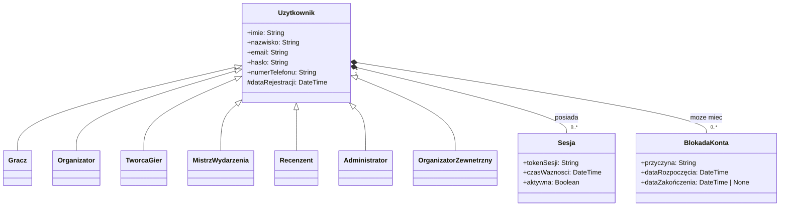
```mermaid
classDiagram
    direction TB

    class Uzytkownik {
        +imie: String
        +nazwisko: String
        +email: String
        +haslo: String
        +numerTelefonu: String
        #dataRejestracji: DateTime
    }

    class Sesja {
        +tokenSesji: String
        +czasWaznosci: DateTime
        +aktywna: Boolean
    }

    class BlokadaKonta {
        +przyczyna: String
        +dataRozpoczęcia: DateTime
        +dataZakończenia: DateTime | None
    }

    class Gracz {
    }

    class Organizator {
    }

    class OrganizatorZewnetrzny {
    }

    class TworcaGier {
    }

    class MistrzWydarzenia {
    }

    class Recenzent {
    }

    class Administrator {
    }

    Uzytkownik <|-- Gracz
    Uzytkownik <|-- Organizator
    Uzytkownik <|-- TworcaGier
    Uzytkownik <|-- MistrzWydarzenia
    Uzytkownik <|-- Recenzent
    Uzytkownik <|-- Administrator
    Uzytkownik <|-- OrganizatorZewnetrzny

    Uzytkownik "1" *-- "0..*" Sesja : posiada
    Uzytkownik "1" *-- "0..*" BlokadaKonta : moze miec
```

---

## 2. Struktura gry

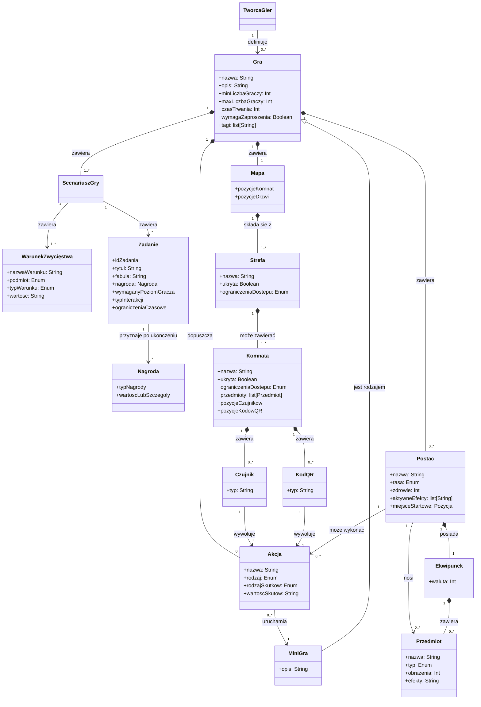
```mermaid
classDiagram
    direction TB

    class TworcaGier {
    }

    class Gra {
        +nazwa: String
        +opis: String
        +minLiczbaGraczy: Int
        +maxLiczbaGraczy: Int
        +czasTrwania: Int
        +wymagaZaproszenia: Boolean
        +tagi: list[String]
    }

    class ScenariuszGry {
    }

    class WarunekZwycięstwa {
        +nazwaWarunku: String
        +podmiot: Enum
        +typWarunku: Enum
        +wartosc: String
    }

    class Zadanie {
        +idZadania
        +tytul: String
        +fabula: String

        +nagroda: Nagroda

        +wymaganyPoziomGracza
        +typInterakcji
        +ograniczeniaCzasowe
    }

    class Nagroda {
        +typNagrody
        +wartoscLubSzczegoly
    }

    class Mapa {
        +pozycjeKomnat
        +pozycjeDrzwi
    }


    class Komnata {
        +nazwa: String
        +ukryta: Boolean
        +ograniczeniaDostepu: Enum
        +przedmioty: list[Przedmiot]
        +pozycjeCzujnikow
        +pozycjeKodowQR
    }

    class Czujnik {
        +typ: String
    }

    class KodQR {
        +typ: String
    }

    class Postac {
        +nazwa: String
        +rasa: Enum
        +zdrowie: Int
        +aktywneEfekty: list[String]
        +miejsceStartowe: Pozycja
    }

    class Ekwipunek {
        +waluta: Int
    }

    class Przedmiot {
        +nazwa: String
        +typ: Enum
        +obrazenia: Int
        +efekty: String
    }

    class MiniGra {
        +opis: String
    }

    class Akcja {
        +nazwa: String
        +rodzaj: Enum
        +rodzajSkutkow: Enum
        +wartoscSkutow: String
    }

    class Strefa {
        +nazwa: String
        +ukryta: Boolean
        +ograniczeniaDostepu: Enum
    }

    TworcaGier "1" --> "0..*" Gra : definiuje

    Gra "1" *-- "1"    Mapa    : zawiera
    Gra "1" *-- "1..*"    ScenariuszGry    : zawiera
    Gra "1" *-- "0..*" Postac  : zawiera
    Gra "1" *-- "0..*" Akcja   : dopuszcza

    ScenariuszGry "1" --> "*" Zadanie : zawiera
    ScenariuszGry "1" --> "1..*" WarunekZwycięstwa : zawiera
    Zadanie "1" --> "*" Nagroda : przyznaje po ukonczeniu

    Mapa "1" *-- "1..*" Strefa : składa sie z
    Strefa "1" *-- "1..*" Komnata : może zawierać

    Komnata "1" *-- "0..*" Czujnik : zawiera
    Komnata "1" *-- "0..*" KodQR : zawiera

    Czujnik "1" --> "1" Akcja : wywołuje
    KodQR "1" --> "1" Akcja : wywołuje

    Postac "1" *-- "1"    Ekwipunek  : posiada
    Postac "1" --> "0..*" Przedmiot  : nosi
    Postac "1" --> "0..*" Akcja      : moze wykonac

    Akcja "0..*" --> "1" MiniGra : uruchamia

    Ekwipunek "1" *-- "0..*" Przedmiot : zawiera

    MiniGra --|> Gra : jest rodzajem
```

---

## 3. Wydarzenie i rozgrywka

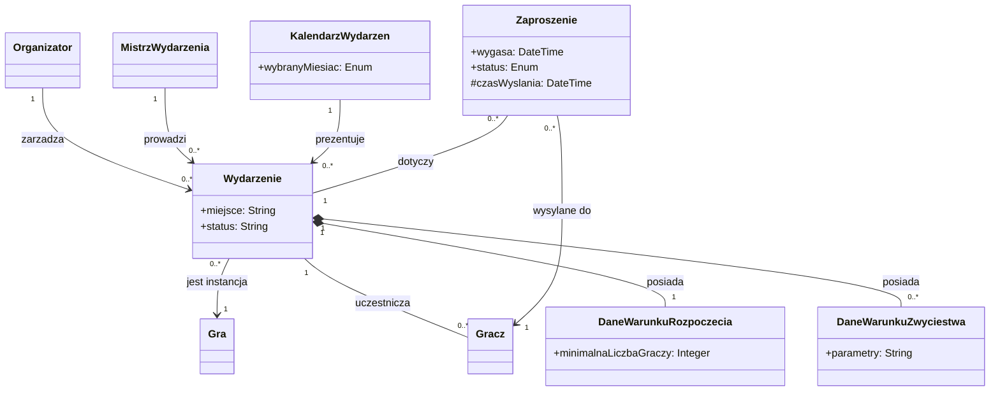
```mermaid
classDiagram
    direction TB

    class Gra {
    }

    class Organizator {
    }

    class MistrzWydarzenia {
    }

    class Gracz {
    }

    class Wydarzenie {
        +miejsce: String
        +status: String
    }

    class KalendarzWydarzen {
        +wybranyMiesiac: Enum
    }

    class Zaproszenie {
        +wygasa: DateTime
        +status: Enum
        #czasWyslania: DateTime
    }

    class DaneWarunkuRozpoczecia {
        +minimalnaLiczbaGraczy: Integer
    }

    class DaneWarunkuZwyciestwa {
        +parametry: String
    }

    Organizator    "1" --> "0..*" Wydarzenie : zarzadza
    MistrzWydarzenia "1" --> "0..*" Wydarzenie : prowadzi

    Wydarzenie "0..*" --> "1"    Gra    : jest instancja
    Wydarzenie "1"    -- "0..*" Gracz  : uczestnicza
    Wydarzenie "1" *-- "1" DaneWarunkuRozpoczecia : posiada
    Wydarzenie "1" *-- "0..*" DaneWarunkuZwyciestwa : posiada

    KalendarzWydarzen "1" --> "0..*" Wydarzenie : prezentuje

    Zaproszenie "0..*" --> "1" Gracz      : wysylane do
    Zaproszenie "0..*" -- "1" Wydarzenie : dotyczy
```

---

## 4. Interakcje i transakcje

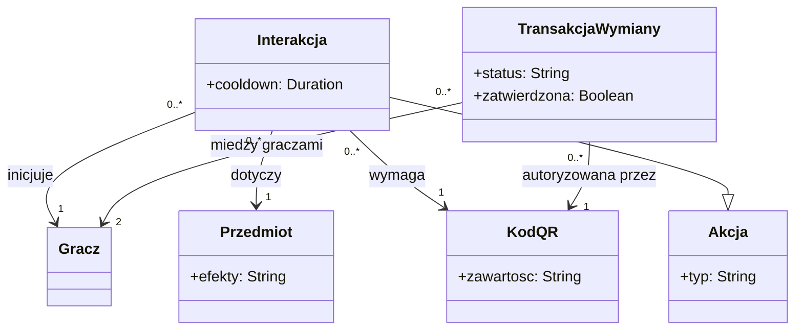
```mermaid
classDiagram
    direction TB

    class Gracz {
    }

    class Przedmiot {
        +efekty: String
    }

    class Akcja {
        +typ: String
    }

    class Interakcja {
        +cooldown: Duration
    }

    class KodQR {
        +zawartosc: String
    }

    class TransakcjaWymiany {
        +status: String
        +zatwierdzona: Boolean
    }

    Interakcja "0..*" --> "1"    Gracz    : inicjuje
    Interakcja "0..*" --> "1"    Przedmiot : dotyczy
    Interakcja "0..*" --> "1"    KodQR    : wymaga
    Interakcja    --|>  Akcja    

    TransakcjaWymiany "0..*" --> "2" Gracz : miedzy graczami
    TransakcjaWymiany "0..*" --> "1" KodQR : autoryzowana przez
```

---

## 5. Komunikacja

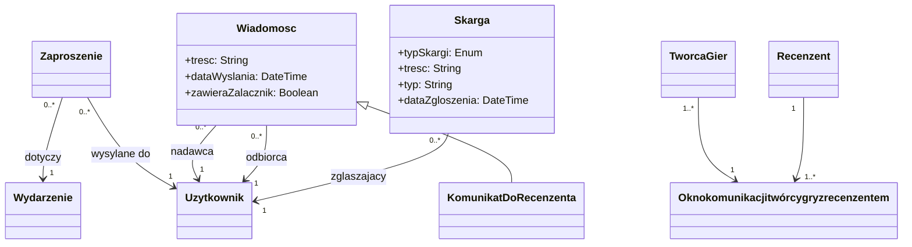
```mermaid
classDiagram
    direction TB

    class Uzytkownik {
    }

    class Wydarzenie {
    }

    class Zaproszenie {
    }

    class Wiadomosc {
        +tresc: String
        +dataWyslania: DateTime
        +zawieraZalacznik: Boolean
    }

    class Skarga {
        +typSkargi: Enum
        +tresc: String
        +typ: String
        +dataZgloszenia: DateTime
    }

    class KomunikatDoRecenzenta {
    }

    class Okno komunikacji twórcy gry z recenzentem {
    }

    class TworcaGier {
    }

    class Recenzent {
    }

    Zaproszenie "0..*" --> "1" Uzytkownik : wysylane do
    Zaproszenie "0..*" --> "1" Wydarzenie : dotyczy

    Wiadomosc "0..*" --> "1" Uzytkownik : nadawca
    Wiadomosc "0..*" --> "1" Uzytkownik : odbiorca
    Wiadomosc <|-- KomunikatDoRecenzenta

    TworcaGier "1..*" --> "1" Okno komunikacji twórcy gry z recenzentem
    Recenzent "1" --> "1..*" Okno komunikacji twórcy gry z recenzentem

    Skarga "0..*" --> "1" Uzytkownik : zglaszajacy
```

## 6. Tworzenie i recenzowanie gier

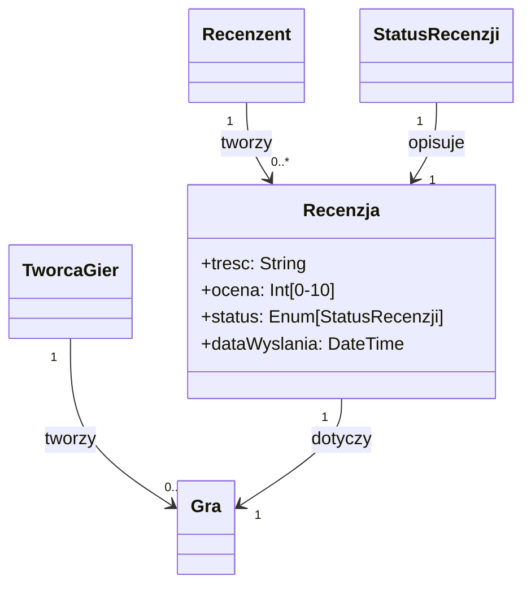
```mermaid
classDiagram
    direction TB

    class TworcaGier {
    }

    class Recenzent {
    }

    class Recenzja {
        +tresc: String
        +ocena: Int[0-10]
        +status: Enum[StatusRecenzji]
        +dataWyslania: DateTime
    }

    class Gra {
    }

    TworcaGier "1" --> "0..*" Gra : tworzy
    Recenzent "1" --> "0..*" Recenzja : tworzy
    Recenzja "1" --> "1" Gra : dotyczy
    StatusRecenzji "1" --> "1" Recenzja : opisuje

```

---

**Użytkownik**

- Typ: aktor systemu
- Wersja: 1.0 (16.03.2026)
- Odpowiedzialny: Zespół projektowy
- Priorytet i trudność: Kluczowe
- Wydanie: 1.0

Osoba posiadająca konto w systemie i korzystająca z jego funkcjonalności.

---

**Gracz**

- Typ: aktor systemu
- Wersja: 1.0 (16.03.2026)
- Odpowiedzialny: Zespół projektowy
- Priorytet i trudność: Kluczowe
- Wydanie: 1.0

[Użytkownik] uczestniczący w [Wydarzeniu] i wykonujący [Akcje] w trakcie rozgrywki.

---

**Organizator**

- Typ: aktor systemu
- Wersja: 1.0 (16.03.2026)
- Odpowiedzialny: Zespół projektowy
- Priorytet i trudność: Kluczowe
- Wydanie: 1.0

[Użytkownik] odpowiedzialny za tworzenie i zarządzanie [Wydarzeniami] w systemie.

---

**Administrator**

- Typ: aktor systemu
- Wersja: 1.0 (16.03.2026)
- Odpowiedzialny: Zespół projektowy
- Priorytet i trudność: Kluczowe
- Wydanie: 1.0

[Użytkownik] posiadający najwyższe uprawnienia w systemie odpowiedzialny za moderowanie i zarządzanie systemem.

---

**Twórca gier**

- Typ: aktor systemu
- Wersja: 1.0 (16.03.2026)
- Odpowiedzialny: Zespół projektowy
- Priorytet i trudność: Istotne
- Wydanie: 1.0

[Użytkownik] odpowiedzialny za definiowanie struktury [Gry], w tym [Mapy], [Postaci] oraz [Akcji] dostępnych w rozgrywce.

---

**Mistrz wydarzenia**

- Typ: aktor systemu
- Wersja: 1.0 (16.03.2026)
- Odpowiedzialny: Zespół projektowy
- Priorytet i trudność: Istotne
- Wydanie: 1.0

[Użytkownik] prowadzący [Wydarzenie] i kontrolujący jego przebieg w trakcie rozgrywki.

---

**Recenzent**

- Typ: aktor systemu
- Wersja: 1.0 (16.03.2026)
- Odpowiedzialny: Zespół projektowy
- Priorytet i trudność: Przydatne
- Wydanie: 1.0

[Użytkownik] odpowiedzialny za ocenę i weryfikację zgłoszonych [Gier].

---

**Organizator zewnętrzny**

- Typ: aktor systemu
- Wersja: 1.0 (16.03.2026)
- Odpowiedzialny: Hlib Filobok
- Priorytet i trudność: Przydatne
- Wydanie: 1.0

[Organizator] będący podmiotem zewnętrznym mający dostęp do wybranych funkcji systemu. Tworzy [Gry] w systemie, rezerwuje czas dla swoich [Wydarzeń], przegląda [Skargi] i komunikuje się z uczestnikami.

---

**Sesja**

- Typ: pojęcie systemowe
- Wersja: 1.0 (15.04.2026)
- Odpowiedzialna: Polina Nesterova
- Priorytet i trudność: Kluczowe
- Wydanie: 1.0

Aktywny okres korzystania z systemu przez zalogowanego [Użytkownika]. [Sesja] jest identyfikowana przez token sesji, ma ograniczony czas ważności (wygasa po zdefiniowanym czasie nieaktywności) i może zostać zakończona przez wylogowanie lub unieważniona przez system (np. po zmianie hasła).

---

**Blokada konta**

- Typ: pojęcie systemowe
- Wersja: 1.0 (15.04.2026)
- Odpowiedzialna: Polina Nesterova
- Priorytet i trudność: Istotne
- Wydanie: 1.0

Tymczasowe wstrzymanie dostępu do konta [Użytkownika] w reakcji na zdarzenie bezpieczeństwa (np. przekroczenie limitu nieudanych prób logowania) lub decyzję [Administratora]. [Blokada konta] uniemożliwia logowanie do czasu odblokowania — automatycznego po upływie zdefiniowanego czasu lub ręcznego przez reset hasła.

---

**Wiadomość**

- Typ: pojęcie systemowe
- Wersja: 1.0 (15.04.2026)
- Odpowiedzialny: Łukasz Czajka
- Priorytet i trudność: Istotne
- Wydanie: 1.0

Komunikat wysłany przez jednego [Użytkownika] do drugiego. [Wiadomość] może zawierać tekst, obrazy lub inne pliki. Tylko [Użytkownik], do którego dana [Wiadomość] została wysłana, jest w stanie ją zobaczyć.

---

**Zaproszenie**

- Typ: pojęcie systemowe
- Wersja: 1.0 (16.03.2026)
- Odpowiedzialny: Hlib Filobok
- Priorytet i trudność: Istotne
- Wydanie: 1.0

[Wiadomość] wysyłana do [Użytkownika] umożliwiająca dołączenie do [Wydarzenia].

---

**Skarga**

- Typ: pojęcie systemowe
- Wersja: 1.0 (16.03.2026)
- Odpowiedzialny: Zespół projektowy
- Priorytet i trudność: Istotne
- Wydanie: 1.0

Zgłoszenie wysyłane przez [Użytkownika] w celu poinformowania [Organizatora] lub [Administratora] o problemie.

---

**Recenzja**

- Typ: pojęcie systemowe
- Wersja: 1.1 (06.05.2026)
- Odpowiedzialny: Maciej Bankiewicz
- Priorytet i trudność: Istotne
- Wydanie: 1.0

Ocena i weryfikacja [Gry] dokonana przez [Recenzenta] zawierająca tekst recenzji i decyzję o zatwierdzeniu.

Walidacja recenzji: tekst recenzji musi posiadać minimalną długość, ocena liczbowa w skali 1–10 jest wymagana, treść nie może zawierać zakazanych słów.

---

**Status recenzji**

- Typ: pojęcie systemowe
- Wersja: 1.0 (06.05.2026)
- Odpowiedzialna: Polina Nesterova
- Priorytet i trudność: Istotne
- Wydanie: 1.0

Stan [Recenzji] w procesie recenzowania [Gry]. Dostępne statusy:

- SR1: szkic – recenzja zapisana przez recenzenta, nieprzesłana do twórcy.
- SR2: przesłana do twórcy – recenzja wysłana i oczekująca na zapoznanie się przez twórcę.

---

**Kalendarz wydarzeń**

- Typ: pojęcie systemowe
- Wersja: 1.0 (16.03.2026)
- Odpowiedzialny: Hlib Filobok
- Priorytet i trudność: Istotne
- Wydanie: 1.0

Widok systemowy umożliwiający przeglądanie [Wydarzeń] w ujęciu czasowym i planowanie [Wydarzeń].

---

**Gra**

- Typ: pojęcie domenowe
- Wersja: 1.0 (16.03.2026)
- Odpowiedzialny: Zespół projektowy
- Priorytet i trudność: Istotne
- Wydanie: 1.0

Zdefiniowany zestaw zasad określających interakcje między uczestnikami systemu. [Gra] zawiera elementy takie jak [Mapa], [Postaci], [Przedmioty] oraz możliwe [Akcje] wykonywane przez [Graczy].

---

**Wydarzenie**

- Typ: pojęcie domenowe
- Wersja: 1.0 (16.03.2026)
- Odpowiedzialny: Hlib Filobok
- Priorytet i trudność: Istotne
- Wydanie: 1.0

Konkretna instancja [Gry] uruchomiona w określonym czasie i miejscu. W [Wydarzeniu] uczestniczą [Gracze] wykonujący [Akcje] zgodnie z zasadami [Gry].

---

**Mapa**

- Typ: pojęcie domenowe
- Wersja: 1.0 (16.03.2026)
- Odpowiedzialny: Zespół projektowy
- Priorytet i trudność: Istotne
- Wydanie: 1.0

Reprezentacja przestrzeni, w której odbywa się [Gra]. [Mapa] zawiera [Pomieszczenia], [Strefy], przejścia, przeszkody oraz inne elementy środowiska [Gry].

---

**Pomieszczenie**

- Typ: pojęcie domenowe
- Wersja: 1.0 (16.03.2026)
- Odpowiedzialny: Zespół projektowy
- Priorytet i trudność: Przydatne
- Wydanie: 1.0

Element [Mapy] reprezentujący konkretną lokalizację w świecie [Gry]. [Pomieszczenie] może zawierać [Przedmioty], [Strefy], zdarzenia lub inne elementy [Interakcji].

---

**Strefa**

- Typ: pojęcie domenowe
- Wersja: 1.0 (15.04.2026)
- Odpowiedzialny: Kacper Koziara
- Priorytet i trudność: Istotne
- Wydanie: 1.0

Wydzielony fizycznie i wirtualnie obszar terenu [Gry], który może posiadać własne ograniczenia dostępu. [Strefy] mogą być ukryte na interaktywnej [Mapie] [Gracza], dopóki jego [Postać] nie zdobędzie odpowiednich uprawnień.

---

**Postać**

- Typ: pojęcie domenowe
- Wersja: 1.0 (16.03.2026)
- Odpowiedzialny: Zespół projektowy
- Priorytet i trudność: Istotne
- Wydanie: 1.0

Rola przypisana [Graczowi] podczas [Wydarzenia]. [Postać] posiada określone atrybuty, [Ekwipunek] oraz możliwe [Akcje] w trakcie rozgrywki.

---

**Ekwipunek**

- Typ: pojęcie domenowe
- Wersja: 1.0 (15.04.2026)
- Odpowiedzialny: Kacper Koziara
- Priorytet i trudność: Kluczowe
- Wydanie: 1.0

Zbiór wirtualnych zasobów ([Przedmiotów], kluczy, wirtualnej waluty) przypisanych do danej [Postaci] w konkretnym [Wydarzeniu]. Stan [Ekwipunku] może ulegać zmianie poprzez [Akcje] w [Grze] oraz system handlu.

---

**Przedmiot**

- Typ: pojęcie domenowe
- Wersja: 1.0 (16.03.2026)
- Odpowiedzialny: Zespół projektowy
- Priorytet i trudność: Przydatne
- Wydanie: 1.0

Obiekt w świecie [Gry], który może być posiadany przez [Postać] w [Ekwipunku]. [Przedmiot] może umożliwiać wykonanie określonych [Akcji] lub wywoływać efekty w [Grze].

---

**Akcja**

- Typ: pojęcie domenowe
- Wersja: 1.0 (16.03.2026)
- Odpowiedzialny: Zespół projektowy
- Priorytet i trudność: Istotne
- Wydanie: 1.0

Działanie wykonywane przez system w wyniku [Interakcji] [Użytkownika], [Postaci] lub zdarzeń w świecie [Gry].

---

**Interakcja**

- Typ: pojęcie domenowe
- Wersja: 1.0 (08.04.2026)
- Odpowiedzialny: Tomasz Rogalski
- Priorytet i trudność: Istotne
- Wydanie: 1.0

[Akcja] zachodząca między [Graczem] a [Przedmiotem] (np. [Mini-grą]) lub innym [Graczem] (np. walka). [Interakcja] wymaga zeskanowania [Kodu QR] i wiąże się bezpośrednio z nałożeniem na [Gracza] ograniczeń czasowych (cooldown) uniemożliwiających natychmiastowe powtórzenie tej samej [Akcji] wobec tego samego [Przedmiotu] lub [Gracza].

---

**Mini-gra**

- Typ: pojęcie domenowe
- Wersja: 1.0 (16.03.2026)
- Odpowiedzialny: Zespół projektowy
- Priorytet i trudność: Przydatne
- Wydanie: 1.0

Dodatkowa aktywność dostępna w trakcie [Wydarzenia] umożliwiająca wykonanie krótkiej [Interakcji] lub zadania.

---

**Kod QR**

- Typ: pojęcie techniczne
- Wersja: 1.0 (16.03.2026)
- Odpowiedzialny: Zespół projektowy
- Priorytet i trudność: Przydatne
- Wydanie: 1.0

Kod graficzny wykorzystywany do identyfikacji elementów [Gry] oraz inicjowania [Interakcji] w aplikacji.

---

**Transakcja wymiany**

- Typ: pojęcie systemowe
- Wersja: 1.0 (15.04.2026)
- Odpowiedzialny: Kacper Koziara
- Priorytet i trudność: Istotne
- Wydanie: 1.0

Bezpieczny transfer zasobów wirtualnych z [Ekwipunku] między dwoma [Graczami], autoryzowany za pomocą aplikacji mobilnej (np. poprzez skanowanie [Kodu QR]). Wymaga obecności obu stron [Transakcji wymiany] i zatwierdzenia jej w systemie.

---

**Warunek zwycięstwa**

- Typ: pojęcie domenowe
- Wersja: 1.0 (05.05.2026)
- Odpowiedzialny: Tomasz Rogalski
- Priorytet i trudność: Kluczowe
- Wydanie: 1.0

Cel do osiągnięcia w grze, ustalany przez organizatora, którego spełnienie skutkuje zwycięstwem w danej grze. Możliwe do spełnienia dla pojedynczego gracza bądź frakcji.

---

**Dane warunku zwycięstwa**

- Typ: pojęcie domenowe
- Wersja: 1.0 (05.05.2026)
- Odpowiedzialny: Tomasz Rogalski
- Priorytet i trudność: Kluczowe
- Wydanie: 1.0

Zestaw parametrów określający dany warunek zwycięstwa, zależny od typu warunku. Parametry te są definiowane podczas tworzenia scenariusza przez Projektanta gier.

---

**Komunikat do recenzenta**

- Typ: pojęcie domenowe
- Wersja: 1.0 (29.04.2026)
- Odpowiedzialny: Michał Marciniak
- Wydanie: 1.0

Wiadomość wysyłana przez twórcę gry do recenzenta w ramach komunikacji dotyczącej konkretnej gry.

---

**Okno komunikacji twórcy gry z recenzentem**

- Typ: pojęcie domenowe
- Wersja: 1.0 (29.04.2026)
- Odpowiedzialny: Michał Marciniak
- Wydanie: 1.0

Okno zawierające historię kontaktu z recenzentem wraz z funkcją wysłania komunikatów do recenzenta.

**Czujnik**

- Typ: pojęcie domenowe
- Wersja: 1.1 (24.04.2026)
- Odpowiedzialna: Alicja Rosiak
- Wydanie: 1.0

Element [mapy] pozwalający na wchodzenie w [interakcje] przez [gracza].
Ma określony [typ czujnika] oraz pozycję na [mapie]. Aktywowanie czujnika zależy
od jego typu i powoduje wykonanie powiązanej [akcji].

---

**Typ czujnika**

- Typ: pojęcie domenowe
- Wersja: 1.0 (24.04.2026)
- Odpowiedzialna: Alicja Rosiak
- Wydanie: 1.0

Sposób, w jaki [czujnik] może być aktywowany. Możliwe typy: NFC, [kod QR],
czujnik ruchu.

---

**Zadanie**

- Typ: pojęcie domenowe
- Wersja: 1.0 (05.05.2026)
- Odpowiedzialna: Julian Stefan
- Wydanie: 1.0

Zbiór celów które gracz musi wykonać podczas [Wydarzenia] jeśli chce otrzymać [Nagrodę].

---

**Nagroda**

- Typ: pojęcie domenowe
- Wersja: 1.0 (05.05.2026)
- Odpowiedzialna: Julian Stefan
- Wydanie: 1.0

Rekompensata za ukończenie [Zadania].

---

**Dane warunku rozpoczęcia**

- Typ: pojęcie domenowe
- Wersja: 1.0 (19.05.2026)
- Odpowiedzialny: Tomasz Rogalski
- Wydanie: 1.0

Konkretny zbiór informacji konfiguracyjnych i kryteriów niezbędnych do uruchomienia [Wydarzenia] w danym formularzu. Obejmuje pole `minimalnaLiczbaGraczy` (integer). Określane mianem spełnionych lub niespełnionych, pozwalając na start wydarzenia.

---

# 4. Wymagania użytkownika

## 4.1 Wymagania funkcjonalne

### 4.1.1 Zarządzanie wydarzeniami

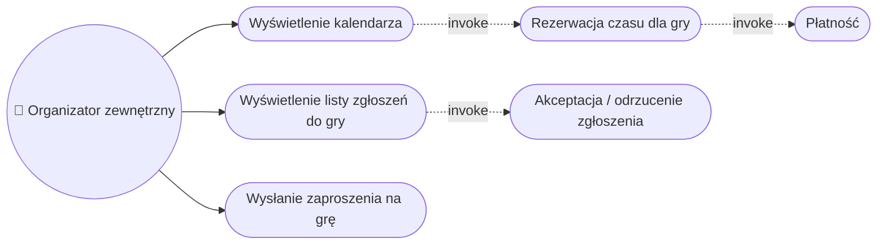
```mermaid
flowchart LR

organizator(("👤 Organizator zewnętrzny"))


UC1(["Wyświetlenie kalendarza"])
UC2(["Rezerwacja czasu dla gry"])
UC3(["Wyświetlenie listy zgłoszeń do gry"])
UC4(["Akceptacja / odrzucenie zgłoszenia"])
UC5(["Wysłanie zaproszenia na grę"])
UC6(["Płatność"])

UC1 -. invoke .-> UC2
UC3 -. invoke .-> UC4
UC2 -. invoke .-> UC6


organizator --> UC1
organizator --> UC3
organizator --> UC5

```

#### PU1: Wyświetlenie kalendarza

**Wersja:** 1.0 (14.04.2026)  
**Odpowiedzialny:** Hlib Filobok
**Priorytet i trudność:** Istotne  
**Wydanie:** 1.0

**Opis:** Organizator przegląda kalendarz dostępnych terminów gry. System wyświetla wolne i zajęte sloty czasowe na podstawie typu wybranej gry.

---

#### PU2: Rezerwacja czasu dla gry

**Wersja:** 1.0 (14.04.2026)  
**Odpowiedzialny:** Hlib Filobok  
**Priorytet i trudność:** Istotne  
**Wydanie:** 1.0

**Opis:** Organizator wybiera dostępny termin w kalendarzu i dokonuje rezerwacji. System wyświetla prośbę o potwierdzenie (z opcją cofnięcia), następnie wymaga dokonania płatności. Potwierdzenie wysyła się do jego skrzynki wiadomości.

---

#### PU3: Wyświetlenie listy zgłoszeń do gry

**Wersja:** 1.0 (14.04.2026)  
**Odpowiedzialny:** Hlib Filobok  
**Priorytet i trudność:** Istotne  
**Wydanie:** 1.0

**Opis:** Organizator przegląda listę zgłoszeń uczestników w swojej skrzynce wiadomości.

---

#### PU4: Akceptacja/odrzucenie zgłoszenia

**Wersja:** 1.0 (14.04.2026)  
**Odpowiedzialny:** Hlib Filobok  
**Priorytet i trudność:** Istotne  
**Wydanie:** 1.0

**Opis:** Organizator wybiera zgłoszenie z listy i widzi profil gracza. Po naciśnięciu "Akceptuj" lub "Odrzuć" gracz jest przypisany do gry lub zgłoszenie zostaje odrzucone. Wiadomość znika ze skrzynki organizatora.

---

#### PU5: Wysłanie zaproszenia na grę

**Wersja:** 1.0 (14.04.2026)  
**Odpowiedzialny:** Hlib Filobok  
**Priorytet i trudność:** Istotne  
**Wydanie:** 1.0

**Opis:** Organizator przechodzi do zakładki "Przyjaciele" i wybiera użytkownika. Po naciśnięciu "Zaproś" system wyświetla listę aktualnych gier. Po wyborze gry zaproszenie zostaje wysłane użytkownikowi na skrzynkę wewnętrzną (w systemie).

---

## 4.1.2 Administracja kont

DIAGRAM:

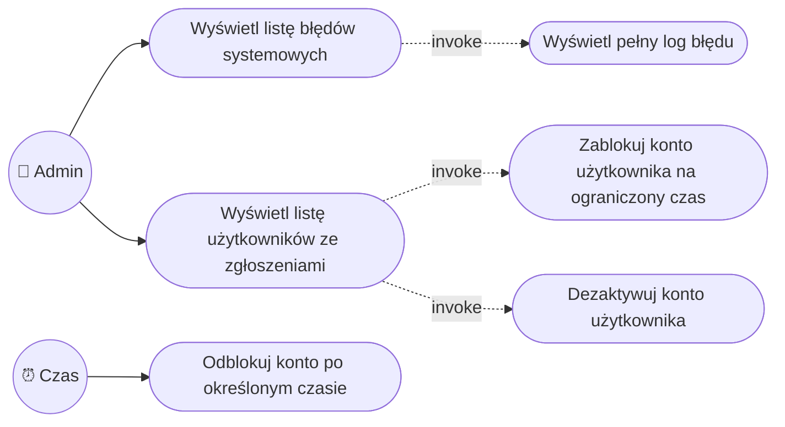
```mermaid
flowchart LR
    Admin(("👤 Admin"))
    Czas(("⏰ Czas"))

    u1(["Wyświetl listę błędów systemowych"])
    u2(["Wyświetl listę użytkowników ze zgłoszeniami"])
    u3(["Zablokuj konto użytkownika na ograniczony czas"])
    u5(["Dezaktywuj konto użytkownika"])
    u6(["Wyświetl pełny log błędu"])
    u7(["Odblokuj konto po określonym czasie"])

    Admin --> u1
    Admin --> u2

    u2 -.->|invoke| u3
    u2 -.->|invoke| u5
    u1 -.->|invoke| u6

    Czas --> u7
```

#### PU6: Wyświetlenie listy uŻytkowników ze zgłoszeniami

- Wersja: 1.0 (14.04.2026)
- Odpowiedzialna: Karolina Wiśniewska
- Wydanie: 1.0
- Opis: System wyświetla menu administratora. Administrator wybiera opcję wyświetlenia listy użytkowników, którzy zostali zgłoszeni za łamanie regulaminu/ zasad społeczności. system wyświetla listę

#### PU7: Zablokowanie konta użytkownika na ograniczony czas

- Wersja: 1.0 (14.04.2026)
- Odpowiedzialna: Karolina Wiśniewska
- Wydanie: 1.0
- Opis: Invoked by PU6. Administrator wybiera wybrane konto uczestnika. System wyświetla zapytanie o blokowanie lub dezaktywację konta. Administrator wybiera opcję zablokowania konta na ustalony czas. System nadaje kontu status zablokowanego na określony czas.

#### PU8: Dezaktywacja konta użytkownika

- Wersja: 1.0 (14.04.2026)
- Odpowiedzialna: Karolina Wiśniewska
- Wydanie: 1.0
- Opis: Invoked by PU6. Administrator wybiera wybrane konto uczestnika. System wyświetla zapytanie o blokowanie lub dezaktywację konta. Administrator wybiera opcję dezaktywacji konta. System usuwa konto z listy kont aktywnych. System zmienia status konta na zdezaktywowane

#### PU9: Odblokowanie konta po określonym czasie

- Wersja: 1.0 (14.04.2026)
- Odpowiedzialna: Karolina Wiśniewska
- Wydanie: 1.0
- Opis: System odblokowuje konto po upływie określonego czasu.

#### PU10: Wyświetlenie listy błędów systemowych

- Wersja: 1.0 (14.04.2026)
- Odpowiedzialna: Karolina Wiśniewska
- Wydanie: 1.0
- Opis: System wyświetla menu administratora. Administrator wybiera opcję wyświetlenia listy błędów systemowych. System wyświetla listę błędów.

#### PU11: Wyświetlenie pełnego logu błędu

- Wersja: 1.0 (14.04.2026)
- Odpowiedzialna: Karolina Wiśniewska
- Wydanie: 1.0
- Opis: Invoked by PU10. Administrator wybiera dowolny log błędu. System wyświetla szczegółowy zapis logu błędu systemowego

---

## 4.1.3 Autentykacja i historia wydarzeń

DIAGRAM:

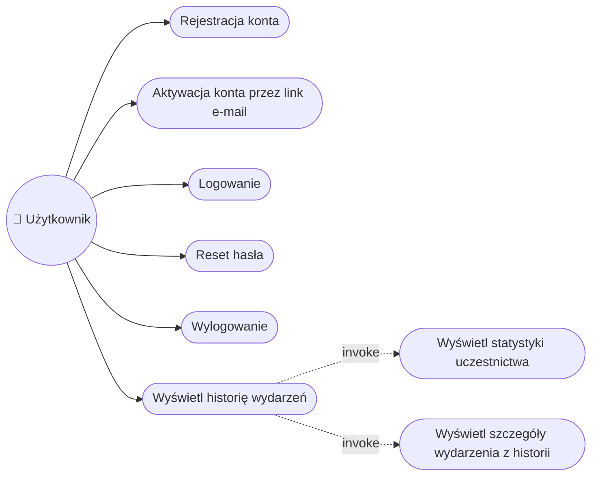
```mermaid
flowchart LR
    User(("👤 Użytkownik"))

    u1(["Rejestracja konta"])
    u2(["Aktywacja konta przez link e-mail"])
    u3(["Logowanie"])
    u4(["Reset hasła"])
    u5(["Wylogowanie"])
    u6(["Wyświetl historię wydarzeń"])
    u8(["Wyświetl statystyki uczestnictwa"])
    u9(["Wyświetl szczegóły wydarzenia z historii"])

    User --> u1
    User --> u2
    User --> u3
    User --> u4
    User --> u5
    User --> u6

    u6 -.->|invoke| u8
    u6 -.->|invoke| u9
```

#### PU12: Rejestracja konta

- Wersja: 1.1 (16.04.2026)
- Odpowiedzialna: Polina Nesterova
- Wydanie: 1.0
- Opis: System wyświetla formularz rejestracji. Użytkownik podaje [dane użytkownika]. System weryfikuje poprawność i unikalność podanych [danych użytkownika], zapisuje konto ze statusem „nieaktywne" i wysyła na wskazany kanał kontaktu wiadomość zawierającą link aktywacyjny. Rejestracja kończy się komunikatem o konieczności potwierdzenia konta przed pierwszym logowaniem — faktyczne potwierdzenie realizuje odrębny przypadek użycia PU13 (Aktywacja konta przez link e-mail), wywoływany przez użytkownika po otrzymaniu wiadomości.

#### PU13: Aktywacja konta przez link e-mail

- Wersja: 1.1 (16.04.2026)
- Odpowiedzialna: Polina Nesterova
- Wydanie: 1.0
- Opis: Przypadek użycia inicjowany przez użytkownika po otrzymaniu wiadomości z linkiem aktywacyjnym wysłanej w ramach PU12 (Rejestracja konta). Użytkownik klika w link aktywacyjny. System weryfikuje poprawność i ważność linku, zmienia status konta na „aktywne" oraz umożliwia logowanie.

#### PU14: Logowanie

- Wersja: 1.0 (15.04.2026)
- Odpowiedzialna: Polina Nesterova
- Wydanie: 1.0
- Opis: System wyświetla ekran logowania. Użytkownik podaje adres e-mail oraz hasło. System weryfikuje dane uwierzytelniające oraz status konta (aktywne / nieaktywne / zablokowane). Po poprawnej autoryzacji system tworzy sesję użytkownika i przyznaje dostęp do funkcji systemu. Po przekroczeniu 5 nieudanych prób w ciągu 15 minut system tymczasowo blokuje konto.

#### PU15: Reset hasła

- Wersja: 1.0 (15.04.2026)
- Odpowiedzialna: Polina Nesterova
- Wydanie: 1.0
- Opis: Użytkownik wybiera opcję „Nie pamiętam hasła" i podaje adres e-mail. System wysyła na ten adres jednorazowy link do resetu hasła (ważny 1 godzinę). Użytkownik po kliknięciu w link ustala nowe hasło, a system aktualizuje dane konta i unieważnia dotychczasową sesję.

#### PU16: Wylogowanie

- Wersja: 1.0 (15.04.2026)
- Odpowiedzialna: Polina Nesterova
- Wydanie: 1.0
- Opis: Zalogowany użytkownik wybiera opcję wylogowania. System kończy sesję użytkownika, unieważnia token sesji i przekierowuje na ekran logowania.

#### PU17: Wyświetlenie historii wydarzeń

- Wersja: 1.1 (16.04.2026)
- Odpowiedzialna: Polina Nesterova
- Wydanie: 1.0
- Opis: Zalogowany użytkownik wybiera zakładkę „Historia wydarzeń". System pobiera listę wydarzeń, w których użytkownik brał udział, i wyświetla ją w porządku chronologicznym wraz z podstawowymi informacjami (nazwa wydarzenia, data, lokalizacja, odgrywana postać, czas trwania, status). W ramach widoku użytkownik może zawęzić listę za pomocą filtrów (przedział czasowy, typ wydarzenia, status, lokalizacja) oraz zmienić porządek sortowania (data rosnąco/malejąco, nazwa wydarzenia) — system każdorazowo aktualizuje wyświetlaną listę zgodnie z wybranymi kryteriami.

#### PU18: Wyświetlenie statystyk uczestnictwa

- Wersja: 1.0 (15.04.2026)
- Odpowiedzialna: Polina Nesterova
- Wydanie: 1.0
- Opis: Invoked by PU17. System agreguje dane z historii użytkownika i prezentuje statystyki: liczbę ukończonych sesji, całkowity czas uczestnictwa, najczęściej grane typy postaci, ulubione scenariusze oraz ranking organizatorów.

#### PU19: Wyświetlenie szczegółów wydarzenia z historii

- Wersja: 1.0 (15.04.2026)
- Odpowiedzialna: Polina Nesterova
- Wydanie: 1.0
- Opis: Invoked by PU17. Użytkownik wybiera konkretne wydarzenie z listy. System wyświetla szczegółowy widok wydarzenia — pełny opis postaci, przebieg sesji, współuczestników oraz dodatkowe materiały powiązane z wydarzeniem.

### 4.1.4 Obsługa wydarzeń

#### PU20: Uruchomienie wydarzenia

- Wersja: 1.0 (14.04.2026)
- Odpowiedzialny: Julian Stefan
- Wydanie: 1.0
- **Opis:** Po osiągnięciu warunków rozpoczęcia wydarzenia, mistrz wydarzenia rozpoczyna wydarzenie.

#### PU21: Zakończenie wydarzenia

- Wersja: 1.0 (14.04.2026)
- Odpowiedzialny: Julian Stefan
- Wydanie: 1.0
- **Opis:** Po osiągnięciu warunków zakończenia wydarzenia, mistrz wydarzenia konczy wydarzenie.

---

### 4.1.3 Gracz i jego akcje podczas wydarzenia

**Diagram:** Gracz i jego akcje podczas wydarzenia

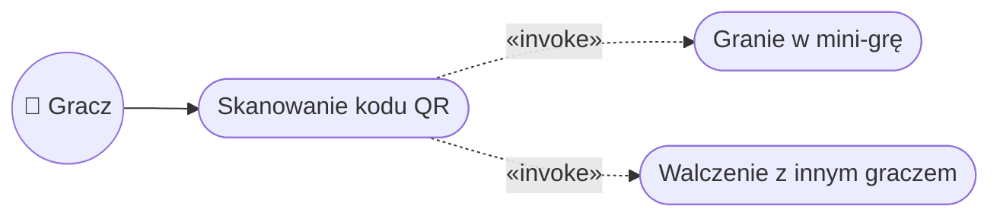
```mermaid
flowchart LR
    Player(("👤 Gracz"))

    UC_QR(["Skanowanie kodu QR"])
    UC_MiniGame(["Granie w mini-grę"])
    UC_Fight(["Walczenie z innym graczem"])
    Player --> UC_QR

    UC_QR -.->|«invoke»| UC_MiniGame
    UC_QR -.->|«invoke»| UC_Fight
```

#### PU22: Skanowanie kodu QR

- Wersja: 1.0 (14.04.2026)
- Odpowiedzialny: Tomasz Rogalski
- Priorytet i trudność: Kluczowe
- Wydanie: 1.0
- **Opis:** Gracz skanuje kod QR umieszczony na przedmiocie lub w otoczeniu gry, aby uruchomić mini-grę, albo skanuje kod QR innego gracza, aby zainicjować walkę.

#### PU23: Granie w mini-grę

- Wersja: 1.0 (14.04.2026)
- Odpowiedzialny: Tomasz Rogalski
- Priorytet i trudność: Istotne
- Wydanie: 1.0
- **Opis:** System uruchamia mini-grę opartą na szablonie. Gracz musi ukończyć ją w wyznaczonym czasie.

#### PU24: Walczenie z innym graczem

- Wersja: 1.0 (14.04.2026)
- Odpowiedzialny: Tomasz Rogalski
- Priorytet i trudność: Istotne
- Wydanie: 1.0
- **Opis:** System kalkuluje wynik walki na podstawie statystyk obu postaci i wyłania zwycięzcę.

### 4.1.5 Tworzenie gier

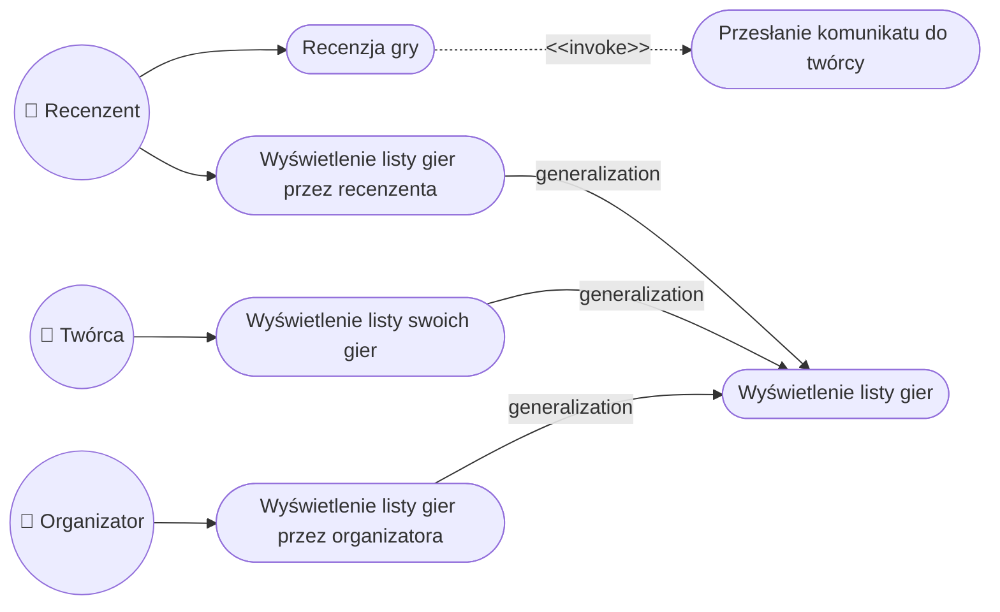
```mermaid
flowchart LR

rec(("👤 Recenzent"))
org(("👤 Organizator"))
tworca(("👤 Twórca"))


pu_lista_gier_tw(["Wyświetlenie listy swoich gier"])
pu_komunikat(["Przesłanie komunikatu do twórcy"])
pu_lista_gier_org(["Wyświetlenie listy gier przez organizatora"])
pu_lista_gier(["Wyświetlenie listy gier"])
pu_recenzja_gry(["Recenzja gry"])
pu_lista_recenzent(["Wyświetlenie listy gier przez recenzenta"])

tworca --> pu_lista_gier_tw
org --> pu_lista_gier_org
rec --> pu_recenzja_gry
rec --> pu_lista_recenzent

pu_lista_gier_org ~~~ pu_lista_gier
pu_lista_gier_tw ~~~ pu_lista_gier
pu_lista_gier_org -->|generalization| pu_lista_gier
pu_lista_gier_tw -->|generalization| pu_lista_gier
pu_lista_recenzent -->|generalization| pu_lista_gier
pu_recenzja_gry -."&lt;&lt;invoke&gt;&gt;".-> pu_komunikat


```

#### PU25: Wyświetlenie listy gier przez twórcę

- Wersja: 1.0 (15.04.2026)
- Odpowiedzialny: Łukasz Czajka
- **Opis:** Twórcy gier mają możliwość wyświetlania listy gier, których są twórcami. Wybranie pozycji z listy pozwala na czynności takie jak edycja.

#### PU26: Wyświetlenie listy gier przez organizatora

- Wersja: 1.0 (15.04.2026)
- Odpowiedzialny: Łukasz Czajka
- **Opis:** Organizatorzy mają możliwość wyświetlania gier, które mogą zostać zorganizowane.

#### PU27: Przesłanie komunikatu do twórcy

- Wersja: 1.0 (15.04.2026)
- Odpowiedzialny: Łukasz Czajka
- **Opis:** Recenzenci mają możliwość przesłania uwag dotyczących recenzowanej gry.

#### PU28: Wyświetlenie listy gier

- Wersja: 1.0 (14.04.2026)
- Odpowiedzialny: Maciej Bankiewicz
- Priorytet i trudność: Istotne
- Wydanie: 1.0
- **Opis:** System wyświetla listę zawierającą wszystkie stworzone uprzednio [gry].

#### PU29: Wyświetlenie listy gier przez recenzenta

- Wersja: 1.0 (14.04.2026)
- Odpowiedzialny: Maciej Bankiewicz
- Priorytet i trudność: Istotne
- Wydanie: 1.0
- **Opis:** System wyświetla listę zawierającą wszystkie stworzone uprzednio [gry] dodając do każdego rekordu opcję recenzji [gry].

#### PU30: Recenzja gry

- Wersja: 1.0 (14.04.2026)
- Odpowiedzialny: Maciej Bankiewicz
- Priorytet i trudność: Istotne
- Wydanie: 1.0
- **Opis:** System wyświetla okno do zapisu tekstu. [Recenzent] zapisuje [recenzję] i zatwierdza ją.

---

## 4.1.12 Akcje Gracza w trakcie gry (Cezary Rybiński)

DIAGRAM:

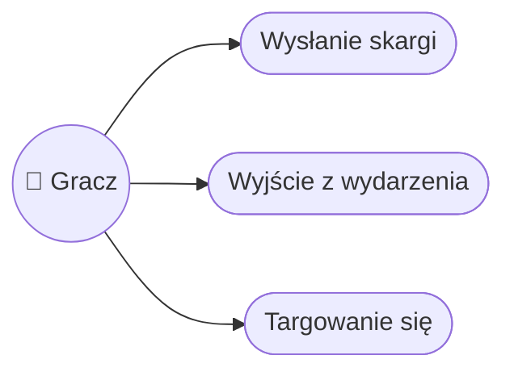
```mermaid
flowchart LR
    Player(("👤 Gracz"))

    u1(["Wysłanie skargi"])
    u2(["Wyjście z wydarzenia"])
    u3(["Targowanie się"])

    Player --> u1
    Player --> u2
    Player --> u3
```

#### PU31: Wysłanie skargi

- Wersja: 1.0 (15.04.2026)
- Odpowiedzialny: Cezary Rybiński
- Wydanie: 1.0
- Opis: Gracz inicjuje proces zgłoszenia poprzez menu aplikacji. System wymaga zdefiniowania kategorii problemu (błąd techniczny, zachowanie gracza, naruszenie bezpieczeństwa) oraz opisania go w dodatkowym polu.

#### PU32: Wyjście z wydarzenia

- Wersja: 1.0 (15.04.2026)
- Odpowiedzialny: Cezary Rybiński
- Wydanie: 1.0
- Opis: Gracz rezygnuje z dalszego udziału przed zakończeniem eventu. System weryfikuje posiadane przez gracza wirtualne przedmioty o znaczeniu krytycznym dla fabuły i przekazuje stosowny komunikat.

#### PU33: Targowanie się

- Wersja: 1.0 (15.04.2026)
- Odpowiedzialny: Cezary Rybiński
- Wydanie: 1.0
- Opis: Gracz inicjujący wybiera zasoby do przekazania. System generuje unikalny kod QR transakcji. Aby sfinalizować proces drugi gracz musi dołączyć do interakcji, co realizowane jest poprzez PU38: Skanowanie kodu QR. Następnie muszą zaakceptować wymianę lub ją odrzucić (wystarczy aby jedna ze stron się nie zgodziła na wymianę aby nie doszła do skutku).

#### PU34: Skanowanie kodu QR

- Wersja: 1.0 (15.04.2026)
- Odpowiedzialny: Cezary Rybiński
- Wydanie: 1.0
- Opis: Gracz uruchamia skaner kodów QR w aplikacji i nakierowuje aparat na kod (wyświetlony u innego gracza lub umieszczony w przestrzeni gry). System dekoduje informację i wywołuje przypisaną do niej akcję.

---

## 4.1.13 Interaktywna mapa i wymiana zasobów (Kacper Koziara)

DIAGRAM:

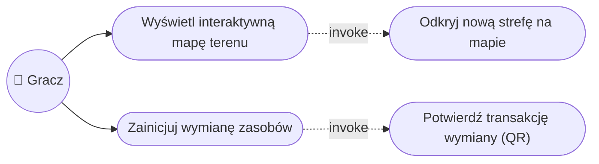
```mermaid
flowchart LR
    Gracz(("👤 Gracz"))

    u1(["Wyświetl interaktywną mapę terenu"])
    u2(["Odkryj nową strefę na mapie"])
    u3(["Zainicjuj wymianę zasobów"])
    u4(["Potwierdź transakcję wymiany (QR)"])

    Gracz --> u1
    Gracz --> u3

    u1 -.->|invoke| u2
    u3 -.->|invoke| u4
```

#### PU35: Wyświetlenie interaktywnej mapy terenu

- Wersja: 1.0 (15.04.2026)
- Odpowiedzialny: Kacper Koziara
- Wydanie: 1.0
- Opis: System wyświetla ekran z mapą układu pomieszczeń (komnat). Mapa dynamicznie dostosowuje się do uprawnień posiadanych przez postać, prezentując graczowi ogólny zarys terenu i szczegóły dostępnych dla niego lokacji.

#### PU36: Odkrycie nowej strefy na mapie

- Wersja: 1.0 (15.04.2026)
- Odpowiedzialny: Kacper Koziara
- Wydanie: 1.0
- Opis: Invoked by PU35. Po uzyskaniu odpowiedniego uprawnienia (np. zdobycie fizycznego klucza, przedmiotu questowego lub zeskanowaniu kodu QR strefy), system odblokowuje przed graczem wcześniej niedostępną lub ukrytą część mapy.

#### PU37: Zainicjowanie wymiany zasobów

- Wersja: 1.0 (15.04.2026)
- Odpowiedzialny: Kacper Koziara
- Wydanie: 1.0
- Opis: Gracz wybiera w module handlu przedmioty lub wirtualną walutę ze swojego ekwipunku, które chce przekazać innemu graczowi. System generuje na ekranie jego urządzenia unikalny, jednorazowy kod QR reprezentujący tę ofertę.

#### PU38: Potwierdzenie transakcji wymiany (QR)

- Wersja: 1.0 (15.04.2026)
- Odpowiedzialny: Kacper Koziara
- Wydanie: 1.0
- Opis: Invoked by PU37. Drugi gracz przy użyciu swojej aplikacji skanuje kod QR z ekranu inicjatora. System wyświetla podsumowanie, a po obustronnej akceptacji aktualizuje stany ekwipunków obu postaci i zapisuje transakcję w logach.

---

## 4.1.6 Zarządzanie wydarzeniami przez organizatora

DIAGRAM:

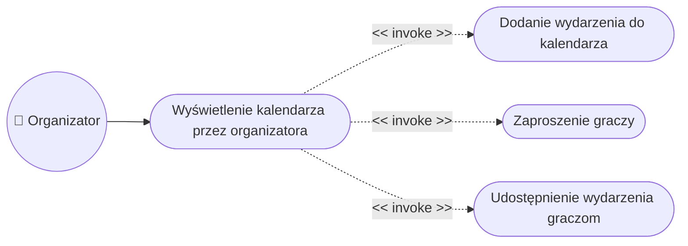
```mermaid
flowchart LR
    User(("👤 Organizator"))
    A(["Dodanie wydarzenia do kalendarza"])
    B(["Zaproszenie graczy"])
    C(["Udostępnienie wydarzenia graczom"])
    D(["Wyświetlenie kalendarza przez organizatora"])

    User-->D
    D-.->|<< invoke >>|A
    D-.->|<< invoke >>|B
    D-.->|<< invoke >>|C
```

#### PU39: Dodanie wydarzenia do kalendarza

- Wersja: 1.0 (15.04.2026)
- Odpowiedzialny: Olaf Smoleński
- Wydanie: 1.0
- Opis: Organizator dodaje wydarzenie do kalendarza. Przy dodawaniu musi podać najważniejsze informacje na temat wydarzenia - nazwę i ewentualny opis, datę i godzinę, miejsce, maksymalną liczbę graczy oraz wymagania dotyczące postaci. Po dodaniu wydarzenie jest widoczne w kalendarzu dla każdego użytkownika systemu.

#### PU40: Zaproszenie graczy

- Wersja: 1.0 (15.04.2026)
- Odpowiedzialny: Olaf Smoleński
- Wydanie: 1.0
- Opis: Invoked by PU47. Organizator wysyła graczom zaproszenia na wydarzenie. Organizator może wybrać graczy, którym wyśle zaproszenie, klikając przycisk _Zaproś graczy_ po wyświetleniu kalendarza. Po jego kliknięciu pokazuje się lista zarejestrowanych graczy, spośród których organizator wybiera poszczególne osoby i klika przycisk _Wyślij zaproszenie_. Zaproszony gracz otrzymuje powiadomienie o zaproszeniu na wydarzenie.

#### PU41: Udostępnienie wydarzenia graczom

- Wersja: 1.0 (15.04.2026)
- Odpowiedzialny: Olaf Smoleński
- Wydanie: 1.0
- Opis: Invoked by PU39. Organizator, klikając przycisk _Udostępnij dla graczy_ w menu wydarzenia, otwiera graczom możliwość zapisania się na dane wydarzenie. Gracz będzie mógł dokonać zapisu, jeżeli są jeszcze wolne miejsca na wydarzenie.

---

### 4.1.7 Rejestracja i zapis przed wydarzeniem

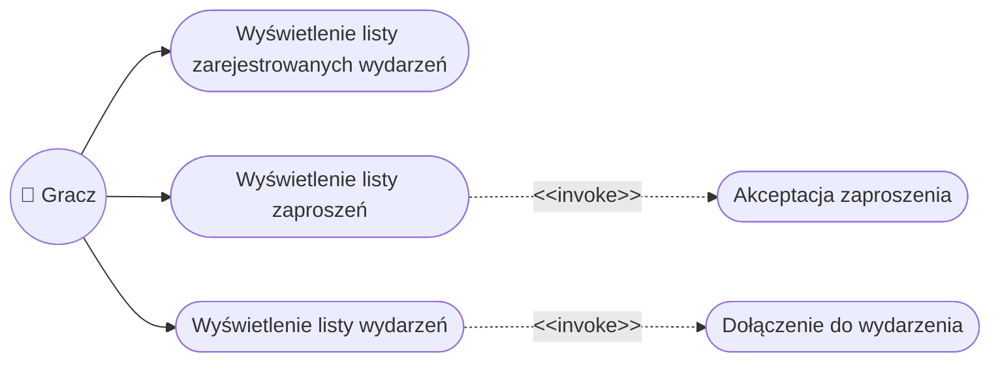
```mermaid
flowchart LR

G(("👤 Gracz"))

SRG(["Wyświetlenie listy zarejestrowanych wydarzeń"])
JG(["Dołączenie do wydarzenia"])
SIL(["Wyświetlenie listy zaproszeń"])
AI(["Akceptacja zaproszenia"])
SEL(["Wyświetlenie listy wydarzeń"])

G --> SRG
G --> SIL
G --> SEL

SEL -..->|&lt;&lt;invoke&gt;&gt;| JG
SIL -..->|&lt;&lt;invoke&gt;&gt;| AI


```

#### PU42: Wyświetlenie listy wydarzeń

- Wersja: 1.0 (14.04.2026)
- Odpowiedzialny: Michał Marciniak
- Priorytet i trudność: Kluczowe
- Wydanie: 1.0
- **Opis:** System wyświetla listę wydarzeń. Gracz określa filtry wydarzeń. System wyświetla wydarzenia spełniające dane kryteria.

#### PU43: Wyświetlenie listy zaproszeń

- Wersja: 1.0 (14.04.2026)
- Odpowiedzialny: Michał Marciniak
- Priorytet i trudność: Istotne
- Wydanie: 1.0
- **Opis:** System wyświetla listę otrzymanych zaproszeń gracza na wydarzenie, które nie zostały jeszcze rozpatrzone.

#### PU44: Akceptacja zaproszenia

- Wersja: 1.0 (14.04.2026)
- Odpowiedzialny: Michał Marciniak
- Priorytet i trudność: Istotne
- Wydanie: 1.0
- **Opis:** Gracz wybiera zaproszenie do akceptacji. System sprawdza dostępność miejsc. W przypadku wolnych miejsc, system dodaje gracza do listy zarejestrowanych i usuwa zaproszenie z listy. W przeciwnym razie, system informuje o braku miejsc.

#### PU45: Wyświetlenie listy zarejestrowanych wydarzeń

- Wersja: 1.0 (14.04.2026)
- Odpowiedzialny: Michał Marciniak
- Priorytet i trudność: Kluczowe
- Wydanie: 1.0
- **Opis:** Gracz wybiera wgląd w swoje rejestracje. System wyświetla wydarzenia, na które gracz jest zarejestrowany.

#### PU46: Dołączenie do wydarzenia

- Wersja: 1.0 (14.04.2026)
- Odpowiedzialny: Michał Marciniak
- Priorytet i trudność: Kluczowe
- Wydanie: 1.0
- **Opis:** Gracz wybiera zarejestrowane wydarzenie i deklaruje chęć dołączenia. System sprawdza status wydarzenia i rejestruje obecność gracza.

### 4.1.8 Zarządzanie organizacją wydarzeń

DIAGRAM:

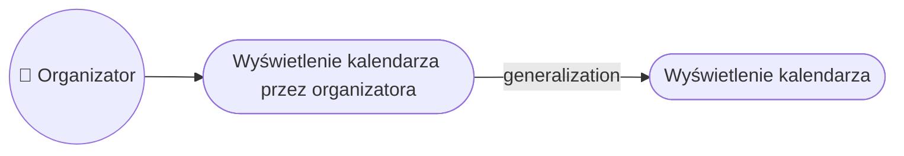
```mermaid
flowchart LR

o(("👤 Organizator"))

uco(["Wyświetlenie kalendarza przez organizatora"])
uc(["Wyświetlenie kalendarza"])

o --> uco

uco --generalization--> uc
```

#### PU47: Wyświetlenie kalendarza przez organizatora

- Wersja: 1.0(14.04.2026)
- Odpowiedzialna: Alicja Rosiak
- Wydanie: 1.0
- Opis: System wyświetla kalendarz wydarzeń organizatora. Organizator widzi
  nadchodzące wydarzenia oraz wolne terminy.

### 4.1.9 Zapisy na wydarzenia

DIAGRAM:

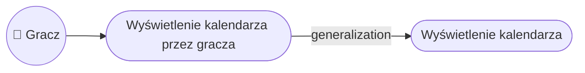
```mermaid
flowchart LR

g(("👤 Gracz"))

ucg(["Wyświetlenie kalendarza przez gracza"])
uc(["Wyświetlenie kalendarza"])

g --> ucg

ucg --generalization--> uc
```

#### PU48: Wyświetlenie kalendarza przez gracza

- Wersja: 1.0(14.04.2026)
- Odpowiedzialna: Alicja Rosiak
- Wydanie: 1.0
- Opis: System wyświetla kalendarz wydarzeń gracza. Gracz widzi dostępne
  wydarzenia, wydarzenia w których bierze udział.

### 4.1.10 Projektowanie świata gry

DIAGRAM:

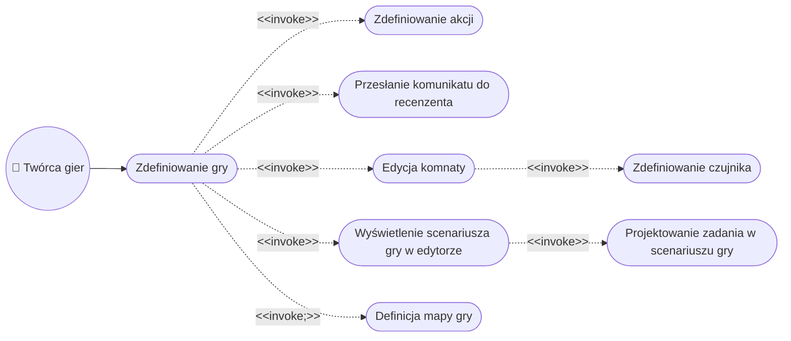
```mermaid
flowchart LR

%% ===== AKTORZY =====
TG(("👤 Twórca gier"))


%% ===== FUNKCJE TWORCY =====
GDF(["Zdefiniowanie gry"])
ADF(["Zdefiniowanie akcji"])
SCR(["Przesłanie komunikatu do recenzenta"])
KED(["Edycja komnaty"])
SEDF(["Zdefiniowanie czujnika"])
DGSCE(["Wyświetlenie scenariusza gry w edytorze"])
TPGS(["Projektowanie zadania w scenariuszu gry"])
DFMP(["Definicja mapy gry"])

%% ===== RELACJE =====
TG --> GDF
GDF -. "&lt;&lt;invoke&gt;&gt;" .-> ADF
GDF -. "&lt;&lt;invoke&gt;&gt;" .-> SCR
GDF -. "&lt;&lt;invoke&gt;&gt;" .-> KED
KED -. <&ltinvoke>> .-> SEDF
GDF -. "&lt;&lt;invoke&gt;&gt;" .-> DGSCE
DGSCE -. "&lt;&lt;invoke&gt;&gt;" .-> TPGS
GDF -. "&lt;&lt;invoke;&gt&gt;" .-> DFMP
```

#### PU49: Zdefiniowanie gry

- Wersja: 1.0 (08.04.2026)
- Odpowiedzialny: Igor Ochocki
- Priorytet i trudność: Istotne
- Wydanie: 1.0
- **Opis:** System wyświetla formularz [opisu ogólnego gry]. Twórca gry wprowadza [dane opisu ogólnego gry] do formularza. Twórca gry może dodać [pozostałe elementy gry]. Twórca gry wciska przycisk zapisz. System zamyka formularz [opisu ogólnego gry] i wyświetla informację o poprawnym zapisie.

#### PU50: Zdefiniowanie czujnika

- Wersja: 1.1 (24.04.2026)
- Odpowiedzialna: Alicja Rosiak
- Wydanie: 1.0
- **Opis:** System wyświetla [formularz definicji czujnika]. Twórca wybiera
  umiejscowienie [czujnika] na [mapie]. Następnie wybiera [akcję]
  z [listy akcji]. Po zakończeniu twórca zapisuje zmiany. System zamyka
  [formularz definicji czujnika].

#### PU51: Zdefiniowanie akcji

- Wersja: 1.0 (08.04.2026)
- Odpowiedzialny: Igor Ochocki
- Priorytet i trudność: Kluczowe
- Wydanie: 1.0
- **Opis:** System wyświetla formularz [definicji akcji]. Twórca gry wybiera [typ akcji], a następnie uzupełnia [skutki akcji]. Na koniec twórca gry wciska przycisk `zapisz i zamknij`. System zamyka formularz [definicji akcji].

#### PU52: Przesłanie komunikatu do recenzenta

- Wersja: 1.0 (08.04.2026)
- Odpowiedzialny: Igor Ochocki
- Priorytet i trudność: Istotne
- Wydanie: 1.0
- **Opis:** Twórca gry wprowadza treść [komunikatu do recenzenta] a następnie klika wyślij. System wyświetla informację o potwierdzeniu przesłania komunikatu i dodaje ją do [okna komunikacji twórcy gry z recenzentem].

#### PU56: Wyświetlenie scenariusza gry w edytorze

- Wersja: 1.0 (29.04.2026)
- Odpowiedzialny: Igor Ochocki
- Priorytet i trudność: Istotne
- Wydanie: 1.0
- Aktor główny: Projektant gier
- **Opis:** Projektant wybiera istniejącą grę lub scenariusz i otwiera go w module edycji. System wczytuje zapis scenariusza z bazy i prezentuje widok edytora (struktura scenariusza, m.in. lista zadań, warunków zwycięstwa i metadane - szczegóły UI w scenopisie). Ten przypadek **poprzedza** projektowanie nowych zadań (**PU57**) i warunków zwycięstwa (**PU58**): operacje te mają miejsce dopiero przy już wyświetlonym w edytorze scenariuszu.

#### PU57: Projektowanie zadania w scenariuszu gry

- Wersja: 1.0 (29.04.2026)
- Odpowiedzialny: Igor Ochocki
- Priorytet i trudność: Istotne (zgodnie z F28)
- Wydanie: 1.0
- Aktor główny: Twórca gier
- **Opis:** Przy aktywnym widoku edytora scenariusza twórca dodaje nowe zadanie fabularne: wypełnia formularz z [danymi zadania]. System waliduje dane, zapisuje zadanie w strukturze scenariusza i informuje o powodzeniu; przy błędach lub konfliktach prezentuje odpowiednie komunikaty.

Powiązanie z wymaganiami funkcjonalnymi: **F28**.

#### PU59: Edycja komnaty

- Wersja: 1.0 (22.04.2026)
- Odpowiedzialny: Maciej Bankiewicz
- Priorytet i trudność: Istotne
- Wydanie: 1.0
- **Opis:** Twórca gry przechodzi do edycji wybranej [komnaty]. System pobiera [dane komnaty] i udostępnia formularz edycyjny. Po wprowadzeniu modyfikacji i zleceniu zapisu, system weryfikuje poprawność [danych]. Jeżeli [dane] są poprawne, system aktualizuje [komnatę]. W przypadku wystąpienia błędów, system wyświetla komunikat o błędzie, a zmiany nie zostają zapisane.

#### PU60: Definicja mapy gry
- Wersja 1.0 (21.05.2026)
- Odpowiedzialny: Łukasz Czajka
- Priorytet i trudność: Istotne
- Wydanie: 1.0
- **Opis** Twórca gry w trybie edycji [mapy gry], definiuje obszar zajmowany przez [komnaty] i [przejścia]. Zmiany są zapisywane na bierząco lokalnie, a następnie po udanej weryfikacji poprawności, zapisywane przez system. W przypadku błędu zapisu syem informuje użytkownika o błędzie.

---

**Diagram:** Funkcje recenzenta

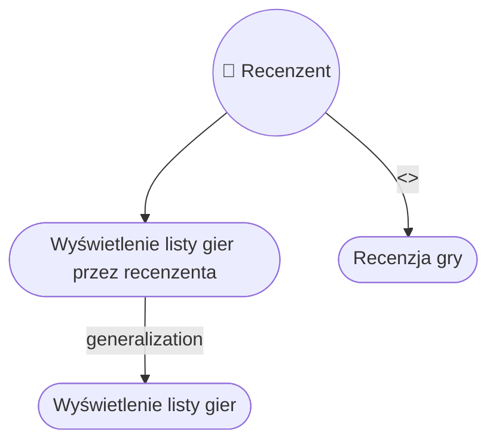
```mermaid
flowchart TB
 A(("👤 Recenzent")) --> n1(["Wyświetlenie listy gier przez recenzenta"]) -->|generalization| n2(["Wyświetlenie listy gier"])
 A -->|<<invoke>>| n3(["Recenzja gry"])
```

#### PU53: Wyświetlenie listy gier

- Wersja: 1.0 (14.04.2026)
- Odpowiedzialny: Maciej Bankiewicz
- Priorytet i trudność: Istotne
- Wydanie: 1.0
- **Opis:** System wyświetla listę zawierającą wszystkie stworzone uprzednio [Gry].

---

#### PU54: Wyświetlenie listy gier przez recenzenta

- Wersja: 1.0 (14.04.2026)
- Odpowiedzialny: Maciej Bankiewicz
- Priorytet i trudność: Istotne
- Wydanie: 1.0
- **Opis:** System wyświetla listę zawierającą wszystkie stworzone uprzednio [Gry] dodając do każdego rekordu opcję [Recenzji] [Gry].

---

#### PU55: Recenzja gry

- Wersja: 1.0 (14.04.2026)
- Odpowiedzialny: Maciej Bankiewicz
- Priorytet i trudność: Istotne
- Wydanie: 1.0
- **Opis:** System wyświetla okno do zapisu tekstu. [Recenzent] zapisuje [Recenzję] i zatwierdza ją.

#### PU58: Definiowanie warunków zwycięstwa w scenariuszu gry

- Wersja: 1.0 (05.05.2026)
- Odpowiedzialny: Tomasz Rogalski
- Priorytet i trudność: Istotne
- Wydanie: 1.0
- Aktor główny: Projektant gier
- **Opis:** Przy aktywnym widoku edytora scenariusza projektant wybiera opcję zdefiniowania warunków zwycięstwa. System wyświetla formularz definiowania warunków zwycięstwa, gdzie możliwe jest określenie ich parametrów. Po zatwierdzeniu formularza i pomyślnej walidacji po stronie systemu, warunki są zapisywane w strukturze scenariusza. Szczegóły scenariusza krok po kroku: rozdział 5.

Powiązanie z wymaganiami funkcjonalnymi: **F23**.

# 5. Scenariusze i scenopisy

## 5.1 [PU51: Zdefiniowanie akcji](#pu51-zdefiniowanie-akcji)

- Wersja 1.0
- Odpowiedzialna: Karolina Wiśniewska
- Aktor Główny: Twórca Gry
  Warunek początkowy: Twórca gry zalogowany, znajduje się w trybie definicji gry

Scenariusz Główny:

1. Twórca wybiera dodanie akcji
2. System wyświetla formularz dodania akcji
3. Twórca wprowadza dane akcji
4. Twórca wybiera przycisk zapisania akcji
5. System weryfikuje poprawność danych akcji
6. System zapisuje akcję
7. System weryfikuje powodzenie zapisania akcji
8. System wyświetla informacje o sukcesie
9. System zamyka formularz
   Warunek końcowy: Dodanie nowej akcji zakończone powodzeniem

Scenariusz Alternatywny A:

6a. System wykrył niepełne dane akcji przy dodaniu 7. System wyświetla informcje o nieuzupełnieniu danych przez twórcę gry 8. Scenariusz wraca do kroku 3 scenariusza głównego

Scenariusz Alternatywny B:

7a. System nie zapisał akcji 7. System wyświetla informację o błędzie zapisu 8. Scenariusz wraca do kroku 3 scenariusza głównego

## 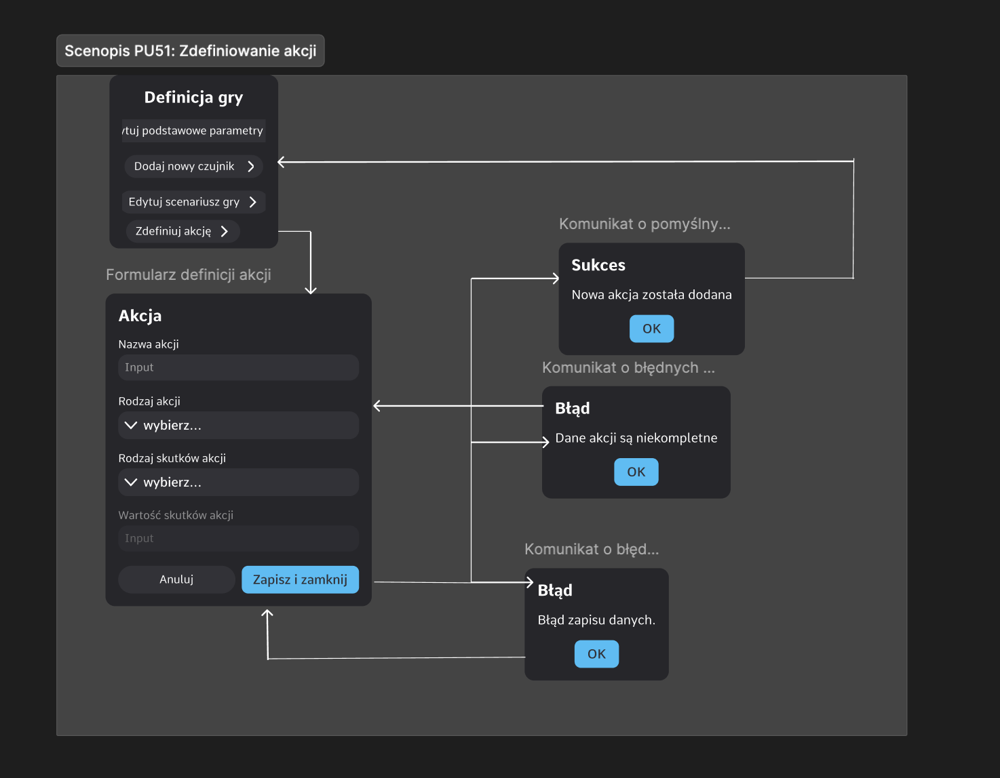

## 5.2 [PU57: Projektowanie zadania w scenariuszu gry](#pu57-projektowanie-zadania-w-scenariuszu-gry)

- Wersja: 1.0 (29.04.2026)
- Odpowiedzialny: Igor Ochocki
- Wydanie: 1.0
- Aktor główny: Projektant gier
- **Związek z [PU56: Wyświetlenie scenariusza gry w edytorze](#pu56-wyświetlenie-scenariusza-gry-w-edytorze):** Przypadek **PU57** realizuje się **po** otwarciu scenariusza w edytorze (PU56).
- Warunek początkowy: Projektant jest zalogowany; w edytorze wyświetlony jest scenariusz gry zgodnie z **[PU56](#pu56-wyświetlenie-scenariusza-gry-w-edytorze)**.

**Scenariusz główny (sukces)**

1. Projektant wybiera [opcję dodania zadania].
2. System wyświetla [formularz definicji zadania].
3. Projektant wprowadza [dane zadania].
4. System waliduje dane.

[dane poprawne]

5. System zapisuje [zadanie].
6. System wyświetla [potwierdzenie zapisu].

**Warunek końcowy:** Nowe zadanie jest dostępne w strukturze scenariusza gry.

**final:** success

---

**Scenariusz alternatywny 1: Dane niepoprawne - brak wymaganych pól**

1.-4. Jak w scenariuszu głównym.

[dane niepoprawne - [brak wymaganych pól]]

5a. System wyświetla [komunikat o błędach].

6a. Scenariusz wraca do kroku 3 scenariusza głównego.

**final:** failure (brak zapisu)

---

**Scenariusz alternatywny 2: Dane niepoprawne - konflikt powiązań**

1.-4. Jak w scenariuszu głównym.

[dane niepoprawne - [konflikt powiązań]]

5b. System wyświetla [ostrzeżenie o konflikcie powiązań].

6b. Projektant wybiera [inny obiekt interakcji].

7b. Scenariusz wraca do kroku 3 scenariusza głównego.

**final:** failure (brak zapisu)

---

**Scenariusz alternatywny 3: Anulowanie zapisu**

1–2. Tak jak w scenariuszu głównym.

3c. Projektant wybiera [opcję anuluj].

4c. System wyświetla [zapytanie o porzucenie zmian].

5c. Projektant potwierdza [wyjście bez zapisu].

6c. System zamyka [formularz definicji zadania].

**Warunek końcowy:** Struktura scenariusza gry nie uległa zmianie.

**Scenopis**
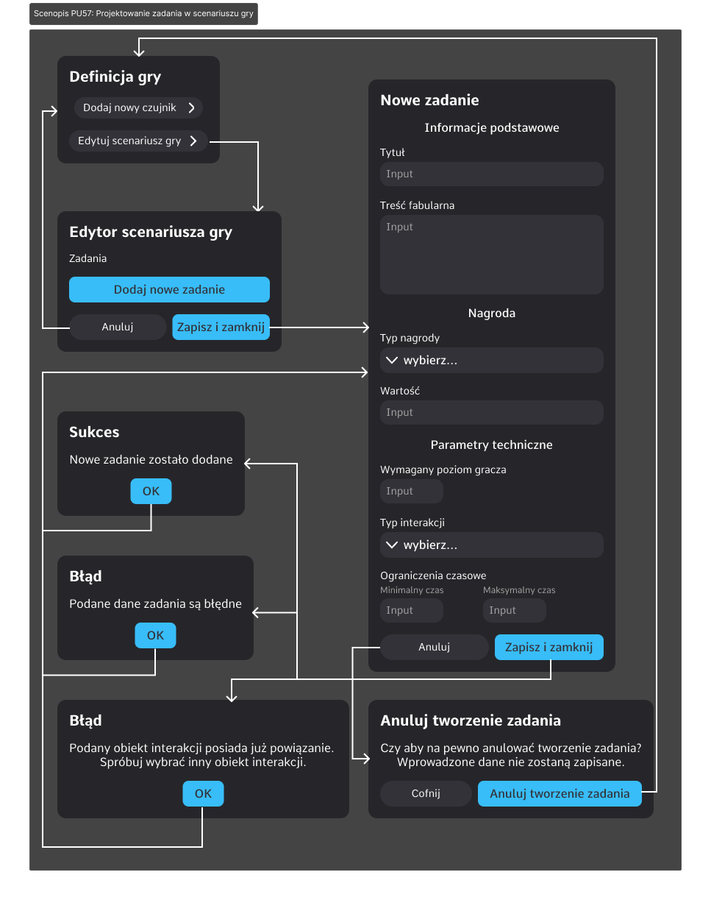

---

## 5.3 [PU52: Przesłanie komunikatu do recenzenta](#pu52-przeslanie-komunikatu-do-recenzenta)

- Wersja 1.0 (29.04.2026)
- Odpowiedzialny: Michał Marciniak
- Wydanie: 1.0
- Aktor główny: Twórca gry
- Wywoływany z: [PU49: Zdefiniowanie gry](#pu49-zdefiniowanie-gry)
- Warunek początkowy: Twórca gry jest zalogowany i znajduje się w formularzu opisu ogólnego gry.
- Warunek końcowy (success): Komunikat do recenzenta został wysłany i jest widoczny w oknie komunikacji twórcy gry z recenzentem.
- Warunek końcowy (failure): Komunikat do recenzenta nie został wysłany, treść pozostaje w polu edycji.

**Scenariusz główny**
1. Twórca gry wybiera [opcję przesłania komunikatu do recenzenta].
2. System wyświetla [okno komunikacji twórcy gry z recenzentem].
3. Twórca gry wpisuje [komunikat do recenzenta].
4. Twórca gry wybiera [opcję wysłania].
5. System waliduje dane. \
[komunikat do recenzenta poprawny]
6. System wysyła komunikat do recenzenta.
7. System dodaje wiadomość do okna komunikacji twórcy gry z recenzentem.

**final:** success

**POST:** Komunikat do recenzenta został wysłany i jest widoczny w oknie komunikacji twórcy gry z recenzentem.

**Scenariusz alternatywny A: Pusty komunikat**

1-5. Jak w scenariuszu głównym. \
[komunikat do recenzenta pusty] \
6a. System wyświetla [komunikat o braku danych].

Powrót do kroku 3. w scenariuszu głównym

**final:** failure

**POST:** Komunikat do recenzenta nie został wysłany.

**Scenariusz alternatywny B: Przekroczenie limitu znaków**

1-5. Jak w scenariuszu głównym. \
[komunikat do recenzenta zbyt długi] \
6b. System wyświetla [komunikat o przekroczeniu limitu znaków].

Powrót do kroku 3. w scenariuszu głównym

**final:** failure

**POST:** Komunikat do recenzenta nie został wysłany, treść pozostaje w polu edycji.

**Scenariusz alternatywny C: Błąd połączenia**

1-5. Jak w scenariuszu głównym. \
[błąd połączenia / brak odpowiedzi serwera] \
6c. System wyświetla [komunikat o błędzie wysłania].

Powrót do kroku 3. w scenariuszu głównym

**final:** failure

**POST:** Komunikat do recenzenta nie został wysłany, treść pozostaje w polu edycji.

**Scenopis**
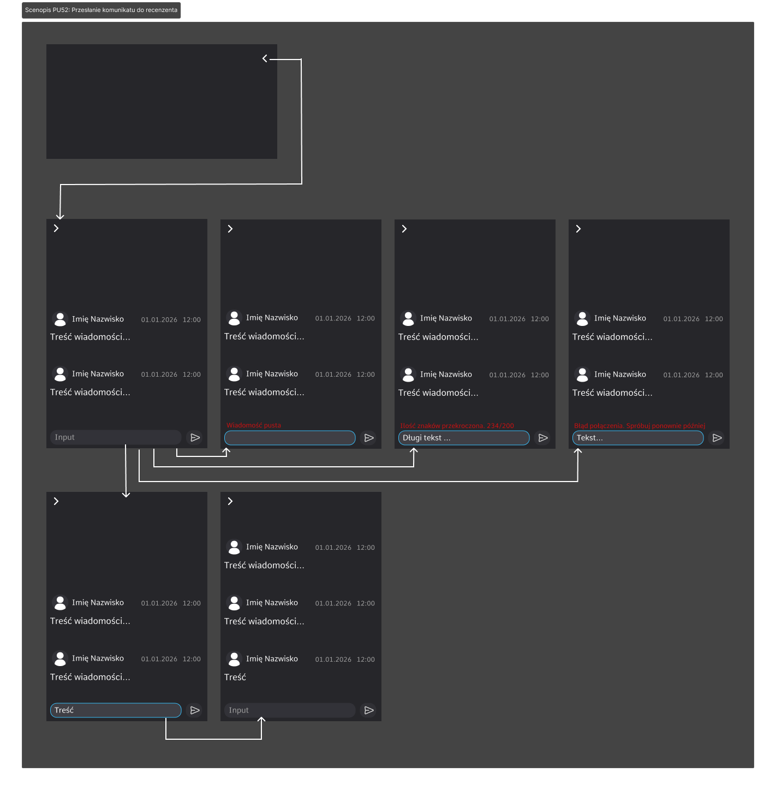

---

## 5.4 [PU53: Wyświetlenie listy gier](#pu53-wyświetlenie-listy-gier)

- Wersja: 1.1 (06.05.2026)
- Odpowiedzialny: Kacper Koziara
- Wydanie: 1.0
- Aktor główny: [Użytkownik]
- Warunek początkowy: [Użytkownik] posiada aktywną [Sesję] i znajduje się na ekranie umożliwiającym nawigację do listy gier.
- Warunek końcowy (sukces): System wyświetla [Użytkownikowi] posortowaną i przefiltrowaną listę [Gier].

**Scenariusz główny**

1. [Użytkownik] wybiera opcję przeglądania listy [Gier].
2. System weryfikuje ważność [Sesji] [Użytkownika].
3. System pobiera i wyświetla domyślną listę [Gier] oraz opcje filtrowania.
4. [Użytkownik] wprowadza kryteria wyszukiwania i filtrowania.
5. System pobiera dane i aktualizuje listę, wyświetlając tylko te [Gry], które spełniają wprowadzone kryteria.
6. [Użytkownik] wybiera opcję wyświetlenia kolejnych wyników.
7. System pobiera i dołącza kolejne [Gry] do wyświetlanej listy, zachowując wybrane filtry.

**Scenariusz alternatywny A: Brak wyników (Pusta lista po filtrach)**

1.-4. Jak w scenariuszu głównym.
[brak wyników]
5a. System nie znajduje [Gier] spełniających wybrane kryteria.
6a. System wyświetla komunikat o braku wyników oraz udostępnia opcję wyczyszczenia filtrów.
7a. [Użytkownik] wybiera opcję wyczyszczenia filtrów.
8a. System resetuje kryteria wyszukiwania.

Powrót do kroku 3 w scenariuszu głównym.

**Scenariusz alternatywny B: Błąd pobierania danych**

1.-2. tak jak w scenariuszu głównym.
[błąd po stronie serwera]
3b. System napotyka problem z pobraniem danych [Gier].
4b. System wyświetla komunikat o błędzie oraz udostępnia opcję ponowienia próby.
5b. [Użytkownik] wybiera opcję ponowienia próby.

Powrót do kroku 3 w scenariuszu głównym.

**Scenariusz alternatywny C: Awaria łączności po stronie klienta**

1.-4. Jak w scenariuszu głównym.
[brak połączenia z siecią]
5c. System wykrywa brak połączenia z siecią podczas próby aktualizacji listy.
6c. System wstrzymuje aktualizację, zachowuje dotychczasowy widok listy [Gier] i wyświetla komunikat o braku połączenia.
7c. System wykrywa przywrócenie połączenia sieciowego i ukrywa komunikat o błędzie.

Powrót do kroku 5 w scenariuszu głównym.

**Scenariusz alternatywny D: Wygaśnięcie sesji**

(W dowolnym momencie po kroku 3)
1d. System wykrywa, że [Sesja] [Użytkownika] wygasła z powodu braku aktywności.
2d. System tymczasowo zapisuje wybrane przez [Użytkownika] filtry wyszukiwania.
3d. System wyświetla komunikat o wygaśnięciu [Sesji] i wylogowuje [Użytkownika].
4d. [Użytkownik] pomyślnie loguje się do systemu (wywołanie [PU14: Logowanie]).
5d. System przywraca zapisane filtry.

Powrót do kroku 5 w scenariuszu głównym.

**Scenopis:**
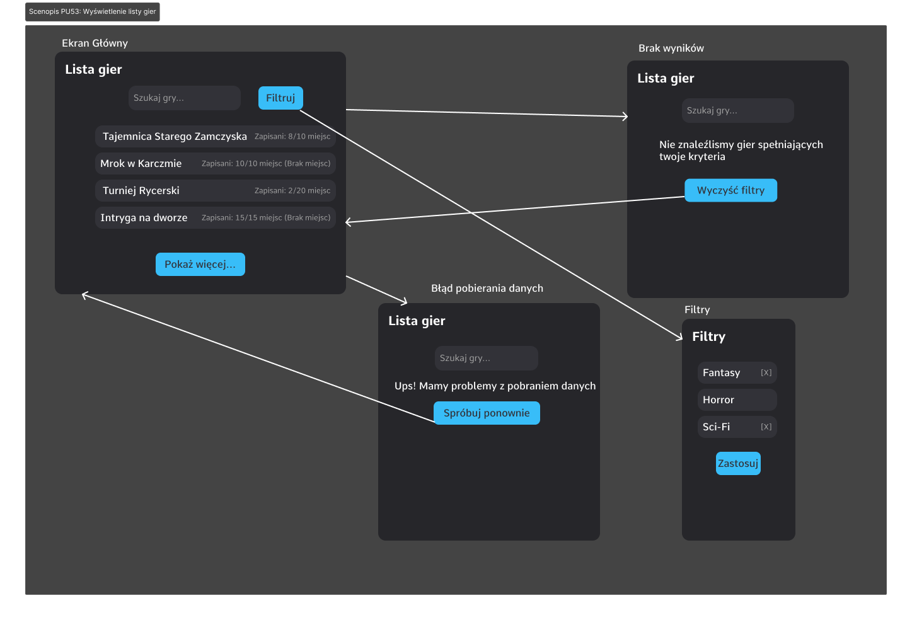

## 5.5 [PU58: Definiowanie warunków zwycięstwa w scenariuszu gry](#pu58-definiowanie-warunków-zwycięstwa-w-scenariuszu-gry)

- Wersja: 1.0 (05.05.2026)
- Odpowiedzialny: Tomasz Rogalski
- Wydanie: 1.0
- Aktor główny: Projektant gier
- **Związek z [PU56: Wyświetlenie scenariusza gry w edytorze](#pu56-wyświetlenie-scenariusza-gry-w-edytorze):** Przypadek **PU58** realizuje się **po** otwarciu scenariusza w edytorze (PU56). Punkt wyjścia stanowi krok 3 scenariusza PU56 (widok edytora aktywny).
- Warunek początkowy: Projektant gier jest zalogowany w aplikacji i znajduje się w panelu edycji wybranego scenariusza gry.
- Warunek końcowy (sukces): Warunki zwycięstwa dla graczy lub frakcji zostały pomyślnie zdefiniowane i zapisane w strukturze scenariusza.

**Scenariusz główny**

1. System wyświetla formularz definiowania warunków zwycięstwa.
2. Projektant wprowadza dane warunku zwycięstwa.
3. System waliduje poprawność dodanego warunku zwycięstwa.
   [dane poprawne]
4. System wyświetla potwierdzenie poprawnego zdefiniowania warunku zwycięstwa na podglądzie scenariusza.

**Scenariusz alternatywny 1: Błędne lub niekompletne wartości w formularzu**

1.-3. tak jak w scenariuszu głównym  
[dane niepoprawne]  
4a. System wyświetla komunikat o błędnych danych.  
Powrót do zdania 2. w scenariuszu głównym.

**Scenariusz alternatywny 2: Logiczna sprzeczność warunków gry**

1.-3. tak jak w scenariuszu głównym  
[konflikt warunków]  
4b. System wyświetla komunikat o sprzeczności z istniejącymi warunkami.  
Powrót do zdania 2. w scenariuszu głównym.

**Scenopis:**
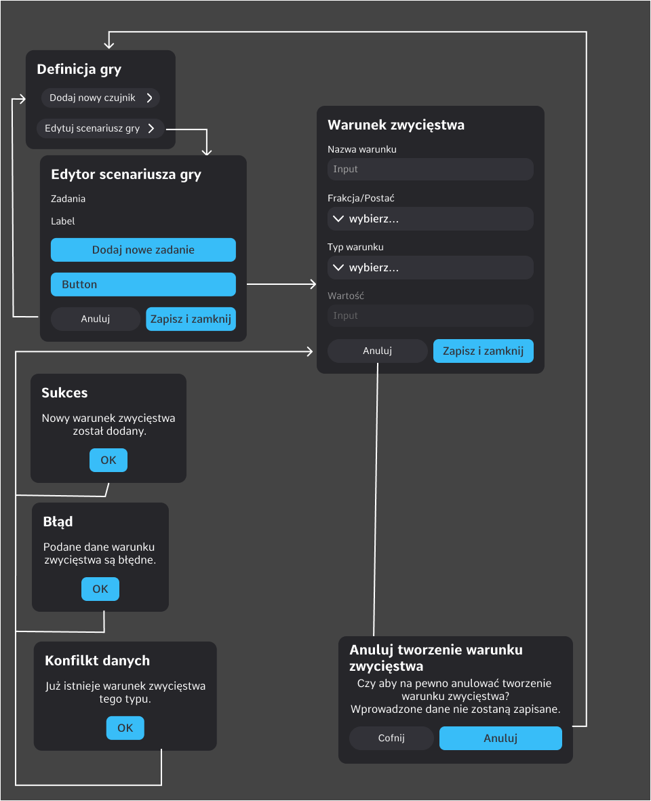

## 5.6 [PU55: Recenzja gry](#recenzja)

- Wersja: 1.1 (06.05.2026)
- Odpowiedzialna: Polina Nesterova
- Wydanie: 1.0
- Aktor główny: Recenzent gry
- Warunek początkowy: Recenzent jest zalogowany w systemie, posiada uprawnienia recenzenta i znajduje się na liście gier wyświetlonej w ramach [PU29: Wyświetlenie listy gier przez recenzenta](#pu29-wyświetlenie-listy-gier-przez-recenzenta).
- Warunek końcowy (sukces): Recenzja została zapisana i powiązana z wybraną grą oraz kontem recenzenta.

**Scenariusz główny**

1. Recenzent wybiera opcję recenzji wybranej gry.
2. System wyświetla okno recenzji.
3. Recenzent wprowadza treść recenzji.
4. Recenzent wysyła recenzję.
5. System waliduje recenzję.

[recenzja poprawna]

6. System zapisuje recenzję.
7. System aktualizuje [Status recenzji].
8. System wyświetla potwierdzenie wysłania.
`<<invoke>>` Przesłanie komunikatu do twórcy
9. Recenzent zamyka potwierdzenie.
10. System przekierowuje recenzenta do listy gier.

**final:** success
**POST:** recenzja została zapisana i powiązana z grą oraz kontem recenzenta.

---

**Scenariusz alternatywny A: Zapisanie szkicu recenzji**

1.-3. tak jak w scenariuszu głównym.

4a. Recenzent zapisuje szkic [Recenzji].
5a. System zapisuje szkic [Recenzji].
6a. System wyświetla potwierdzenie zapisu szkicu.
7a. System przekierowuje recenzenta do listy gier.

**final:** success
**POST:** szkic [Recenzji] został zapisany i powiązany z kontem recenzenta.

---

**Scenariusz alternatywny B: Puste pola formularza recenzji**

1.-4. Jak w scenariuszu głównym.

[pola formularza puste]

5b. System wyświetla komunikat o konieczności wypełnienia pól.
6b. System nie zapisuje recenzji.

Powrót do kroku 3 scenariusza głównego.

---

**Scenariusz alternatywny C: Anulowanie recenzji**

1.-2. tak jak w scenariuszu głównym.

3a. Recenzent anuluje recenzję.
4a. System wyświetla prośbę o potwierdzenie.
5a. Recenzent potwierdza anulowanie.
6a. System porzuca dane recenzji.
7a. System przekierowuje recenzenta do listy gier.

**final:** failure
**POST:** recenzja nie została zapisana w systemie.

---

**Scenariusz alternatywny D: Recenzent już zrecenzował tę grę**

1a. System wykrywa istniejącą recenzję dla wybranej gry.
2a. System wyświetla komunikat o istniejącej recenzji.
3a. System oferuje edycję istniejącej recenzji.
4a. Recenzent wybiera edycję recenzji.

[edycja wybrana]

5a. System wczytuje istniejącą recenzję.

Powrót do kroku 3 scenariusza głównego.

---

**Scenariusz alternatywny E: Anulowanie edycji istniejącej recenzji**

1a.-4a. tak jak w scenariuszu alternatywnym D.

[anulowanie wybrane]

5b. System przekierowuje recenzenta do listy gier.

**final:** failure
**POST:** nowa recenzja nie została utworzona; istniejąca recenzja pozostaje bez zmian.

---

**Scenariusz alternatywny F: Błąd zapisu recenzji**

1.-5. tak jak w scenariuszu głównym.

[błąd zapisu]

6c. System zgłasza błąd zapisu.
7c. System wyświetla komunikat o błędzie.

Powrót do kroku 4 scenariusza głównego.

**Scenopis**
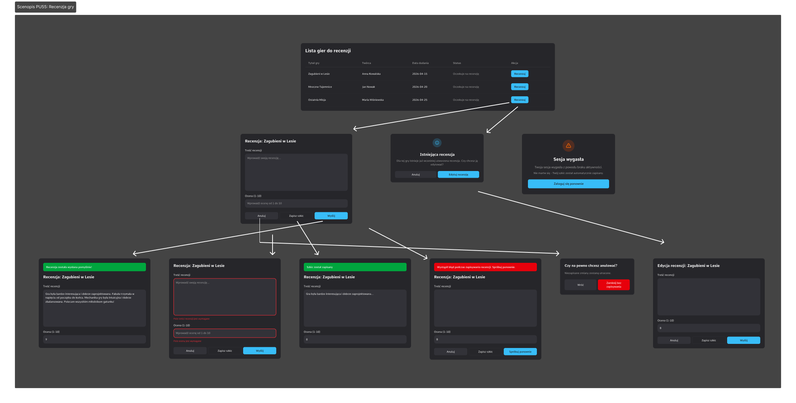

---

## 5.7 [PU50: Zdefiniowanie czujnika](#pu50-zdefiniowanie-czujnika)

- Wersja: 1.2 (20.05.2026)
- Odpowiedzialna: Alicja Rosiak
- Wydanie: 1.0
- Aktor główny: Twórca gry
- Warunek początkowy: Twórca gry jest zalogowany
  i jest w menu edycji komnaty
  i conajmniej jedna akcja została zdefiniowana dla danej gry
  i mapa gry została została zdefiniowana dla danej gry

**Scenariusz główny**

1. Twórca wybiera opcję dodania nowego czujnika.
2. System wyświetla formularz definicji czujnika.
3. Twórca wybiera opcję wybrania pozycji czujnika.
4. System wyświetla okno podglądu mapy.
5. Twórca wybiera pozycję nowego czujnika.
6. System zamyka okno podglądu mapy.
7. Twórca uzupełnia pozostałe dane czujnika.
8. Twórca wybiera opcję zapisu i zamknięcia formularza.  
   [dane poprawne]
9. System zapisuje nowy czujnik.  
   [zapis pomyślny]
10. System wyświetla komunikat o pomyślnym dodaniu czujnika.

Warunek końcowy: nowy czujnik jest zarejestrowany dla danej gry

**Scenariusz alternatywny 1**

1.-8. jak w Scenariuszu głównym  
[dane niepoprawne]  
9a. System wyświetla komunikat o błędnych danych.  
Powrót do kroku 3. w Scenariuszu głównym

**Scenariusz alternatywny 2**

1.-9. jak w Scenariuszu głównym  
[zapis niepomyślny]  
10b. System wyświetla komunikat o błędzie zapisu.  
11b. System zamyka formularz definicji czujnika.

Warunek końcowy: nowy czujnik nie został zarejestrowany dla danej gry

**Scenopis**
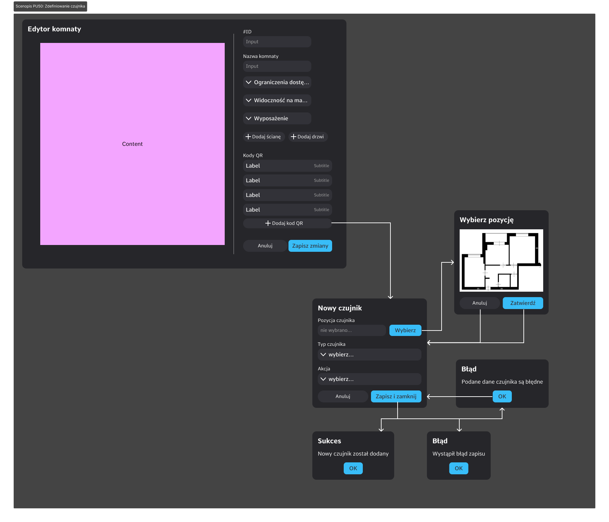

## 5.8 [PU49: Zdefiniowanie gry](#pu49-zdefiniowanie-gry)

- Wersja: 1.0 (22.04.2026)
- Odpowiedzialny: Cezary Rybiński
- Wydanie: 1.0
- Aktor główny: Twórca gry
- Warunek początkowy: Twórca gry jest zalogowany w systemie i posiada uprawnienia do tworzenia gier.
- Warunek końcowy (sukces): Nowa gra zostaje zapisana w systemie ze statusem „Oczekuje na weryfikację".

**Scenariusz główny**

1. Twórca gry wybiera opcję **„Utwórz nową grę"** w Panelu Twórcy.
2. System wyświetla główny formularz zarządzania grą: **„Definicja gry"**.
3. Twórca wybiera opcję **„Edytuj podstawowe parametry"**.
4. System wyświetla formularz **„Podstawowe parametry gry"**.
5. Twórca wypełnia wymagane pola i klika przycisk **„Zapisz"**.
6. System waliduje dane i wyświetla komunikat **„Poprawnie zapisano parametry"**.
7. Twórca klika przycisk **„OK"**.
8. System powraca do widoku **„Definicja gry"**.
9. Twórca klika przycisk **„Zapisz i wyślij"**.
10. System zapisuje grę ze statusem „Oczekuje na weryfikację" i wyświetla komunikat **„Poprawnie zapisano grę i wysłano do recenzenta"**.
11. Twórca klika przycisk **„OK"**.
12. System przekierowuje twórcę do widoku **„Panel Twórcy"**.

**Scenariusz alternatywny A: Błędne dane w parametrach**

5a. System stwierdza, że dane w formularzu parametrów są nieprawidłowe lub niekompletne.

1. System wyświetla komunikat **„Błąd: Podane dane są błędne”**.
2. Twórca klika przycisk **„OK”**.
3. Formularz parametrów pozostaje otwarty, a błędne pola zostają wyróżnione.
4. Scenariusz wraca do kroku 5 scenariusza głównego.

**Scenariusz alternatywny B: Definiowanie elementów szczegółowych (Czujniki)**

7a. Twórca chce zdefiniować czujniki dla gry.

1. Twórca wybiera opcję **„Dodaj nowy czujnik”** w widoku „Definicja gry”.
2. System wywołuje **PU50: Zdefiniowanie czujnika**.
3. Po zakończeniu definiowania czujnika system powraca do widoku **„Definicja gry”**.
4. Scenariusz wraca do kroku 8 scenariusza głównego.

**Scenariusz alternatywny C: Definiowanie elementów szczegółowych (Scenariusz)**

7b. Twórca chce edytować zadania lub mapę w scenariuszu.

1. Twórca wybiera opcję **„Edytuj scenariusz gry”** w widoku „Definicja gry”.
2. System wywołuje **PU56: Wyświetlenie scenariusza gry w edytorze**.
3. Po zakończeniu edycji scenariusza system powraca do widoku **„Definicja gry”**.
4. Scenariusz wraca do kroku 8 scenariusza głównego.

**Scenariusz alternatywny D: Zapis lokalny (bez wysyłki do recenzji)**

8a. Twórca klika przycisk **„Zapisz”**.

1. System zapisuje grę ze statusem „W edycji”.
2. System wyświetla komunikat **„Poprawnie zapisano grę”**.
3. Twórca klika przycisk **„OK”**; system przekierowuje go do widoku **„Lista gier”**.

**Scenariusz alternatywny E: Anulowanie tworzenia gry**

(W dowolnym momencie przebywania w widoku „Definicja gry”) Twórca klika przycisk **„Anuluj”**.

1. System zamyka formularz i przekierowuje twórcę do widoku **„Panel Twórcy”** bez zapisywania żadnych zmian.

**Scenopis**
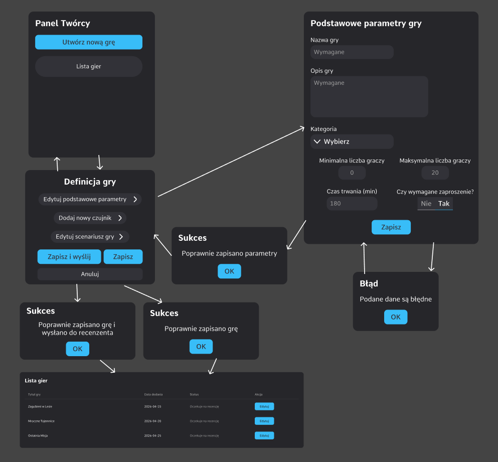

## 5.9 [PU1: Wyświetlenie kalendarza](#pu1-wyświetlenie-kalendarza)

- Wersja: 1.0 (29.04.2026)
- Odpowiedzialny: Olaf Smoleński

Scenariusz główny

1. Użytkownik wybiera opcję _Kalendarz_ w głównym menu aplikacji.
2. System wyświetla użytkownikowi stronę z kalendarzem wydarzeń.

Scenariusz alternatywny: Sesja użytkownika wygasła przed kliknięciem opcji _Kalendarz_

2a. System wylogowuje użytkownika.

1. System wyświetla komunikat "Sesja wygasła. Zaloguj się ponownie" oraz okno logowania.
2. Strona z kalendarzem nie zostaje wyświetlona.

**Scenopis**
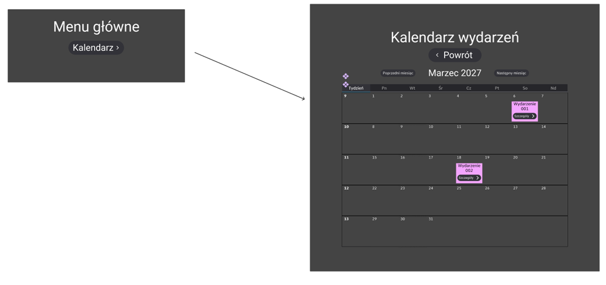

## 5.10 [PU59: Edycja komnaty](#pu59-edycja-komnaty)

- Wersja: 1.0 (22.04.2026)
- Odpowiedzialny: Maciej Bankiewicz
- Wydanie: 1.0
- Aktor główny: Twórca gier
- Warunek początkowy: Twórca gry jest zalogowany i jest w oknie definicji gry.

**Scenariusz główny**

1. Twórca gry wybiera opcję edycji komnaty.
2. System pobiera dane komnaty.
   [dane pobrane pomyślnie]
3. System wyświetla formularz edycji komnaty.
4. Twórca gry dokonuje edycji danych komnaty.
5. Twórca gry wybiera opcję „Zapisz zmiany”.
6. System sprawdza poprawność danych.
   [dane poprawne]
7. System zapisuje zmiany.
   [dane zapisane pomyślnie]
8. System wyświetla potwierdzenie zapisania zmian.

**Scenariusz alternatywny A: Błąd pobierania danych komnaty**

1-2. Jak w scenriuszu głównym.
[błąd pobierania danych] 

3. System wyświetla komunikat o błędzie pobierania danych komnaty. 

4. Twórca gry wybiera "Ok". 

5. Dane pozostają bez zmian.

**Scenariusz alternatywny B: Wprowadzone dane są niepoprawne**

1-6. Jak w scenariuszu głównym.  

7a. System wyświetla komunikat o braku przedmiotu w magazynie.  

8a. Twórca gry wybiera „Ok”.  
Powrót do kroku 3. w scenariuszu głównym.

**Scenariusz alternatywny C: Błąd zapisu zmian**

1-7. Jak w scenariuszu głównym.  
[błąd zapisu / problem z połączeniem]  

8c. System wyświetla komunikat o błędzie zapisu zmian.  

9c. Twórca gry wybiera „Ok”.  

10c. Zmiany w komnacie nie zostają zapisane, dane pozostają bez zmian.

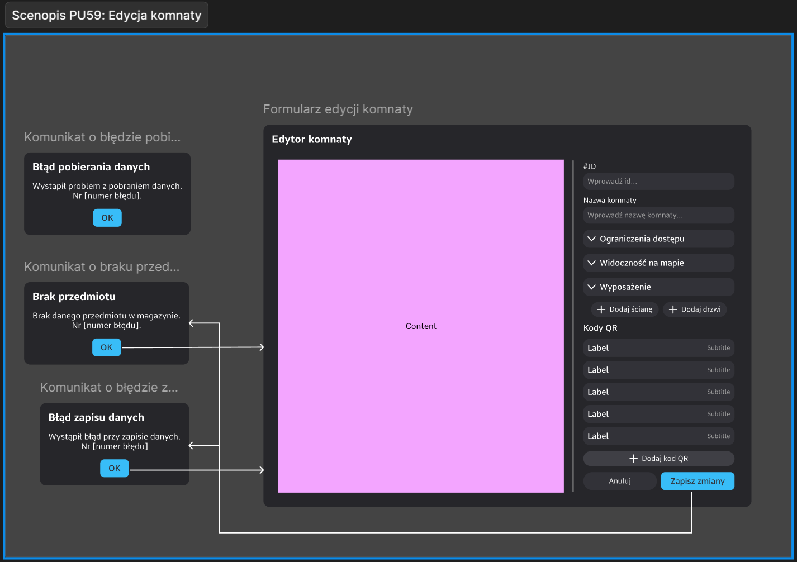

## 5.11 [Zdefiniowanie mapy gry](#pu60%3A-definicja-mapy-gry)

- Wersja: 1.0 (30.04.2026)
- Odpowiedzialny: Łukasz Czajka
- Wydanie: 1.0
- Aktor główny: Twórca gry
- Warunek początkowy: Twórca gry jest zalogowany w systemie, posiada uprawnienia do edycji tworzonej gry oraz znajduje się w edytorze gry.
- Warunek końcowy (sukces): Poprawna mapa gry została zapisana w systemie.

**Scenariusz główny**

1. Twórca gry wybiera opcję "Zdefiniuj mapę gry" w edytorze gry.
2. System pobiera obecną mapę gry.
3. System wyświetla interaktywny edytor mapy gry z aktualną mapę gry.
4. Twórca gry wprowadza zmiany w mapie gry.
5. System zapisuje zmiany na bieżąco w przeglądarce.
6. Twórca gry wybiera opcję "Zapisz i wyjdź".
7. System zapisuje mapę gry.
8. System automatycznie waliduje poprawnoś mapy gry.

final: success

**Scenariusz alternatywny A: Brak zdefiniowanej mapy gry**

2a. System pobiera domyślną mapę gry.

Powrót do kroku 3 scenariusza głównego.

**Scenariusz alternatywny B: Błąd zapisu mapy gry w przeglądarce użytkownika**

5a. System wykrywa błąd zapisu mapy gry w przeglądarce.
6a. System sprawdza czas od ostatniego zapisu.    
7a. System wyświetla komunikat o błędzie zapisu mapy gry w przeglądarce, informuje użytkownika o tym, że ostatni zapis został wykonany [czas] temu, oferuje możliwości wyjścia, ponowienia zapisu lub kontynuowania bez zapisu.    
8a. Twórca gry wybra opcję ponowienia zapisu mapy gry w przeglądarce.    
8a1.1 System ponawia próbę zapisu mapy gry w przeglądarce.     
8a1.2 System powraca do kroku 4 scenariusza głównego.

8a2.1 Twórca gry wybiera opcję kontynuowania bez zapisu mapy gry w przeglądarce.  
8a2.2 System wyłącza funkcję automatycznego zapisu mapy gry w przeglądarce.  
8a2.3 System powraca do kroku 4 scenariusza głównego

8a3.1 Twórca gry wybiera opcję wyjścia z edytora mapy gry.
8a3.2 System zamyka edytor mapy gry bez zapisywania zmian.

final: failure

**Scenariusz alternatywny C: Bład zapisu mapy**

7a. System wykrywa błąd zapisu mapy gry.    
8a. System wyświetla komunikat o błędzie zapisu mapy gry, informuje użytkownika o tym, że mapa jest zapisana lokalnie. System oferuje możliwości ponowienia zapisu mapy gry i wyjścia z edytora mapy gry.

9a1.1 Twórca gry wybiera opcję ponowienia zapisu mapy gry.   
9a1.2 System powraca do kroku 7 scenariusza głównego.   

9a2.1 Twórca gry wybiera opcję wyjścia z edytora mapy gry.   
9a2.2 System zamyka edytor mapy gry bez zapisywania

final: failure

**Scenariusz alternatywny D: Mapa gry jest niepoprawna**   
8a. System informuje użytkownika o błędach w mapie gry (np. brak wymaganych elementów, niespójności) informuje, że mapa gry jest niepoprawna i oznacza mapę jako niepoprawną.   
9a. System oferuje możliwość zapisu z wyjściem lub powrotu do edycji mapy gry.   

9a1.1 Twórca gry wybiera opcję powrotu do edycji mapy gry.   
9a1.2 System powraca do kroku 4 scenariusza głównego

9a2.1 Twórca gry wybiera opcję zapisu z wyjściem.   
9a2.2 System skacze do kroku 7 scenariusza głównego, ale mapa gry pozostaje oznaczona jako niepoprawna, co uniemożliwia publikację gry do czasu poprawy mapy gry.   

---

## 5.12 [PU46: Dołączenie do wydarzenia](#pu46-dołączenie-do-wydarzenia)

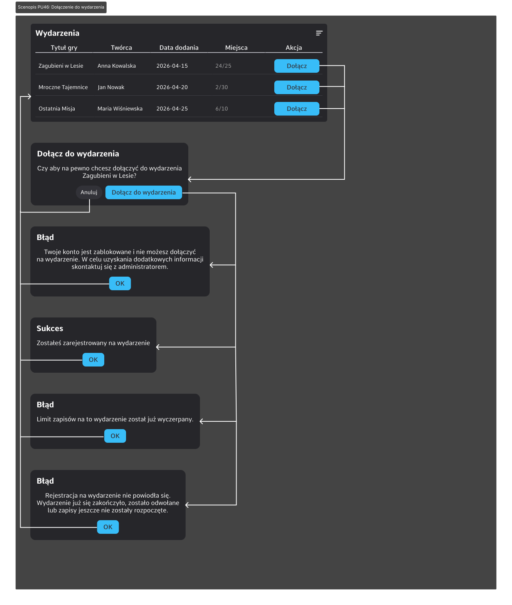

- Wersja: 1.0 (19.05.2026)
- Odpowiedzialny: Igor Ochocki
- Wydanie: 1.0
- Aktor główny: [Gracz]
- **Związek z [PU45: Wyświetlenie listy zarejestrowanych wydarzeń](#pu45-wyświetlenie-listy-zarejestrowanych-wydarzeń):** Przypadek **PU46** jest wywoływany z listy zarejestrowanych [Wydarzeń] (PU45).
- Warunek początkowy: [Gracz] jest zalogowany; na liście z PU45 widoczne jest [Wydarzenie].

**Scenariusz główny**

1. [Gracz] wybiera opcję [Dołącz] z listy zarejestrowanych wydarzeń (PU45).
2. System wyświetla [komunikat potwierdzenia dołączenia do wydarzenia].
3. [Gracz] wybiera jedną z dwóch opcji na [komunikacie potwierdzenia dołączenia do wydarzenia].
[wybrano opcję "Dołącz do wydarzenia"]
4. System sprawdza status [Wydarzenia], dostępność miejsc oraz brak aktywnej [Blokady konta] u [Gracza].
   [warunki spełnione]
5. System rejestruje obecność [Gracza] w [Wydarzeniu].
6. System wyświetla [potwierdzenie dołączenia].

**Warunek końcowy (sukces):** System zarejestrował obecność [Gracza] w wybranym [Wydarzeniu].
**Scenariusz alternatywny A: Przekroczony maksymalny limit graczy**

1.-4. Jak w scenariuszu głównym.

[osiągnięto maksymalną liczbę uczestników [Wydarzenia]]

4a. System wyświetla [komunikat o braku wolnych miejsc].

5a. [Gracz] wybiera opcję [OK].

6a. System wyświetla [listę zarejestrowanych wydarzeń] (powrót do PU45)

**Warunek końcowy (sukces):** [Gracz] nie jest zarejestrowany w wybranym wcześniej [Wydarzeniu].

**final:** failure

---

**Scenariusz alternatywny B: [Wydarzenie] nieaktualne**

1.-4. Jak w scenariuszu głównym.

[wydarzenie zakończone, odwołane lub jeszcze nierozpoczęte]

4b. System wyświetla [komunikat o niemożności dołączenia do wydarzenia].

5b. [Gracz] wybiera opcję [OK].

6b. System wyświetla [listę zarejestrowanych wydarzeń] (powrót do PU45)

**Warunek końcowy (sukces):** [Gracz] nie jest zarejestrowany w wybranym wcześniej [Wydarzeniu].

**final:** failure

---

**Scenariusz alternatywny C: Aktywna [Blokada konta]**

1.-4. Jak w scenariuszu głównym.

[aktywna [Blokada konta] u [Gracza]]

4c. System wyświetla [komunikat o zablokowanym koncie].

5c. [Gracz] wybiera opcję [OK].

6c. System wyświetla [listę zarejestrowanych wydarzeń] (powrót do PU45)

**Warunek końcowy (sukces):** [Gracz] nie jest zarejestrowany w wybranym wcześniej [Wydarzeniu].

**final:** failure

**Scenariusz alternatywny D: Anulowano dołączanie do wydarzenia**

1.3. Jak w scenariuszu głównym.

[wybrano opcję "Anuluj"]

4d. System wyświetla [listę zarejestrowanych wydarzeń] (powrót do PU45)
## 5.13 [PU20: Uruchomienie wydarzenia](#pu20-uruchomienie-wydarzenia)

- Wersja: 1.0 (19.05.2026)
- Odpowiedzialny: Tomasz Rogalski
- Wydanie: 1.0
- Aktor główny: Mistrz wydarzenia
- Warunek początkowy: Mistrz wydarzenia jest zalogowany w systemie i znajduje się na ekranie zarządzania [Wydarzeniem].
- Warunek końcowy (sukces): [Wydarzenie] zostaje pomyślnie uruchomione, jego status zmienia się na aktywne, a uczestnicy otrzymują odpowiednie powiadomienia.

**Scenariusz główny**

1. Mistrz Wydarzenia wybiera opcję Uruchom [Wydarzenie].
2. System wyświetla formularz z [Danymi warunku rozpoczęcia].
3. Mistrz Wydarzenia uzupełnia formularz.
4. System waliduje poprawność wprowadzonych danych.
   [dane poprawne]
5. System wyświetla potwierdzenie uruchomienia [Wydarzenia].

**final:** success

**Scenariusz alternatywny A: Niespełnione warunki rozpoczęcia**

1.-4. Jak w scenariuszu głównym.  
[dane niepopranwe]  
5a. System wyświetla komunikat o niespełnionych warunkach rozpoczęcia.

Powrót do zdania 3 scenariusza głównego.

---

**Scenariusz alternatywny B: Anulowanie uruchomienia wydarzenia**

1.-2. tak jak w scenariuszu głównym.

3b. Mistrz Wydarzenia anuluje uruchomienie [Wydarzenia].  
4b. System wyświetla prośbę o potwierdzenie.  
5b. Mistrz Wydarzenia potwierdza anulowanie.  
6b. System zamyka formularz uruchomienia [Wydarzenia]

**final:** failure

**Scenopis:**
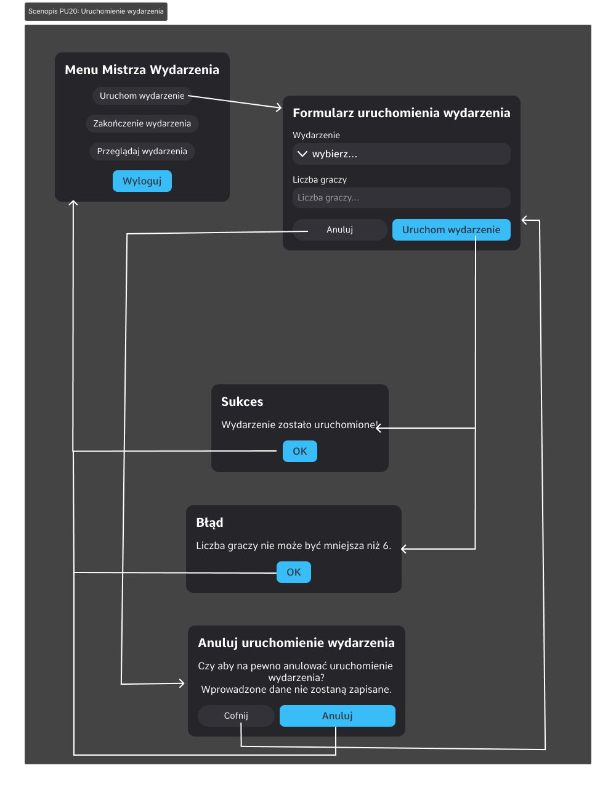

## 5.14 [PU42: Wyświetlenie listy wydarzeń](#pu42-wyświetlenie-listy-wydarzeń)

Wersja: 1.0 (19.05.2026)
Odpowiedzialny: Karolina Wiśniewska
Wydanie: 1.0
Aktor główny: Gracz
Warunek początkowy: Gracz jest zalogowany i znajduje się w widoku "Menu gracza". Istnieją wydarzenia, na które nie jest zarejestrowany.

**Scenariusz główny**
1.  Gracz wybiera opcję "Wydarzenia" w Menu gracza
2.  System pobiera dane i wyświetla ekran "Lista Wydarzeń", zawieracy tabelę wydarzeń oraz opcję "Filtry".
3.  Gracz wybiera opcję "Filtry"
4.  System wyświetla ekran "Menu Filtrów", zawierający listę filtrów wydarzeń.
5.  Gracz wybiera jeden z filtrów
6.  System wyświetla posortowane wydarzenia w sposób określony przez filtr

**Scenariusz alternatywny A - sesja gracza wygasła przed wyświetleniem listy**
2a. System wylogowuje gracza.
3.System wyświetla komunikat "Sesja wygasła. Zaloguj się ponownie" oraz okno logowania.

Warunek końcowy: Nie wyświetlono listy wydarzeń

**Scenariusz alternatywny B - sesja gracza wygasła przed wyświetleniem posortowanej listy**
6a. System wylogowuje gracza.
7.System wyświetla komunikat "Sesja wygasła. Zaloguj się ponownie" oraz okno logowania.

Warunek końcowy: Nie wyświetlono listy wydarzeń

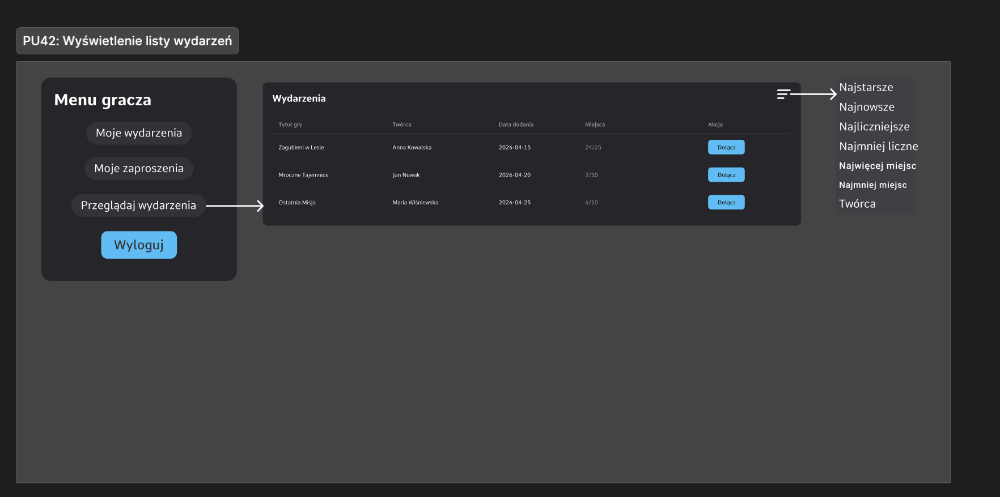

## 5.15 [PU21: Zakończenie wydarzenia](#pu21-zakończenie-wydarzenia)

- **Wersja:** 1.0 (18.05.2026)
- **Odpowiedzialny:** Kacper Koziara
- **Wydanie:** 1.0
- **Aktor główny:** Mistrz wydarzenia / System (w przypadku automatu)
- **Warunek początkowy:** Wydarzenie LARP posiada status „W trakcie rozgrywki” (jest uruchomione). Warunki zakończenia scenariusza (np. fabularne lub czasowe) zostały osiągnięte LUB Mistrz wydarzenia decyduje o wcześniejszym przerwaniu gry.
- **Warunek końcowy (sukces):** Rozgrywka zostaje pomyślnie zamknięta, status wydarzenia zmienia się na „Zakończone”, punkty doświadczenia (XP) oraz odznaki zostają naliczone, wyniki są zapisane w bazie danych, a gracze otrzymują podsumowanie gry.

---

### Scenariusz główny (Ręczne zakończenie przez Mistrza Wydarzenia)

1. Mistrz wydarzenia wybiera opcję **„Zakończ wydarzenie”** w panelu sterowania grą.
2. System wyświetla okno potwierdzenia z podsumowaniem aktualnego stanu rozgrywki (np. osiągnięte cele, aktualna punktacja frakcji).
3. Mistrz wydarzenia klika przycisk **„Potwierdź zakończenie”**.
4. System automatycznie blokuje graczom możliwość wykonywania dalszych akcji w aplikacji (np. skanowanie kodów QR, handel, interakcje z czujnikami).
5. System zmienia status wydarzenia na „Zakończone”.
6. System automatycznie oblicza i przyznaje graczom punkty doświadczenia (XP) oraz odznaki na podstawie ich aktywności w trakcie gry.
7. System zapisuje ostateczne wyniki i statystyki gry w bazie danych.
8. System generuje i wyświetla wszystkim uczestnikom ekran **„Podsumowanie wydarzenia”** (zawierający statystyki, zdobyte punkty i osiągnięcia).

**final:** success

### Scenariusz alternatywny A: Automatyczne zakończenie gry (Upływ limitu czasu)

1a. System wykrywa, że zdefiniowany w scenariuszu limit czasu trwania rozgrywki upłynął.
2a. System automatycznie wywołuje blokadę akcji graczy.
3a. Scenariusz przechodzi do kroku 5 scenariusza głównego (automatyczna zmiana statusu na „Zakończone”, naliczenie XP i wygenerowanie podsumowania).
### Scenariusz alternatywny B: Awaryjne przymusowe zakończenie gry (Sytuacja awaryjna)

1b. Mistrz wydarzenia (lub Organizator) wybiera opcję **„Awaryjne zatrzymanie gry”** w panelu sterowania.
2b. System wyświetla ostrzeżenie o natychmiastowym przerwaniu rozgrywki i prosi o potwierdzenie.
3b. Mistrz wydarzenia potwierdza przymusowe zakończenie.
4b. System zmienia status wydarzenia na „Przerwane awaryjnie”.
5b. System zapisuje aktualny, cząstkowy stan rozgrywki w bazie danych, aby nie utracić dotychczasowych postępów graczy.
6b. System wysyła do aplikacji mobilnych wszystkich uczestników natychmiastowy komunikat push o przerwaniu gry ze względów bezpieczeństwa/technicznych.

**final:** success

---

### Scenariusz alternatywny C: Błąd zapisu ostatecznych wyników w bazie danych

1.–6. Tak jak w scenariuszu głównym.
7c. System wykrywa błąd połączenia z serwerem lub błąd zapisu ostatecznych statystyk w bazie danych.
8c. System wyświetla Mistrzowi wydarzenia komunikat: **„Błąd zapisu danych. Czy chcesz ponowić próbę?”**.
9c. Mistrz wydarzenia wybiera opcję **„Ponów próbę”**.
10c. System pomyślnie zapisuje dane.
11c. Scenariusz wraca do kroku 8 scenariusza głównego (wyświetlenie podsumowania).

**final:** success

**Scenopis**
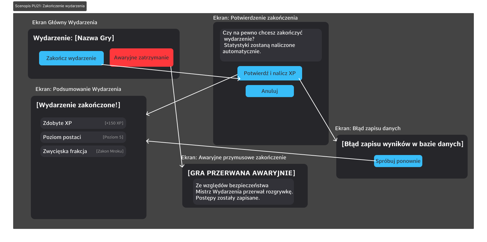

## 5.16 [PU39: Dodanie wydarzenia do kalendarza](#pu39-dodanie-wydarzenia-do-kalendarza)

- Wersja 1.0 (20.05.2026)
- Odpowiedzialny: Michał Marciniak
- Wydanie: 1.0
- Aktor główny: Organizator
- Wywoływany z: [PU47: Wyświetlenie kalendarza przez organizatora](#pu47-wyświetlenie-kalendarza-przez-organizatora)
- Warunek początkowy: Organizator jest zalogowany i znajduje się w kalendarzu.
- Warunek końcowy (success): Wydarzenie zostało dodane do kalendarza i jest widoczne w kalendarzu.
- Warunek końcowy (failure): Wydarzenie nie zostało dodane do kalendarza.

**Scenariusz główny**

1. Organizator wybiera [opcję dodania wydarzenia].
2. System wyświetla [formularz dodania wydarzenia do kalendarza].
3. Organizator wprowadza [dane wydarzenia].
4. Organizator wybiera [opcję dodania].
5. System waliduje dane. \
[dane poprawne i termin wolny]
6. System dodaje [wydarzenie] do [kalendarza].

**final:** success

**POST:** Wydarzenie zostało dodane do kalendarza i jest widoczne w kalendarzu.

**Scenariusz alternatywny A: Błędne dane**

1-5. Jak w scenariuszu głównym. \
[dane niepoprawne] \
6a. System wyświetla [komunikat o błędnych danych wydarzenia]. \
7a. Organizator wybiera "OK".

Powrót do kroku 3. w scenariuszu głównym

**final:** failure

**POST:** Wydarzenie nie zostało dodane do kalendarza.

**Scenariusz alternatywny B: Zajęty termin**

1-5. Jak w scenariuszu głównym. \
[termin wydarzenia zajęty] \
6b. System wyświetla [komunikat o zajętej dacie]. \
7b. Organizator wybiera "OK".

Powrót do kroku 3. w scenariuszu głównym

**final:** failure

**POST:** Wydarzenie nie zostało dodane do kalendarza.

**Scenopis**:
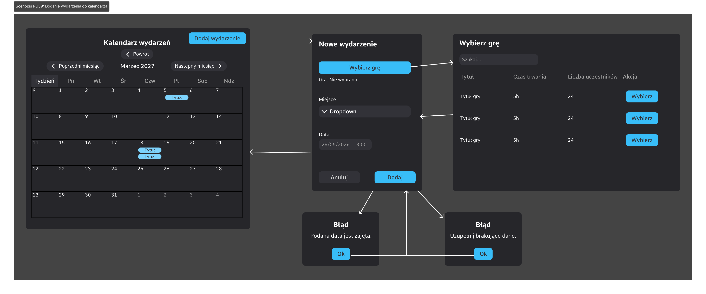

## 5.17 [PU47: Wyświetlenie kalendarza przez organizatora](#pu47-wyświetlenie-kalendarza-przez-organizatora)

- Wersja 1.0 (20.05.2026)
- Odpowiedzialny: Michał Marciniak
- Wydanie: 1.0
- Aktor główny: Organizator
- Specjalizacja: [PU1: Wyświetlenie kalendarza](#pu1-wyświetlenie-kalendarza)
- Warunek początkowy: Organizator jest zalogowany i znajduje się w menu organizatora.
- Warunek końcowy (success): Wyświetlony kalendarz

**Scenariusz główny**

1. Organizator wybiera [opcję wyświetlenia kalendarza].
2. System wyświetla [kalendarz] z [opcją dodania wydarzenia].

**final:** success

**POST:** Wyświetlony kalendarz

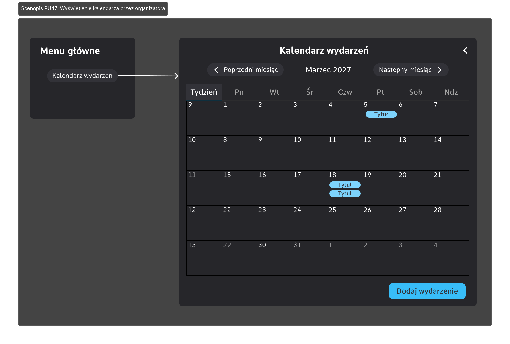

## 5.18 [PU41: Udostępnienie wydarzenia graczom](#pu41-udostępnienie-wydarzenia-graczom)

- Wersja 1.0 (19.05.2026)
- Odpowiedzialny: Olaf Smoleński
- Wydanie: 1.0
- Aktor główny: Organizator
- Wywoływany z: [PU39: Dodanie wydarzenia do kalendarza](#pu39-dodanie-wydarzenia-do-kalendarza)
- Warunek początkowy: Organizator jest zalogowany i ma otwarte menu danego wydarzenia.
- Warunek końcowy (success): Wydarzenie zostało udostępnione graczom.
- Warunek końcowy (failure): Wydarzenie nie zostało udostępnione graczom.

**Scenariusz główny**

1. Organizator wybiera opcję udostępnienia wydarzenia graczom.
2. System wyświetla formularz udostępnienia wydarzenia.
3. Organizator wprowadza datę otwarcia i zamknięcia zapisów na wydarzenie.
4. Organizator wybiera opcję dodania.
5. System udostępnia wydarzenie dla graczy.
6. System wyświetla komunikat o udostępnieniu wydarzenia.

**final**: success \
**POST**: Wydarzenie zostało udostępnione, gracze mogą dokonywać zapisów w określonym terminie.

**Scenariusz alternatywny A**: Brak lub niepoprawna data otwarcia i/lub zamknięcia

1.-4. Jak w scenariuszu głównym. \
\[brak lub niepoprawna data] \
5a. System wyświetla komunikat o niepoprawnej dacie. \
6a. Organizator wybiera "OK". \
(powrót do kroku 3. w scenariuszu głównym)

**final**: failure \
**POST**: Wydarzenie nie zostało udostępnione.

**Scenopis**

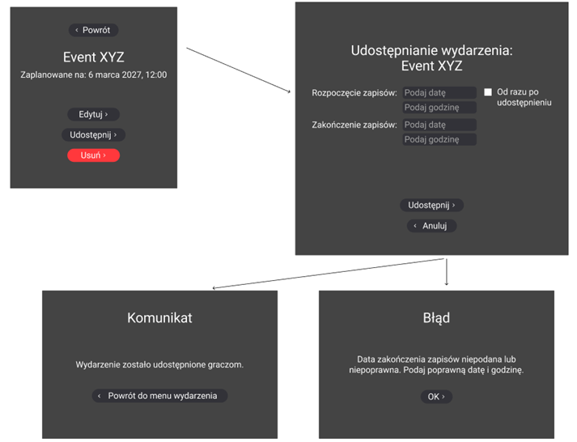
## 5.19 [PU40: Zaproszenie graczy](#pu40-zaproszenie-graczy)

- Wersja: 1.0 (18.05.2026)
- Odpowiedzialna: Polina Nesterova
- Wydanie: 1.0
- Aktor główny: Organizator wydarzenia
- **Związek z [PU47: Wyświetlenie kalendarza przez organizatora](#pu47-wyświetlenie-kalendarza-przez-organizatora):** Przypadek **PU40** jest wywoływany z PU47; organizator wybiera [Wydarzenie] z [Kalendarza] i inicjuje zaproszenie graczy.
- Warunek początkowy: Organizator jest zalogowany; [Wydarzenie] zostało pomyślnie utworzone; organizator ma dostęp do opcji [zaproszenia graczy].

**Scenariusz główny (sukces)**

1. Organizator wybiera [opcję zaproszenia graczy].
2. System wyświetla [okno zapraszania graczy].
3. Organizator wybiera [graczy] z [listy zarejestrowanych graczy].
4. Organizator wybiera [opcję wysłania zaproszenia].
5. System waliduje wybór.

[wybór poprawny]

6. System zapisuje [Zaproszenia] dla wybranych [Graczy] w ramach [Wydarzenia].
7. System wysyła [powiadomienia o zaproszeniu] do wybranych [Graczy].
8. System wyświetla [potwierdzenie wysłania zaproszeń].

**Warunek końcowy:** [Zaproszenia] zostały zapisane i powiązane z wybranymi [Graczami] oraz [Wydarzeniem]; zaproszeni [Gracze] otrzymali [powiadomienie o zaproszeniu].

**final:** success

**Scenariusz alternatywny 1: Filtrowanie listy graczy**

1–2. Tak jak w scenariuszu głównym.

3a. Organizator wprowadza [kryteria wyszukiwania] w [polu wyszukiwania].

4a. System filtruje [listę zarejestrowanych graczy].

[wyniki znalezione]

5a. Organizator wybiera [graczy] z [przefiltrowanej listy].

6a. Scenariusz wraca do kroku 4 scenariusza głównego.

**final:** success (kontynuacja scenariusza głównego)
**POST:** [Lista zarejestrowanych graczy] została przefiltrowana zgodnie z [kryteriami wyszukiwania].

---

**Scenariusz alternatywny 2: Brak wybranych graczy**

1.-4. Jak w scenariuszu głównym.

[wybór niepoprawny - [brak zaznaczonych graczy]]

5a. System wyświetla [komunikat o konieczności wybrania gracza].

6a. Scenariusz wraca do kroku 3 scenariusza głównego.

**final:** failure (brak wysłania)
**POST:** [Zaproszenia] nie zostały wysłane; [okno zapraszania graczy] pozostaje otwarte z widocznym [komunikatem].

---

**Scenariusz alternatywny 3: Błąd zapisu zaproszeń**

1–5. Tak jak w scenariuszu głównym.

[błąd zapisu]

6e. System zgłasza [błąd zapisu zaproszeń].

7e. System wyświetla [komunikat o błędzie wysłania] z [opcją ponowienia próby].

8e. Organizator wybiera [opcję ponowienia próby].

9e. Scenariusz wraca do kroku 5 scenariusza głównego.

**final:** failure (brak zapisu)
**POST:** [Zaproszenia] nie zostały zapisane; [wybór graczy] pozostaje zachowany w [oknie zapraszania graczy].

---

**Scenopis**
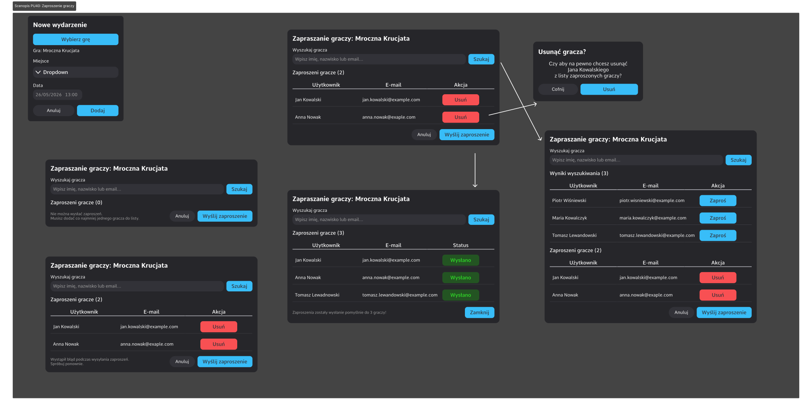

---

## 5.20 [PU43: Wyświetlenie listy zaproszeń](#pu43-wyświetlenie-listy-zaproszeń)
- Wersja: 1.0 (19.05.2026)
- Odpowiedzialny: Cezary Rybiński
- Wydanie: 1.0
- Aktor główny: Gracz
- Warunek początkowy: Gracz jest zalogowany w systemie i znajduje się w widoku "Menu gracza".
- Warunek końcowy (sukces): System wyświetla ekran "Lista zaproszeń".

**Scenariusz główny**
1. Gracz wybiera opcję "Moje zaproszenia" w Menu gracza.
2. System pobiera dane i wyświetla ekran "Lista zaproszeń".

**Scenariusz alternatywny A: Brak zaproszeń**

2a. System wyświetla ekran "Lista zaproszeń" z komunikatem o braku dostępnych zaproszeń.

**Scenopis**
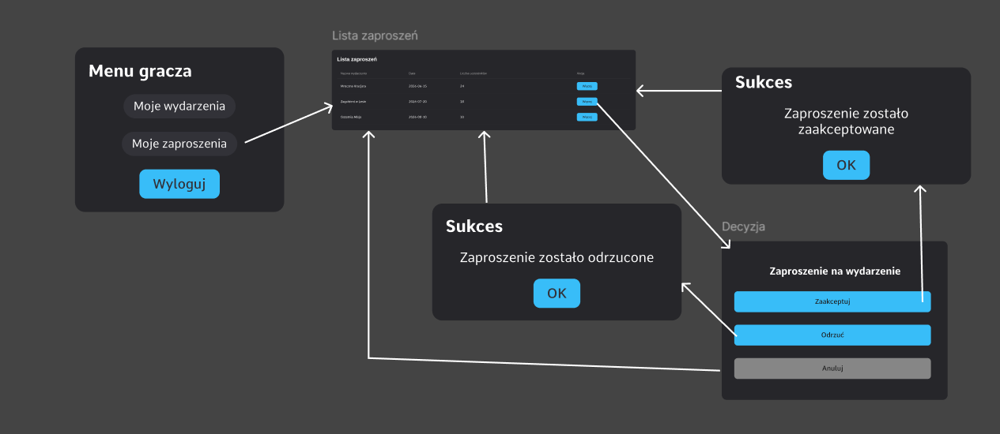

## 5.21 [PU31: Wysłanie skargi](#pu31-wysłanie-skargi)

- Wersja: 1.0 (20.05.2026)
- Odpowiedzialna: Alicja Rosiak
- Wydanie: 1.0
- Aktor główny: Gracz
- Warunek początkowy: Gracz jest zalogowany
  i jest w menu głównym

**Scenariusz główny**

1. Gracz wybiera opcję wysłania skargi.
2. System wyświetla formularz wysyłania skargi.
3. Gracz wypełnia dane skargi.
4. Gracz wybiera opcję wysłania skargi.  
[dane poprawne]
5. System wysyła skargę.  
[wysłanie pomyślne]
6. System wyświetla komunikat o pomyślnym wysłaniu skargi.

Warunek końcowy: skarga jest wysłana

**Scenariusz alternatywny 1**

1.-4. jak w Scenariuszu głównym  
[dane niepoprawne]  
5a. System wyświetla komunikat o błędnych danych.  
Powrót do kroku 3. w Scenariuszu głównym

**Scenariusz alternatywny 2**

1.-5. jak w Scenariuszu głównym  
[wysłanie niepomyślne]  
6b. System wyświetla komunikat o błędzie wysyłania.  
7b. System zamyka formularz wysyłania skargi.

Warunek końcowy: skarga nie została wysłana

**Scenopis**

## 5.13 [PU22: Skanowanie kodu QR](#pu22%3A-skanowanie-kodu-qr)

- Wersja: 1.0 (20.05.2026)
- Odpowiedzialny: Łukasz Czajka
- Wydanie: 1.0
- Aktor główny: Gracz
- Warunek początkowy: Gracz jest zalogowany w aplikacji i znajduje się na ekranie startowym
- Warunek końcowy (sukces): Użytkownik rozpoczął walkę lub mini-grę.

**Scenariusz główny (Skan kodu QR)**
1. Gracz naciska przycisk skanowania kodów QR.
2. System wyświetla okno skanowania kodów.
3. Gracz umieszcza kod QR w oknie.
4. System sprawdza kod.

[kod QR poprawny]     
5. System sprawdza typ akcji powiązanej z kodem QR (walka/mini-gra)    
6. System wyświetla komunikat z prośbą o potwierdzenie akcji danego typu    
7. Gracz potwierdza    
8. System wykonuje akcję    

final: success

**Scenariusz alternatywny A: Anulowanie skanu kodu QR**

1-2: Tak jak w scenariuszu głównym    
3a. Gracz naciska przycisk wstecz    
4a. System wraca do menu głównego aplikacji    

final: failure

**Scenariusz alternatywny B: Błędny kod QR**

1-4: Tak jak w scenariuszu głównym    
[Kod QR błędny]    
5b. System wyświetla komunikat o błędzie   
6b. Gracz naciska przycisk OK    
7b. System wraca do kroku     

**Scenariusz alternatywny C: Gracz anulował wykonanie akcji**

6c. Gracz naciska przycisk "Anuluj"    

final: failure
## 5.23 [PU44: Akceptacja zaproszenia](#pu44-akceptacja-zaproszenia)

- Wersja: 1.0 (14.04.2026)
- Odpowiedzialny: Maciej Bankiewicz
- Priorytet i trudność: Istotne
- Wywołany z: [PU43: Wyświetlenie listy zaproszeń](#pu43-wyswietlenie-listy-zaproszen)
- Wydanie: 1.0
- Aktor główny: Gracz
- Warunek początkowy: Gracz jest zalogowany i znajduje się w widoku listy zaproszeń.

**Scenariusz główny**
1. Gracz wybiera opcję [akceptacji] przy wybranym zaproszeniu.
2. System sprawdza dostępność miejsc. [są wolne miejsca]
3. System dodaje gracza do listy zarejestrowanych uczestników.
4. System usuwa zaproszenie z listy zaproszeń gracza.
5. System wyświetla potwierdzenie pomyślnej akceptacji zaproszenia.

**Scenariusz alternatywny A: Brak wolnych miejsc**

1-2. Jak w scenariuszu głównym. [brak wolnych miejsc]

3a. System wyświetla komunikat informujący o braku wolnych miejsc.

4a. Gracz wybiera „Ok”.

5a. Gracz nie zostaje dodany do listy, a zaproszenie pozostaje bez zmian.

**Scenariusz alternatywny B: Błąd zapisu / problem techniczny**

1-2. Jak w scenariuszu głównym.
[błąd zapisu do bazy danych / problem z połączeniem]

3b. System wyświetla komunikat o błędzie akceptacji zaproszenia.

4b. Gracz wybiera „Ok”.

5b. Proces zostaje przerwany, gracz nie zostaje dodany, a zaproszenie pozostaje na liście bez zmian.

**Scenariusz alternatywny C: Odrzucenie zaproszenia**

1c. Gracz wybiera opcję [odrzucenia] przy wybranym zaproszeniu.

2c. System usuwa zaproszenie z listy zaproszeń gracza.

3c. System wyświetla komunikat z potwierdzeniem pomyślnego odrzucenia zaproszenia.

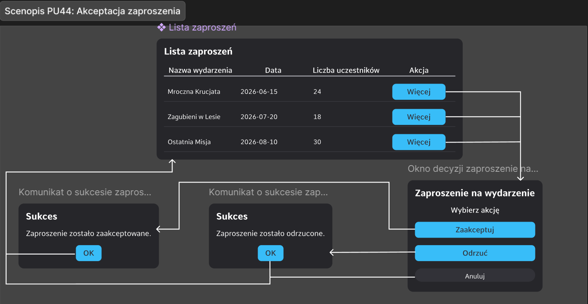
