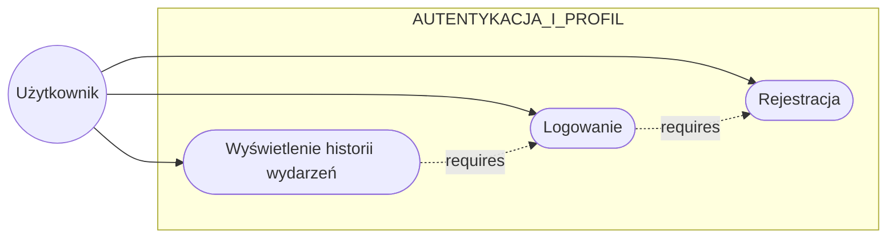
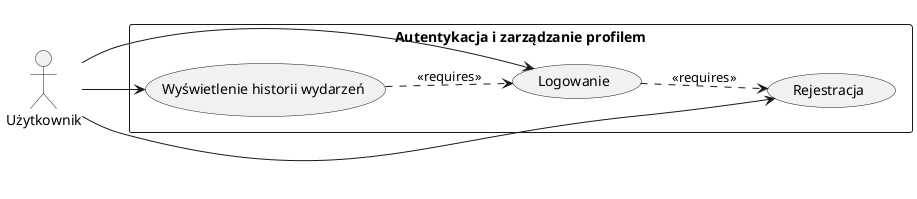

# Przypadki użycia - Polina Nesterova

## Opis przypadków użycia

Zestaw przypadków użycia odpowiedzialnych za podstawową funkcjonalność użytkownika w systemie:
- **Rejestracja** - tworzenie nowego konta w systemie LARP z weryfikacją email i aktywacją konta
- **Logowanie** - autoryzacja użytkownika do systemu z obsługą sesji i zabezpieczeniami
- **Wyświetlenie historii wydarzeń** - dostęp do pełnej historii uczestnictwa użytkownika w wydarzeniach LARP wraz ze statystykami

---

## Diagram Mermaid

---

## Diagram PlantUML

---

## Szczegółowe opisy przypadków użycia

### UC1: Rejestracja

**Aktor:** Użytkownik  
**Priorytet:** Kluczowy  

Nowy użytkownik tworzy konto w systemie poprzez wypełnienie formularza rejestracyjnego. System wymaga podania podstawowych danych osobowych (imię, nazwisko, adres email oraz hasło). Podczas rejestracji następuje weryfikacja unikalności adresu email - jeśli podany email już istnieje w bazie, rejestracja zostaje odrzucona z odpowiednim komunikatem. 

Po pomyślnej walidacji danych system tworzy profil użytkownika i automatycznie wysyła wiadomość email z linkiem aktywacyjnym. Konto pozostaje nieaktywne do momentu kliknięcia w link aktywacyjny, co ma na celu potwierdzenie tożsamości użytkownika oraz poprawności podanego adresu email. System przechowuje informację o dacie rejestracji oraz statusie aktywacji konta.

---

### UC2: Logowanie

**Aktor:** Użytkownik  
**Priorytet:** Kluczowy  

Użytkownik posiadający zarejestrowane i aktywowane konto uzyskuje dostęp do systemu poprzez autoryzację. Proces logowania wymaga podania adresu email oraz hasła. System weryfikuje poprawność danych uwierzytelniających poprzez porównanie z zapisanymi w bazie wartościami.

W przypadku poprawnych danych system tworzy sesję użytkownika i przyznaje dostęp do wszystkich funkcji systemu. Sesja jest zarządzana za pomocą tokenów bezpieczeństwa i wygasa po określonym czasie nieaktywności. System monitoruje nieudane próby logowania - po przekroczeniu określonej liczby błędnych prób (np. 5 w ciągu 15 minut) konto zostaje tymczasowo zablokowane jako mechanizm ochrony przed atakami brute-force. Użytkownik może odblokować konto poprzez reset hasła emailem.

Dodatkowo system sprawdza status konta - jeśli konto nie zostało jeszcze aktywowane lub zostało zablokowane przez administratora, logowanie zostaje odrzucone z odpowiednim komunikatem wyjaśniającym przyczynę.

---

### UC3: Wyświetlenie historii wydarzeń

**Aktor:** Użytkownik  
**Priorytet:** Średni  

Zalogowany użytkownik ma dostęp do pełnej historii swojego uczestnictwa w wydarzeniach LARP. System prezentuje chronologiczną listę wszystkich wydarzeń, w których użytkownik brał udział, wraz ze szczegółowymi informacjami takimi jak: nazwa wydarzenia, data i godzina, lokalizacja, nazwa i opis odgrywanej postaci, czas trwania sesji oraz status wydarzenia (zakończone, anulowane, w trakcie).

Użytkownik może filtrować wyświetlaną listę według różnych kryteriów: przedział czasowy (ostatni miesiąc, rok, wszystkie), typ wydarzenia (fantasy, sci-fi, horror), status (tylko zakończone, w trakcie), oraz lokalizacja. System umożliwia również sortowanie listy według daty (rosnąco/malejąco) lub nazwy wydarzenia.

Dodatkowo system prezentuje zagregowane statystyki uczestnictwa użytkownika: całkowitą liczbę ukończonych sesji, całkowity czas spędzony na wydarzeniach, najczęściej grane typy postaci (np. wojownik, mag, łotrzyk), ulubione scenariusze oraz ranking najpopularniejszych organizatorów wydarzeń. 

Dla użytkowników którzy nie brali jeszcze udziału w żadnym wydarzeniu, system wyświetla komunikat zachęcający do przeglądania dostępnych wydarzeń wraz z bezpośrednim linkiem do modułu wyszukiwania.
