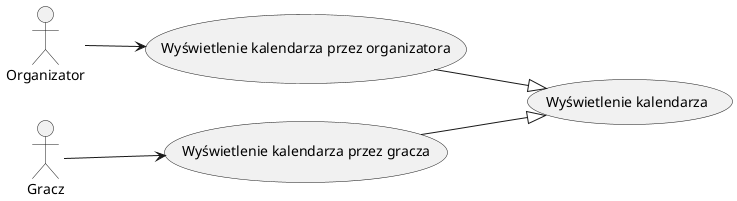

```plantuml
@startuml
left to right direction

"Wyświetlenie kalendarza przez gracza" as (ucg)
"Wyświetlenie kalendarza przez organizatora" as (uco)
"Wyświetlenie kalendarza" as (uc)

:Gracz: --> (ucg)
:Organizator: --> (uco)

ucg --|> uc
uco --|> uc
@enduml
```
