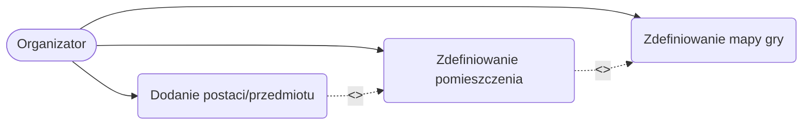

# Przypadki użycia - Kacper Koziara

## 1. Diagram Przypadków Użycia

## 2. Scenariusze Przypadków Użycia

### UC1: Zdefiniowanie mapy gry
**Aktor główny:** Organizator
**Cel:** Utworzenie nowej instancji mapy dla konkretnego wydarzenia LARP.
**Warunki początkowe:** Organizator jest zalogowany do systemu i znajduje się w panelu zarządzania wydarzeniem.
**Scenariusz główny:**
1. Organizator wybiera opcję "Kreator mapy" w panelu wydarzenia.
2. System wyświetla pusty obszar roboczy (siatkę/kanwę).
3. Organizator podaje podstawowe parametry mapy (np. nazwa lokacji, rozmiar siatki).
4. System zapisuje wstępny projekt mapy.

**Rozszerzenia (Punkty rozszerzeń):** * W kroku 4 (zapisanie mapy), Organizator może przejść do definiowania konkretnych pomieszczeń na mapie (rozszerzenie przez UC2).

### UC2: Zdefiniowanie pomieszczenia
**Aktor główny:** Organizator
**Cel:** Wydzielenie i zdefiniowanie konkretnej strefy (pomieszczenia/komnaty) na wcześniej utworzonej mapie gry.
**Warunki początkowe:** Mapa gry została zainicjowana w systemie.
**Scenariusz główny:**
1. Organizator zaznacza obszar na siatce mapy i wybiera opcję "Dodaj pomieszczenie".
2. System wyświetla formularz właściwości pomieszczenia.
3. Organizator nadaje nazwę, określa typ pomieszczenia (np. korytarz, pokój zagadek) i ustala wymagane uprawnienia dostępu.
4. System renderuje pomieszczenie na mapie i zapisuje jego parametry.

**Rozszerzenia (Punkty rozszerzeń):**
* W kroku 4, po utworzeniu pomieszczenia, Organizator może od razu przejść do dodawania do niego elementów interaktywnych (rozszerzenie przez UC3).

### UC3: Dodanie postaci/przedmiotu
**Aktor główny:** Organizator
**Cel:** Przypisanie wirtualnego przedmiotu, obiektu fabularnego (np. skrzyni z kodem QR) lub postaci (NPC) do konkretnego pomieszczenia.
**Warunki początkowe:** Zdefiniowano przynajmniej jedno pomieszczenie na mapie.
**Scenariusz główny:**
1. Organizator wybiera zdefiniowane pomieszczenie.
2. Wybiera z menu bocznego opcję "Dodaj element".
3. System wyświetla listę dostępnych zasobów (przedmioty z ekwipunku gry, stworzone postacie).
4. Organizator przeciąga wybrany element w konkretne miejsce w pomieszczeniu (Drag & Drop) i konfiguruje jego status (np. widoczny/ukryty).
5. System zapisuje lokalizację elementu i aktualizuje bazę danych wydarzenia.

---

## 3. Słownik pojęć

* **Mapa Gry (obszar roboczy):** Interaktywna i wizualna reprezentacja przestrzeni (np. budynku, terenu), w której odbywa się wydarzenie LARP, składająca się z siatki współrzędnych i naniesionych na nią obiektów.
* **Pomieszczenie (Komnata):** Logicznie lub fizycznie wydzielony obszar na Mapie Gry, posiadający własne atrybuty, takie jak nazwa, pojemność oraz ewentualne blokady dostępu (np. wymagany klucz cyfrowy).
* **Punkt zaczepienia (POI - Point of Interest):** Ściśle określone współrzędne (X, Y) w obrębie Pomieszczenia, w którym można umieścić Przedmiot, Kod QR lub Postać.
* **Warstwa (Layer):** Element interfejsu kreatora mapy, pozwalający na oddzielne edytowanie różnych kategorii obiektów (np. warstwa strukturalna dla ścian/pokoi, warstwa interaktywna dla przedmiotów).

---

## 4. Wymagania jakościowe

**J-MAP01: Wydajność renderowania mapy w kreatorze**
* **Typ:** Wydajność
* **Opis:** System powinien płynnie renderować mapę zawierającą do 100 zdefiniowanych pomieszczeń i 500 przedmiotów bez odczuwalnych spadków klatek (FPS poniżej 30).
* **Sposób pomiaru:** Załadowanie testowej mapy o maksymalnych parametrach (100 pomieszczeń, 500 elementów) na standardowym komputerze biurowym i pomiar czasu reakcji na przesuwanie mapy (panning). Oczekiwany czas reakcji < 100ms.

**J-MAP02: Intuicyjność dodawania elementów (Zasada 3 kliknięć)**
* **Typ:** Użyteczność
* **Opis:** Interfejs kreatora mapy musi być na tyle zoptymalizowany, aby dodanie nowego przedmiotu lub postaci do istniejącego pomieszczenia nie wymagało więcej niż 3 interakcji (kliknięć / przeciągnięć myszą).
* **Sposób pomiaru:** Wykonanie scenariusza badawczego polegającego na dodaniu przedmiotu przez osobę, która przeszła podstawowe szkolenie z systemu.

**J-MAP03: Integralność współrzędnych przy edycji**
* **Typ:** Niezawodność
* **Opis:** Zmiana rozmiaru lub przesunięcie całego Pomieszczenia przez Organizatora musi skutkować automatycznym i proporcjonalnym przesunięciem wszystkich przypisanych do niego Przedmiotów i Postaci, bez utraty ich relatywnego położenia.
