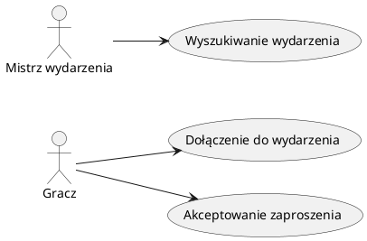

```plantuml
@startuml 
left to right direction

actor "Gracz" as gracz
actor "Mistrz wydarzenia" as gm

usecase "Wyszukiwanie wydarzenia" as uc1
usecase "Dołączenie do wydarzenia" as uc2
usecase "Akceptowanie zaproszenia" as uc3

gm --> uc1
gracz --> uc2
gracz --> uc3

@enduml
```

