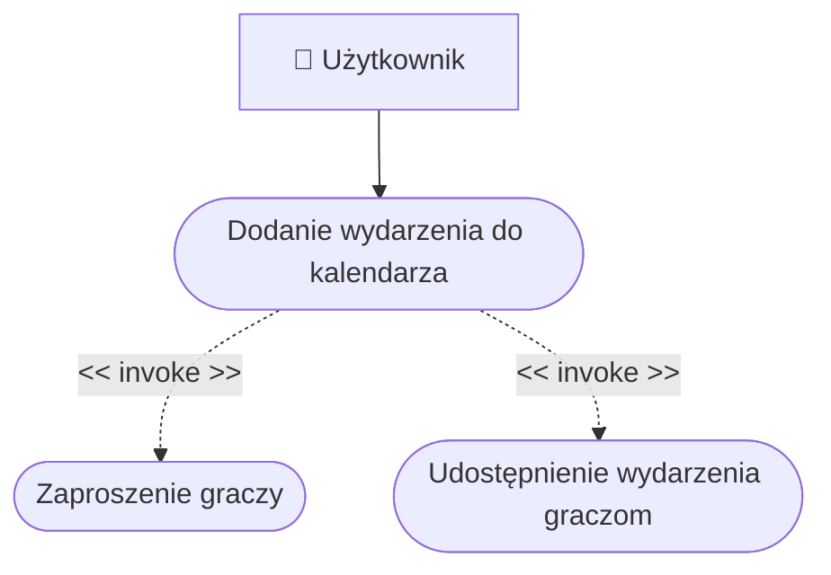

```mermaid
flowchart TD
    User[👤 Użytkownik]
    A([Dodanie wydarzenia do kalendarza])
    B([Zaproszenie graczy])
    C([Udostępnienie wydarzenia graczom])

    User-->A
    A-.->|<< invoke >>|B
    A-.->|<< invoke >>|C
```
