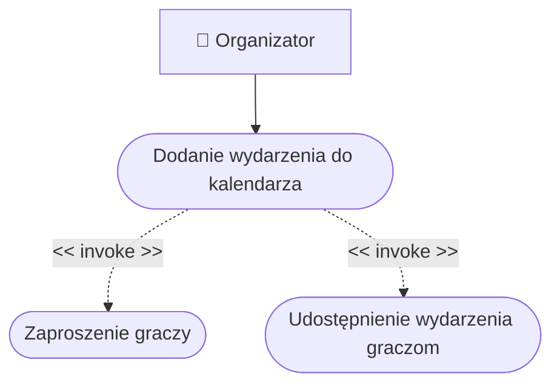

# Opis przypadków użycia

## Dodanie wydarzenia do kalendarza
Organizator dodaje wydarzenie do kalendarza. Przy dodawaniu musi podać najważniejsze informacje na temat wydarzenia - nazwę i ewentualny opis, datę i godzinę, miejsce, maksymalną liczbę graczy oraz wymagania dotyczące postaci. Po dodaniu wydarzenie jest widoczne w kalendarzu dla każdego użytkownika systemu.

## Zaproszenie graczy
Organizator wysyła graczom zaproszenia na wydarzenie.
Organizator może wybrać graczy, którym wyśle zaproszenie, klikając przycisk *Zaproś graczy* w menu wydarzenia. Po jego kliknięciu pokaże się lista zarejestrowanych graczy, spośród których organizator wybiera poszczególne osoby i klika przycisk *Wyślij zaproszenie*.
Zaproszony gracz otrzyma powiadomienie o zaproszeniu na wydarzenie. Po otwarciu powiadomienia gracz zobaczy nazwę i opis, datę i godzinę oraz miejsce rozgrywania wydarzenia. Gracz będzie miał możliwość zaakceptowania lub odrzucenia zaproszenia.

## Udostępnienie wydarzenia graczom
Organizator z poziomu menu wydarzenia otwiera graczom możliwość zapisu na dane wydarzenie. Gracz będzie mógł dokonać zapisu, jeżeli są jeszcze wolne miejsca na wydarzenie i jeżeli ta opcja nie jest dla gracza niedostępna, np. z powodu bana.

# Słownik
* **Powiadomienie** - wiadomość wysłana do użytkownika przez system. Użytkownik ma dostęp do otrzymanych powiadomień w menu *Powiadomienia* na swoim profilu.
* **Menu wydarzenia** - indywidualna strona przypisana do wydarzenia, wyświetlająca się po kliknięciu w dane wydarzenie w kalendarzu. Zawiera nazwę wydarzenia, opis, datę i godzinę, miejsce, maksymalną liczbę graczy oraz wymagania dotyczące postaci, a także opcje dotyczące wydarzenia, różniące się w zależności od użytkownika.
* **Ban** - czasowa lub stała blokada nałożona na gracza w konsekwencji złamania regulaminu platformy lub wydarzenia, odbierająca mu pewne opcje, w szczególności dołączania do wydarzeń.
