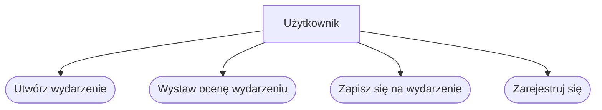
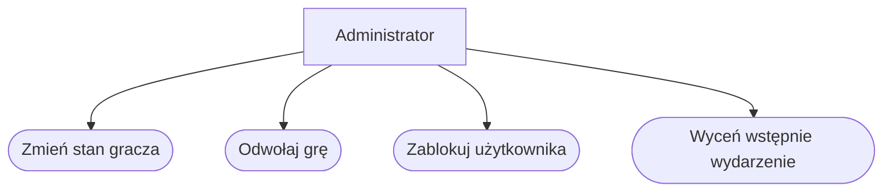

```mermaid
flowchart TB
 A["Użytkownik"] --> n1(["Utwórz wydarzenie"]) & n2(["Wystaw ocenę wydarzeniu"]) & n3(["Zapisz się na wydarzenie"]) & n4(["Zarejestruj się"])
```

```mermaid
flowchart TB
    B["Administrator"] --> n5(["Zmień stan gracza"]) & n6(["Odwołaj grę"]) & n7(["Zablokuj użytkownika"]) & n8(["Wyceń wstępnie wydarzenie"])
```
