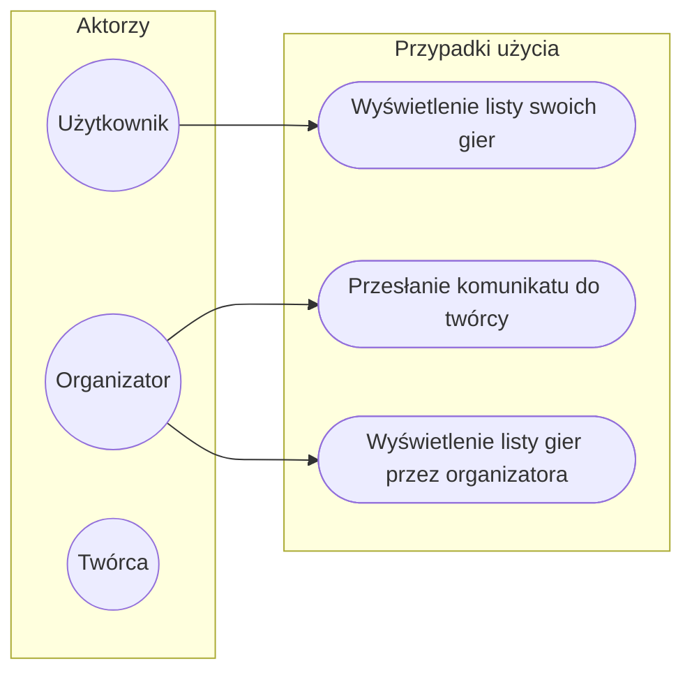

```mermaid
flowchart LR

subgraph Aktorzy
user((Użytkownik))
org((Organizator))
tworca((Twórca))
end

subgraph Przypadki użycia
pu_lista_gier([Wyświetlenie listy swoich gier])
pu_komunikat([Przesłanie komunikatu do twórcy])
pu_lista_gier_org([Wyświetlenie listy gier przez organizatora])

user --> pu_lista_gier
org --> pu_lista_gier_org
org --> pu_komunikat

end
```